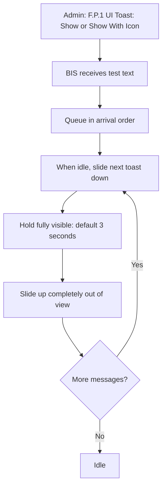

# User Story Diagrams

## Proposed renumbered catalog

The canonical catalog below is now the proposed ordering. `P` means Player Wallet, `G` means Game Wallet, `P/G` means shared wallet behavior, and `N` means neutral/Admin or spike work. Numbers restart at 1 within each lane and do not skip.

```text
A. Accounts
   A.P.1  Open Account
   A.P.2  Create Account
   A.P.3  Restore Account
   A.P.4  Account Balance and Details
   A.P.5  Log Out
   A.G.1  Admin Game Wallet
   A.G.2  User-facing Game Wallet
   A.G.3  Game-Wallet Security
   A.G.4  Reliable Game-Wallet Onboarding
          and Transfer Recovery

B. Payments/Transfers
   B.P.1  Pay to Continue
   B.P.2  Continue After Game Death
   B.P.3  Receive Funds by Address
   B.P.4  Receive Funds With Lightning Invoice
   B.P.5  Send Funds to an Address
   B.P.6  Pay a Lightning Invoice
   B.P.7  Account Transfer
   B.P.8  Open Onboarding
   B.G.1  Receive Player Continuation Payment
   A.G.3  Board Game Wallet

C. Assets
   C.P.1  Reward Player With Trophy
   C.G.1  Mint Asset
   C.G.2  Mint Marketplace Items
   C.G.3  Burn Marketplace Items
   C.G.4  List Marketplace Items

D. Contracts
   D.P.1  Contracts UI
   D.P.2  Treasure Chest Player Flow
   D.G.1  Treasure Chest Game-Wallet Funding

E. Transactions
   E.P.1  View Activity
   E.P.2  Inspect Transfer Recovery Details
   E.P.3  Cancel Pending Transfer

F. Integrations
   F.P.1  UI Toast

X. Appendix
   X.N.1  Arkade Onboarding Spike
   X.N.2  USD-relative Sats Pricing
```

The catalog above is authoritative; the sections below provide the current domain-organized diagrams and implementation status.

### Catalog navigation

- [A.P.1 Open Account](#ap1-open-the-game-then-account)
- [A.P.2 Create Account](#ap2-create-a-new-disposable-test-account)
- [A.P.3 Restore Account](#ap3-restore-an-account-from-this-experience)
- [A.P.4 Account Balance and Details](#ap4-open-account-with-an-active-profile)
- [A.P.5 Log Out](#ap5-log-out-and-return-to-ordinary-gameplay)
- [A.G.1 Admin Game Wallet](#f1-admin-game-wallet-and-pay-to-continue)
- [A.G.2 User-facing Game Wallet](#ag2-game-wallet-user-facing)
- [A.G.3 Game-Wallet Security](#ag3-add-security-to-game-wallet)
- [A.G.4 Reliable Game-Wallet Onboarding and Transfer Recovery](#ag4-reliable-onboarding-and-transfer-recovery)
- [B.P.1 Pay to Continue](#bp1-mvp-request-continue)
- [B.P.2 Continue After Game Death](#bp2-game-death-screen-and-continuation-integration)
- [B.P.3 Receive Funds by Address](#bp3-receive-funds-using-addresses)
- [B.P.4 Receive Funds With Lightning Invoice](#bp4-receive-funds-using-lightning-invoices)
- [B.P.5 Send Funds to an Address](#bp5-send-funds-to-an-address)
- [B.P.6 Pay a Lightning Invoice](#bp6-pay-a-lightning-invoice)
- [B.P.7 Account Transfer](#bp7-make-deposited-bitcoin-available)
- [B.P.8 Open Onboarding](#bp8-open-onboarding)
- [C.P.1 Reward Player With Trophy](#cp1-reward-player-with-trophy-after-level-complete)
- [C.G.1 Mint Asset](#cg1-mint-asset)
- [C.G.2 Mint Marketplace Items](#cg2-marketplace-mint)
- [C.G.3 Burn Marketplace Items](#cg3-marketplace-burn)
- [C.G.4 List Marketplace Items](#cg4-marketplace-listing)
- [D.P.1 Contracts UI](#dp1-contracts-ui)
- [D.P.2 Treasure Chest Player Flow](#dp2-lto-treasure-chest)
- [E.P.1 View Activity](#ep1-inspect-activity)
- [E.P.2 Inspect Transfer Recovery Details](#ep2-inspect-and-copy-transfer-recovery-details)
- [E.P.3 Cancel Pending Transfer](#ep3-cancel-pending-transfer)
- [F.P.1 UI Toast](#fp1-ui-toast)
- [X.N.1 Arkade Onboarding Spike](#xn1-arkade-onboarding-spike)
- [X.N.2 USD-relative Sats Pricing](#xn2-usd-relative-sats-pricing)

## Current implementation

**Shared runtime operation presentation:** Page loads and user-triggered async operations immediately cover their rendered source page with the Pending Operation Dialog. An `ing...` label appears above the spinning bolt until data, refresh and rendering are ready. Read failure retries once; final failure shows only OK, closing the prompt and failed source page. Keep existing read deadlines (Transactions 75 seconds per attempt, Assets 30 seconds; otherwise 30 seconds where missing). Burn retains its explicit confirmation, then uses pending/confirmed toasts without a covering progress dialog through submission or holdings refresh. This newer behavior is implemented in the checkout, but its change remains open for the recorded integrated acceptance checks. Background checks and Admin-only operations stay unobtrusive. These rules supersede older inline async and Retry/Back illustrations below.


Reviewed against the current checkout and recorded acceptance evidence on 2026-09-09. A trailing ✓ in the contents, heading, or Story column marks that story’s completed scope. A ✓ inside the Status column marks only the completed portion described beside it; outstanding live or manual acceptance keeps the whole story unchecked. Synced OpenSpec requirements also include planned work and do not establish implementation completion.

| Story | Admin UI demonstration | Status |
| --- | --- | --- |
| A.P.1 Open Account ✓ | Account / Account Button | Complete: no-profile Account button, Account dialogue, and Back. Active-profile opening belongs to A.P.4. |
| A.P.2 Create Account | Account / Account Dialog | Implemented; creation and reload/browser-restart persistence verified. Manual real-storage reset verification pending. |
| A.P.3 Restore Account ✓ | Account / Account Dialog | Account-access restoration implemented; see the A.P.3 verification evidence. |
| A.P.4 Account Balance ✓ | Account / Account Dialog | Complete, confirmed by the user on 2026-09-09. |
| A.P.5 Log Out ✓ | Account / Account Dialog | Complete, confirmed by the user on 2026-09-09. |
| C.G.1 Mint Asset ✓ | Mint Asset & Send | Complete, confirmed by the user on 2026-09-09; generic mint/list APIs and destination selection are delivered. |
| C.G.2 Mint Marketplace Items | C. Assets / Game Wallet | Mints the nine-item Stealth & Steel catalog through the active Game Wallet and reports verified progress in Console. |
| C.G.3 Burn Marketplace Items | C. Assets / Game Wallet | Burns only freshly classified marketplace items through the active Game Wallet and preserves trophies and unrelated assets. |
| C.G.4 List Marketplace Items | C. Assets / Game Wallet | Lists freshly classified marketplace items from the active Game Wallet in Console. |
| B.P.1 Pay to Continue ✓ | Implemented and verified | Live 1,000-sat sink payment verified; all three assets preserved in player change. |
| B.P.2 Continue After Game Death ✓ | Implemented; game loss screen | Shared BIS price, payment/toast callback and fresh player respawn; isolated browser verification recorded in `add-b2-game-pay-to-continue`. |
| C.P.1 Reward Player With Trophy ✓ | Implemented; Admin and game | Two-level completion flow, optional player-funded trophy collection and image toast; isolated verification recorded in `reward-player-with-trophy-after-level-complete`. |
| F.P.1 UI Toast ✓ | UI / Toast | Implemented: FIFO text notifications, optional left image, duration overrides, reduced motion, and lifecycle cleanup; Admin exposes Show and Show With Icon subbuttons. |
| B.P.7 Account Transfer | Account / Account Dialog | Both directions, Max, quotes, explicit confirmation, and unresolved-operation guards implemented. A registered transfer remains unresolved; remaining recovery coverage and live completion verification are pending. |
| E.P.1 View Activity ✓ | Account / Transactions | Production account activity view is available from Admin E.P.1 and opens the active account's Transactions screen with refresh, history and transaction detail navigation. |
| E.P.2 Inspect Transfer Recovery Details ✓ | Transactions → Transaction Detail → Recovery details | Implemented and verified: one-click pending entry, Check Status, copy/manual fallback. Cancellation remains separate and blocked. |
| E.P.3 Cancel Pending Transfer | Not implemented | Blocked on verified operator cancellation scope and terminal-outcome guarantees; no cancellation UI or live cancellation delivered. |
| A.G.1 Admin Game Wallet | A. Accounts / Game Wallet | Admin setup for the shared local game-wallet selection. |
| A.G.2 User-facing Game Wallet ✓ | Account Details / Balance / Game Wallet Login | Serverless setup for every BIS account host. |
| A.G.3 Board Game Wallet ✓ | Payments/Transfers / Game Wallet | Admin-only balance and boarding controls for the selected game wallet. |
| D.P.1 Contracts UI ✓ | Account Details / Contracts | Complete and user-accepted 2026-09-09; shared list/details and eligible actions. Specs synced; change archived. |
| D.P.2 / D.G.1 Treasure Chest ✓ | BIS contract demo / Stealth & Steel Level01 | Complete locally and user-accepted 2026-09-09; 1,000-sat, 90-second chest with shared persistent game wallet. Specs synced; archived with verification limits retained. HTTPS service deployment remains outstanding. |
| X.N.1 Arkade Onboarding Spike ✓ | [Standalone spike](http://127.0.0.1:5174/spike1/) | Original six-step experiment and the documented four-run and three-run acceptance cohorts reached verified Step 6; 89 tests and both builds passed. Robustness follow-up tasks remain separately tracked, and this does not establish BIS production acceptance. |
| B.P.3 Receive Funds by Address ✓ | Account / Account Dialog | Complete: address journey, dedicated demo, isolated error checks, and real-account demo/independent-host verification. B.P.4 remains blocked. |
| B.P.4 Receive Funds With Lightning Invoice | Not enabled | Blocked on a supported Arkade Signet receiving route and verified quote/recovery support. Live invoices, receipt processing, and related account-clearing guards are not implemented. |
| B.P.5 Send Funds to an Address | Account / Account Dialog | Arkade-to-Arkade entry, exact review and explicit submission implemented; live payment acceptance pending. E.P.2 recovery is separate. |

The demo starts empty, including after refresh. Account Button renders the production entry button; Create Account opens the production dialogue directly. Logged-out Account offers enabled Create Account, enabled Restore Account, and Back. Completed accounts are remembered across browser restarts. Logged-in Account shows the title Account with Account Details, Log Out, and Back. Account Details shows the identity, Signet, available/total balances, Refresh, and Back to Account; it has no Log Out button. Reset Client clears BIS-owned account storage and transient state; its real stored-data verification remains manual.

Stories are sized to be completed independently. A.P.1 covers entry; A.P.2 owns creation and the minimal active dialogue, A.P.3 restoration, and A.P.4 the lean balance dialog. Each feature updates its diagram and Admin UI demonstration together. Build one small story, try it together, and refine it through hands-on feedback.

## Reading these diagrams

Based on [the original brief](BGS_PROJECT_BRIEF.md), especially sections 4, 5, 7, 8, and 14, and [confirmed design decisions](design-discussion.md).

These diagrams include implemented and planned user journeys. Use the current implementation table and each story’s status for delivery evidence; unmarked stories may be partly implemented. A.P.2 real stored-data reset verification and the separately listed financial acceptance gates remain pending. A.P.4, E.P.1, and A.P.5 are complete. API names and events below come from the brief's proposed contract; additional behavior is marked as proposed or unresolved.

Diagram key: `Game` = the separate Babylon.js game; `UI`, `Core`, and `Arkade` = internal layers of `BIS/packages/integration`. UI uses React + TypeScript; Core owns workflows/state/events; Arkade wraps `@arkade-os/sdk` and public Signet infrastructure. The demo app substitutes for the game host, using the same public integration surface.

Diagrams use plain ASCII and omit the lightning icon; actual player-facing account/action buttons retain the brief's lightning prefix. Developer technology labels are not button text. All wallet activity is Signet-only, with no project-operated application server.

Step references use the story ID and a step number, such as `[A.P.2.09]`. Each labeled action, state, or branch can be referenced independently; connector lines and explanatory annotations are not numbered. Keep existing IDs when revising a diagram; assign new steps the next unused number.

## A. Accounts

Create or restore a test identity, inspect its state, and leave the connected session. An account is optional; ordinary gameplay is always available.

### A.P.1. Open the game, then Account ✓

Status: complete. Precondition: no active profile. The host decides where to place the BIS Account button; the demo provides a centered container.

```text
[A.P.1.01] Host mounts BIS UI (initially empty)
  |
[A.P.1.02] Host requests Account button presentation
  |  Demo: Admin > Account > Account Button
  v
[A.P.1.03] Player clicks Account
  |
  v
[A.P.1.04] BIS: context.openAccountDialog()
  |
  v
[A.P.1.05] Account dialogue
  Title: Account
  State: You are not logged in.
  |
  +--> [A.P.1.06] Create Account  [enabled; A.P.2]
  +--> [A.P.1.07] Restore Account [enabled; A.P.3]
  +--> [A.P.1.08] Back --> Account button, profile unchanged
```

- Create Account is enabled and primary; Restore Account is enabled and secondary; Back is enabled and secondary. All three action buttons have equal width and padding. Only Create/Restore carry lightning icons. Disabled actions have the prohibited cursor and perform no operation.
- No decorative title icon, coming-soon explanation, Escape handling, backdrop dismissal, wallet initialization, or network operation is part of A.P.1.
- The production context owns state. The mounted production UI renders the dialogue and restores focus to Account after Back. The game owns its own menus and gameplay policy.
- Admin observes public state and disables the story action while the dialogue is open. Reset Client clears selection, runtime state, and BIS-owned saved account material, returning to the Game Viewport placeholder. Preview scaling preserves the active flow.
- Opening Account with an active profile now uses the shared A.P.4 balance dialog; A.P.2 originally supplied its minimal account-access endpoint. Creating and restoring profiles are A.P.2 and A.P.3.

### A.P.2. Create a new disposable test account

Status: implemented, with manual real-storage Reset Client verification pending. Confirmed scope is captured in [add-a2-account-creation](../../openspec/changes/archive/2026-09-03-add-a2-account-creation/proposal.md); the change task list records outstanding verification. Game and Runtime Preview share production persistence behavior. Story IDs identify scope, not development order.

```text
[A.P.2.11] Host opens the production Account dialogue
  |
  +--> [A.P.2.12] Saved active account --> shared Account dialogue (A.P.2.14 / A.P.4)
  |
  +--> [A.P.2.13] No saved account --> Account: You are not logged in.
  |      Create Account / enabled Restore Account / Back
  v
[A.P.2.01] Player: Create Account
  |
  v
[A.P.2.02] UI: test-only explanation + lightning loader
  |
  v
[A.P.2.03] Core: start account-creation workflow
  |
  v
[A.P.2.04] Arkade: create real in-browser Signet wallet via SDK
  |
  +--> [A.P.2.05] Failure --> UI: explain / retry / return to game
  |
  v
[A.P.2.06] UI: immediately show recovery phrase + test-only warning
  |
  +--> [A.P.2.21] Copy to Clipboard --> all 12 words, single-space-separated text
  |      Success feedback, or retry/manual copy on failure
  |
  +--> [A.P.2.07] Player saves phrase privately outside the app
  |
  +--> [A.P.2.08] Player skips saving for a disposable session
  |
  v
[A.P.2.09] Player: Continue
  |
  v
[A.P.2.10] Save account, activate profile --> accountConnected --> Game
  |
  v
[A.P.2.14] Account dialogue
  Title: Account
  State: You are now logged in as Account ID: <first 4 characters>…<last 4 characters>.
  |
  +--> [A.P.2.15] Log Out [opens A.P.5 confirmation]
  +--> [A.P.2.16] Back --> preceding host presentation

[A.P.2.17] Refresh/close before Continue commits --> next entry starts at A.P.2.13
[A.P.2.18] Refresh/reopen after commit --> retain account; next entry uses A.P.2.12
[A.P.2.19] Admin Reset Client --> clear saved/transient account and selection
  |
  v
[A.P.2.20] Empty Game Viewport; next A.P.2 entry starts at A.P.2.13
```

- Copy to Clipboard appears above Continue and copies only on an explicit click. A.P.3 Paste from Clipboard consumes the same plain, space-separated phrase.
- Game receives account state, not recovery material or Arkade-specific types. Creating an account does not itself mean the wallet is funded or a payment succeeded.
- Service: UI explains and displays recovery; Core orchestrates activation; Arkade owns SDK identity/wallet setup and any required connectivity. SDK 0.4.67 creation has been verified against the live Signet operator with explicit transient repositories.
- Confirmed: persist the completed account on this browser across refreshes and restarts until Log Out (A.P.5), Admin Reset Client, or loss of browser data. Do not resume an unfinished creation after reopening. The admin selection resets on refresh; the viewport stays empty until a story is selected.
- Confirmed: the minimal logged-in dialogue hides Create/Restore and shows enabled Log Out plus working Back. A.P.4 owns the lean balance dialog; A.P.5 owns functional logout. Admin Reset Client is the first-run reset available in this slice, replacing the previous preserve-persisted-data behavior when A.P.2 is implemented.
- Implemented default: Continue is immediately available without a mandatory backup checkbox or phrase verification, consistent with optional external saving. The linked design records the implemented storage protection, SDK evidence, and failure behavior.
- Security: warn never to enter or reuse a real-funds recovery phrase. Keep recovery material out of game callbacks, logs, analytics, demo event history, and verification captures. Account creation does not imply funding or network availability.

### A.P.3. Restore an account from this experience ✓

Status: implemented for account access only. Verification is recorded in [A.P.3_VERIFICATION.md](../../openspec/changes/archive/2026-09-03-add-a3-account-restoration/A3_VERIFICATION.md).

```text
[A.P.3.01] Player: Restore Account
  |
  v
[A.P.3.02] UI: warning + 12 numbered word fields
        One * per character; one Show checkbox; Paste from Clipboard
  |
  v
[A.P.3.03] Validate English BIP39 words + complete checksum
  |
  +--> [A.P.3.04] Invalid: red word / phrase error; Restore disabled
  |
  v
[A.P.3.05] Core --> Arkade: restore same identity + connect to Signet
  |
  +--> [A.P.3.06] Unavailable: operation error + OK; close Restore page
  |
  v
[A.P.3.07] Save account access in existing encrypted persistence
  |
  v
[A.P.3.08] Same profile active --> accountConnected --> Game
  |
  v
[A.P.3.09] Account dialogue: You are now logged in as Account ID: <first 4 characters>…<last 4 characters>. / Log Out / Back
```

- Show starts unchecked. Manual typing remains available while hidden. Paste unchecks Show before filling all twelve fields. Wrong word count leaves existing words unchanged with an error; clipboard denial allows manual entry.
- Empty words are neutral, valid words green, and invalid words red. All-green words with an invalid checksum show a phrase-level error and keep Restore disabled.
- A successful Signet connection is required before persistence/activation. Success returns directly to Account without Continue. Network failure retains the phrase temporarily for Retry; Back clears it. Save failures reconcile before retry, and stale work cannot overwrite another account.
- Restoration preserves the same profile ID and survives reload/browser restart. The supported phrase format is the experience's twelve English words; validity does not prove where a phrase originated. Never enter a real-funds phrase.
- Wallet balances, achievements, other account menu features, and gameplay checkpoints are outside A.P.3. Wallet and asset loading at A.P.3.07 is deferred.

### A.P.4. Open Account with an active profile ✓

Status: complete, confirmed by the user on 2026-09-09. Earlier funded-balance acceptance is closed on that confirmation. See [A.P.4 verification](../../openspec/changes/archive/2026-09-03-add-a4-account-balance/A4_VERIFICATION.md). A.P.2/A.P.3 enter this shared dialog after account activation; their account-access behavior remains separate.

```text
[A.P.4.01] Player: Gear --> Account
                   |
[A.P.4.02] Game --> Core: openAccountDialog()
                   |
[A.P.4.03] UI: Account menu --> Account Details
  |
  +--> [A.P.4.04] Details: existing Account ID / Network: Signet
  +--> [A.P.4.05] Available balance / Total balance (sats)
  |             Refresh --> Pending Operation Dialog --> ready / error + OK
  +--> [A.P.4.06] DEFERRED: Assets inspection
  +--> [A.P.4.07] DEFERRED: activity/history ----> E.P.1
  +--> [A.P.4.08] Log Out ----------------------> A.P.5
  +--> [A.P.4.09] Back: Details --> Account --> Game

[A.P.4.10] Core --> fresh bounded Arkade wallet read --> UI
```

- A.P.4.06 and A.P.4.07 retain their IDs as deferred branches; no placeholder buttons appear. Receiving/funding details and custom asset rendering are separate future features.
- Load on each Account Details entry and Refresh; no continuous UI updates. Available balance is prominent, total secondary. Neither failures nor unknown values become zero.
- Starting a read clears prior amounts. Failure retries once under the Pending Operation Dialog, then shows an error and OK that closes Account Details. No balance is persisted or reused after closing/reloading; no stale values or update timestamps are shown.
- Account ID is locally verified identity; Signet is configured network, not a connection indicator. Balance failure does not log out the account or block Back; Log Out remains on the Account menu. Missing/unreadable keys follow account-access errors.
- Leaving, logout confirmation, reset, account replacement, and disposal invalidate pending balance work. Cancelling logout returns to Account without a balance read; reopening Account Details starts a new read. Temporary SDK resources are disposed after the bounded request.

### E.P.1. Inspect Activity ✓

Complete, confirmed by the user on 2026-09-09: production SDK history, transaction rows/detail, Copy-all, automatic updates, and account-scoped cleanup. Earlier live-transition acceptance is closed on that confirmation; see [E.P.1 verification](../../openspec/changes/archive/2026-09-08-add-a5-inspect-activity/A5_VERIFICATION.md).

```text
[E.P.1.01] Player: Account --> Accounts Details --> Transactions (below Balance)
                       |
[E.P.1.02] UI --> Core: openAccountActivity() / refreshActivity()
           |
           +--> [E.P.1.03] Account-scoped saved operations supplement history
           |           Explicit local status; deduplicate known references
           |
           +--> [E.P.1.04] Arkade SDK: full available history + coin status
                       Notifications + periodic reconciliation while open
                       |
[E.P.1.05] UI: Transactions rows in history order
        Three lines: operation/amount, network, shortened identifier
        Copy Transactions icon --> every record, one full line each
        Click row --> Transaction Detail / Copy selected report
        Detail Back --> list; retain selection
                       |
                  [E.P.1.06] Back to Accounts Details; clear activity and stop watching
```

- All SDK-supplied incoming/outgoing history is retained, including spent records. Undated pending rows come first, followed by dated rows newest first and other undated rows in SDK order. No fabricated timestamps, output indexes, receipt, or settlement.
- Copy-all preserves full identifiers, supported status and exact asset quantities. Clipboard failure exposes the complete selectable export; empty/loading lists disable copying. Detail Copy remains specific to the selected transaction.
- Transactions and Transaction Detail retain native compact 384px height capped by the host. The list and full detail report scroll internally with persistent scrollbars. Account ID and its Copy action appear only on Accounts Details. An empty successful list retains its heading, disabled copy icon, space and scrollbar without an empty-state message. Foreground reads use the shared Pending Operation Dialog and 75 seconds per attempt with one retry. Available partial records are explicitly labeled when full history cannot refresh.
- Account changes, Back, logout/reset and disposal invalidate callbacks and stop monitoring. SDK reads perform no funding, sending or settlement. Saved operations are not proof of network completion; completeness is limited to history the SDK supplies. A.P.4 balances, asset inspection, B.P.3/B.P.4 receiving, B.P.5/B.P.6 sending and B.P.7/E.P.2/E.P.3 transfer recovery remain separate capabilities.

### A.P.5. Log out and return to ordinary gameplay ✓

**Status:** Complete, confirmed by the user on 2026-09-09. Earlier manual logout acceptance is closed on that confirmation.

**Current logout behavior (2026-09-08):** Require the wallet-backup checkbox and, when the pending count is greater than zero, `I accept losing my (N) pending transactions.` with the actual count. Unresolved transactions do not prevent logout. Logout removes saved wallet access, demo preferences and player transaction/recovery journals, including continuation and reservation records. Separate Admin game-wallet records remain intact. Logout does not cancel submitted transactions. Administrative reset retains its separate guards.


```text
[A.P.5.01] Player: Account --> Log Out
                       |
                       v
[A.P.5.10] UI: backup confirmation; checkbox initially unchecked
           |
           +--> Back --> Account; account remains active and saved
           |
           +--> [A.P.5.11] Check "I have backed up my wallet"
                       --> enable Log Out --> Player confirms
                       |
                       v
[A.P.5.02] Core: validate the confirmed account and storage generation
           |
           +--> [A.P.5.03] Future pending-payment policy (deferred)
           |
           +--> [A.P.5.04] Safe to log out
                       |
                       v
            [A.P.5.05] Clear remembered account material; end active service session
                 |     |
                 |     +--> [A.P.5.12] Failure/unconfirmed --> operation error + OK; close page
                 |                                          |
                 |                         reconcile <------+
                 v
            [A.P.5.06] Arkade: release session resources as needed
                       |
                       v
[A.P.5.07] Core: no active profile --> notify Game
                       |
                       v
[A.P.5.08] UI: Create Account / Account Dialog
[A.P.5.09] Game: ordinary gameplay remains available
```

- Implemented with manual real-storage verification pending. See [A.P.5 verification](../../openspec/changes/archive/2026-09-03-add-a6-account-logout/A6_VERIFICATION.md). Game observes the non-secret `accountDisconnected` event after confirmed active-to-absent state; normal gameplay remains usable.
- Service: Core owns session transition and pending-work policy; UI explains consequences; Arkade handles SDK-specific lifecycle cleanup. Logout is not an on-chain transaction and does not erase wallet assets.
- Confirmed scope: use the supplied Arkade Reset wallet screenshots as the behavioral reference for a backup confirmation, with our heading "Account Log Out" and action "Log Out". Ask "Did you back up your wallet?" and warn that clearing the account from this browser cannot be undone locally; restoring access requires the saved recovery phrase. This confirmation is permanent A.P.5 behavior, independent of A.P.3 restoration availability.
- The "I have backed up my wallet" checkbox starts unchecked every time the confirmation opens. Log Out is disabled until checked and becomes disabled again if unchecked. Checking the box alone does not log out; the player must press Log Out. Back cancels without clearing account material or ending the session.
- The Admin Log Out demonstration opens the real Account dialogue, recognizing a saved account or showing the chooser if none exists. Successful logout preserves selection and shows Create Account / Account Dialog (Restore is enabled). Back restores the preceding host presentation.
- Failures show an operation error with OK closing the confirmation page. No success is reported until storage clearing is confirmed; retries reconcile ambiguous completion and never clear a replacement account using an old confirmation. Other live contexts reconcile confirmed logout. Arkade wallets are already disposed after creation, so this slice has no additional network cleanup.
- A.P.5 offers no recovery-phrase access. Pending-payment handling is deferred until payments exist. Game-specific mid-run policy is also deferred; the brief's connected-run eligibility rule is unchanged.

## B. Payments/Transfers

The first deliverable was B.P.1: a complete minimal continuation request demonstrated through Admin and Console. B.P.2 connects it to the game death screen. Restarting ordinary gameplay remains free.

### B.P.1. MVP Request Continue ✓

**Status:** Historical B.P.1 sink-payment verification passed, preserving all three assets in player change. A.G.1 changes new requests to a configured recipient; its live verification remains pending. See [B.P.1 verification](../../openspec/changes/archive/2026-09-04-add-b-pay-to-continue-mvp/VERIFICATION.md).

```text
[B.P.1.01] Admin: "Pay 1000 Sats To Continue" (Player->Game), BIS-owned 1000-sat price
  |
  v
[B.P.1.02] Public API: validate amount, account and operation identity
  |
  +--> Invalid / unavailable / insufficient funds --> Console error; no submission
  |
  v
[B.P.1.03] Submit configured game-wallet payment once
  |
  +--> Confirmed success --> Console result and Runtime Preview success toast
  +--> Confirmed failure --> Console error
  +--> Unknown / pending --> Console pending; retain request for reconciliation
```

- One initiating call; no separate consume call, stored continuation entitlement, or second confirmation overlay. B.P.2's follow-up connects the shared controller to Admin B.P.1: pending checks run automatically, and confirmed success shows `User paid 1000 sats to continue` in Runtime Preview. Production Admin submits real requests, never simulated transaction success.
- Demo default is **1,000 sats**. API accepts numeric whole-sat amounts from **1,000 through 10,000 inclusive** and throws before submission for invalid values.
- Add a code comment that this local validation is not fail-safe or cheat-resistant. The accepted server-free demo does not establish trusted price enforcement.
- Core owns request identity, account association, status and recovery; the adapter owns verified payment to the configured game recipient. Invalid input, insufficient funds, confirmed failures, pending tracking, reload reconciliation, and duplicate protection all belong to B.P.1.
- Repeating the same request must not pay twice. A timeout is not proof of failure. Results retain the original context so a future host can ignore obsolete runs; BIS does not revive a player itself.
- Historical B.P.1 used a generated sink recipient. A.G.1 replaces this for new requests with the configured game wallet, while retaining historical recovery. No automatic funding or refund is promised.
- A.G.1 configures the game-wallet recipient; X.N.2's USD-relative pricing remains deferred.

<!-- B.P.1 pricing validation is not fail-safe: client-controlled checks do not establish trusted price enforcement. Carry this explanation into API validation comments. -->

### B.P.2. Game death screen and continuation integration ✓

**Status:** Implemented and verified with the real game and isolated payment fixtures. No new live Signet payment was made for B.P.2. See [B.P.2 verification](../../openspec/changes/archive/2026-09-07-add-b2-game-pay-to-continue/verification.md).

The game shows a lightning icon followed by `Pay 1000 Sats To Continue`, then `Restart Game` below. BIS supplies the hardcoded 1000-sat price through a public API; the game dynamically inserts it. Pay stays visible and greyed out whenever the player is not logged in. All shared game menu labels shrink when needed to fit, accounting for the icon.

Clicking Pay disables both actions until confirmed success or definitive failure. Pending/read errors retain the lock. On success BIS shows exactly `User paid 1000 sats to continue` through the toast system and delivers one callback for the original account/loss context. The game replaces the defeated player using the same row/column spawn function as level start, preserving position and loadout with full health and fresh rendering/input. It instantly removes enemies in that cell and the eight neighbors, then resumes. Other world state is preserved. Failure restores the choices. Closing/reloading abandons the current run; old payment results never revive a replacement session. No checkpoint restoration, extra confirmation overlay or automatic refund is added. The shared `Restart Game` wording follows the user's C.P.1 instruction to use it on death too.

```text
[B.P.2.01] Player dies --> Game death screen
  +--> Restart Game --> Free new run
  +--> Pay 1000 Sats To Continue --> Disable both actions --> B.P.1 request
       +--> Pending --> Keep disabled and reconcile
       +--> Failure --> Restore choices
       +--> Success --> Toast + callback --> Full health + clear 3x3 enemies --> Resume
```

## C. Assets

The completed asset stories are C.G.1. Mint Asset and C.P.1. Reward Player With Trophy After Level Complete. Normal game progress does not depend on collecting a trophy.

### C.G.1. Mint Asset ✓

**Status:** Complete, confirmed by the user on 2026-09-09. OpenSpec mint and destination changes are archived with completed task lists.

Current BIS/Admin flow:

```text
[C.G.1.01] Admin: Mint Asset -> Admin-owned modal
[C.G.1.02] Optional quick fill: Achievement: Level 1 / LVL1
[C.G.1.03] Optional quick fill: Achievement: Level 2 / LVL2
[C.G.1.04] Optional quick fill: Achievement: Level 3 / LVL3
[C.G.1.05] Source: Game wallet (fixed); Select Destination: Player wallet / Game wallet (default); edit name, ticker, amount, decimals, icon URL; Control Asset = None
[C.G.1.06] Explicit Mint -> public mintAsset(request)
[C.G.1.07] No account / invalid / blocked -> Console error; no submission
[C.G.1.08] Confirmed issuance -> Console minted + asset ID; fresh holdings available through the listing API
[C.G.1.09] Close idle form -> Admin; Runtime Preview unchanged
```

- Presets only fill editable fields, with amount 1, decimals 0 and the matching hosted numbered trophy icon URL. The initial form still has a blank optional Icon URL. The game-specific names are Admin example data; BIS applies no accomplishment rules. The three 64 by 64 transparent numbered trophy PNGs use versioned GitHub Pages URLs; preserve their published paths and bytes for existing mint metadata. See [trophy assets and public URLs](../packages/integration-demo/public/assets/achievements/README.md).
- Mint always uses the separately selected Game Wallet's eligible spendable Signet funds as its source and issues no control asset. Game Wallet remains the destination when selected; Player Wallet receives an exact-quantity Game-to-Player delivery when selected. Operation-ID retries reconcile issuance and delivery without duplicate submission; identical names on deliberate new operations are allowed.
- A pending C.G.1 operation is scoped to the Game Wallet source and selected destination. Select a destination before choosing Resume pending mint; resuming locks the original metadata, source, destination, and operation ID for reconciliation. Closing retains recovery access for unresolved issuance or delivery. No implicit funding, boarding, or account dialog occurs.
- Completion was confirmed by the user on 2026-09-09. The archived mint-destination verification record preserves the historical distinction between isolated checks and live issuance evidence.

### C.P.1. Reward Player With Trophy After Level Complete ✓

**Status:** Complete, confirmed by the user on 2026-09-09, and archived in [reward-player-with-trophy-after-level-complete](../../openspec/changes/archive/2026-09-07-reward-player-with-trophy-after-level-complete/proposal.md). See [verification](../../openspec/changes/archive/2026-09-07-reward-player-with-trophy-after-level-complete/verification.md). Admin simulates two completed levels; the game loads actual packaged levels. Wallet acceptance uses isolated fixtures; live Signet issuance was not performed.

The game shows **Level Completed** when another packaged level exists, with the current HUD gold numbers (minimum two digits):

> Great jobs. You collected 00/100 gold and reached the exit.

The final **Game Completed** body is `Great jobs. You completed {N}/{L} levels. You collected {collected}/{total} gold in the final level and reached the exit.` Its buttons are Trophy and Restart only. `N` and `L` are completed levels in this run and total packaged levels. Continue persists the next level in tab session storage; Restart returns to Level 1 without clearing the wallet. The approved minimal Level 2 uses existing terrain and three gold pickups.

Buttons, in order:

1. **Collect Level N Trophy** — greyed out if the player already owns the related trophy. Otherwise, when eligible and clicked, the player mints their own trophy using their own wallet and funds. Confirmed success shows `Level N Trophy collected!` with the awarded image and greys out the button. Keep the level-complete menu open throughout this interaction.
2. **Continue To Next Level** — advance game progression independently of trophy collection.
3. **Restart Game** — restart the game. Use this exact button text on the death prompt too.

When the trophy is owned, the existing completion body ends with **You already own this trophy.** There is no separate ownership label or status text box. Other collection status messages also use the existing body.

```text
[C.P.1.01] Game: level completed; show gold summary and three buttons
  |
[C.P.1.02] Read active player's trophy ownership
  +--> Already owns related trophy: Collect Level 1 Trophy greyed out
  +--> Guest / ownership unavailable: collection disabled, navigation available
  +--> Eligible and unowned
         |
       [C.P.1.03] Player clicks Collect Level 1 Trophy
         |
       [C.P.1.04] BIS: mint through player's own wallet; prevent repeat submission
         +--> Failed / uncertain: truthful status; reconcile before another mint
         +--> Confirmed success
                |
              [C.P.1.05] Show result toast; grey out trophy button
  |
[C.P.1.06] Completion menu remains open; no automatic navigation
  +--> Continue To Next Level
  +--> Restart Game
```

**Scope:** C.P.1 uses existing generic public mint/list APIs. The game owns completion and trophy eligibility. F.P.1 supplies the shared toast presentation, including the awarded asset image via its optional image URL. [A.G.1. Admin game wallet](#f1-admin-game-wallet-and-pay-to-continue) / Accept User Pay To Continue will introduce the game-controlled wallet later as a separate feature; it is not part of C.P.1.

**Collection policy:** Positive holdings with the preset's exact name, ticker and decimals count, including existing Admin trophies and older icon versions. This demo policy does not prove trusted issuance. Burning/transferring the trophy permits collection after a later completion. Ownership is checked again before minting. Missing trophy configuration disables collection without blocking progression. All menu actions lock during a bounded mint attempt. Definitive errors require an in-menu acknowledgment; uncertainty restores navigation and offers **Check Trophy Status** using the same operation ID. Account changes or abandoned menus invalidate late UI results. No automatic new issuance or success on timeout.

## F. Integrations — Notifications

### F.P.1. UI Toast ✓

**Status:** Implemented in `add-d7-toast-messaging`; see [toast verification](../../openspec/changes/archive/2026-09-08-add-d7-toast-messaging/VERIFICATION.md).

As a player, I receive brief BIS notifications at the top of the runtime viewport without losing focus or interrupting gameplay. As a developer, I can trigger the same production presentation from Admin to try it out.

**Confirmed behavior:**

- Each toast slides down from above the runtime viewport, stays fully visible for 3 seconds by default, then slides back up completely out of view. A caller can override the hold duration per message; animation time is additional.
- The input is text plus an optional image URL. When supplied, the image appears on the left. A confirmed trophy-award notification supplies that trophy asset's `iconUrl`.
- Messages queue in arrival order and display one at a time. Repeated identical messages remain separate notifications.
- Errors requiring acknowledgment retain their existing dialogs and OK actions.

**Demonstration:** F. Integrations in Admin contains `F.P.1 UI Toast [Show] [Show With Icon]`. Show sends `This is a test message from BIS.` through the shared BIS notification API and displays a text-only toast in the 9:16 Runtime Preview. Show With Icon uses the existing Level 1 trophy artwork. Both work without an account and while Account is open. Repeated clicks exercise the queue. The independent `tests/toast-host.html` fixture also offers Trophy image preview without awarding an asset.



**API:** `context.showToast(message, { durationMs, imageUrl })`, with the options object and both fields optional. For a confirmed trophy result, use `context.showToast('Trophy collected.', { imageUrl: result.asset.iconUrl })`. The C.P.1 host owns confirmation of the award; this API only displays its message.

**Presentation:** Shared context-local API and BIS UI; plain text, polite announcements, unchanged keyboard focus, pointer pass-through, and reduced-motion support. Notifications are temporary and confined to the runtime viewport. Optional artwork is prepared before entry, with a 3-second deadline and text-only fallback on failure. Preparation never consumes the full visible hold. The image stays proportional in a 48px thumbnail on the left.

**Acceptance:** The actual Admin action and independent host were browser-checked for slide timing, duration override, repeated clicks, narrow/scaled presentation, focus, live-region updates, reduced motion, and cleanup. Trophy artwork, broken/stalled-image fallback, and scrolling into the mobile preview were checked too. Physical mobile devices and a spoken screen-reader session were not tested. F.P.1 does not initiate wallet work or convert existing operation errors, confirmations, or clipboard indicators into toasts.

## X. Appendix — Admin tools


### C.G.2. Marketplace Mint

The Game Wallet marketplace mint operation uses the active Game Wallet and reports catalog progress through the Console. It does not change Player Wallet or Game Wallet ownership rules.

### C.G.3. Marketplace Burn

The Game Wallet marketplace burn operation selects only freshly classified marketplace items and preserves trophies and unrelated assets. Unknown outcomes remain recoverable.

### C.G.4. Marketplace Listing

The Game Wallet marketplace listing operation reads fresh inventory and reports only classified marketplace equipment.

## A. Accounts — Game Wallet

### A.G.1. Admin game wallet / Accept User Pay To Continue

**Status:** Implementation in progress; live two-wallet payment verification pending.

Admin has an independent game wallet, imported through one recovery-phrase field. Importing another wallet retains earlier wallets; re-entering a phrase selects that wallet again. Reload restores the last selection. Player logout and reset leave game-wallet storage intact.

**Serverless game wallet implementation — 2026-09-10:** A.G.1 (Admin-facing) and A.G.2 (user-facing) select the same browser-and-origin-scoped game wallet through BIS local storage. A.G.2 is available from Account Details → Balance below Get Recovery Phrase and is the setup path for any consuming game with no Admin. It creates/restores or logs out the game wallet only; A.G.3 remains the Admin-only board controls. D.P.2 uses the selected local wallet for direct Arkade operations, so no BIS wallet-service endpoint is configured or deployed.

The **A.G.1. Game Wallet (Admin-facing)** row shows **Login** initially and **Logout** after import. A.G.1 and A.G.2 read and write the same selected record. Logout deselects the wallet across reloads without deleting saved identities.

Game-wallet trophy issuance remains a separate deferred proposal; existing player self-minting is unchanged. See [A.G.1 planning](../../openspec/changes/add-admin-game-wallet-and-continue-payments/proposal.md).

### A.G.2. Game Wallet (User-facing) ✓

**Status:** Serverless user-facing setup flow.

A.G.2 provides the Game Wallet Login page in Account Details → Balance. It can create or restore the separate game wallet, then offers Logout Game Wallet before a replacement can be created or restored. It does not display the wallet's balance, addresses, or board controls.

### A.G.3. Board Game Wallet ✓

A.G.3 remains Admin-only. It reads the wallet selected by A.G.1 or A.G.2, shows its balance beside the board controls, and provides the existing Details, quote, confirmation, and boarding-state workflow. It is not a player-payment route and is never displayed in a standalone consuming game.

## D. Contracts

D.P.1 and D.P.2 retain their completed generic contract behavior, with the current serverless A.G.1/A.G.2/A.G.3 game-wallet migration planned in the active OpenSpec change. Historical acceptance records describe the previous hosted topology and are retained only as evidence for that superseded slice. BIS owns reusable contract tracking and operations; the game owns gameplay and placement.

### D.P.1. Contracts UI ✓

Status: complete for the delivered feature; user confirmed it works on 2026-09-09. Broader verification notes remain recorded separately. See the [verification record](../../openspec/changes/archive/2026-09-09-add-contracts-ui-and-lto-treasure-chest/verification.md). Add Contracts alongside the existing Account Details views, following the Assets list/detail interaction. Initially show only contracts BIS creates or tracks for the active account; this is not discovery of every Arkade contract associated with a wallet.

```text
[D.P.1.01] Account Details --> Contracts
[D.P.1.02] Load account-scoped unresolved contracts
[D.P.1.03] Empty --> "No active contracts"
[D.P.1.04] Entry --> Limited-Time Offer / 1,000 sats / status
[D.P.1.05] Select entry --> Contract Details --> Back to list
[D.P.1.06] Verified claim or refund --> remove from active list
```

- Details show contract type, reward, status, game wallet, player wallet, claim deadline, evidence freshness and related transaction IDs. Distinguish gameplay eligibility from actual financial resolution.
- The list supports multiple contract types and entries. D.P.2 separately limits each player to one unresolved treasure offer; zero or one is expected for this first demo.
- Displayed states include: Funding, Ready, Active, Claim pending, Refund pending, and Needs attention. Expired offers remain visible until their funds are resolved; elapsed time alone is not proof of refund.
- Claimed/refunded offers leave the active list only after verified resolution. Related financial activity remains in Transactions. Reload or returning to the menu must retain enough state to reconcile unresolved operations without duplicate submission.
- Actions: role-eligible Claim/Reject in player Contract Details and Refund for the game wallet, using the same generic production operations as the game. The BIS demo may simulate host gameplay events; the game start menu contains no debugging controls or offer information.
- No generic Burn action. "Burn" in the interview means end/refund the agreement, not destroy sats or delete an unresolved record. The cooperative early-cancellation path uses the shared refund controller. UI actions cannot bypass the actual contract paths.
- The public query is `checkContracts()`: it reads saved contract state without signing; the service separately reconciles provider evidence. Cleanup is a separate idempotent operation. BIS understands generic LTOs; the game matches its exact saved contract/session reference and ignores unrelated LTOs and other contract types.

### D.P.2. LTO Treasure Chest ✓

Status: complete for the delivered feature; user confirmed it works on 2026-09-09. Broader verification notes remain recorded separately. See the [verification record](../../openspec/changes/archive/2026-09-09-add-contracts-ui-and-lto-treasure-chest/verification.md). LTO means Limited-Time Offer: a funded reward bound to a specific player, with a player claim path and a game refund path. The gameplay demonstration is a timed treasure chest in Stealth & Steel.

```text
[D.P.2.01] Enter start menu --> silently check contracts / eligible cleanup
[D.P.2.02] Click Start --> begin game and 90-second elapsed-time deadline
[D.P.2.03] Wallets ready + prior offer resolved --> fund offer in background
[D.P.2.04] Prerequisite missing / old offer unresolved --> skip this session
[D.P.2.05] BIS funding pending / confirmed --> non-blocking toasts
[D.P.2.06] Chest exists at authored spawner position regardless of backend
[D.P.2.07] Collision --> pause; game opens Treasure Chest; checkContracts
[D.P.2.08] Matching active offer --> Claim / Reject
[D.P.2.09] Action accepted --> pending toast; close prompt; resume game
[D.P.2.10] Verified result --> confirmed toast without interrupting gameplay
[D.P.2.11] Expired --> disabled Claim / Reject; Back; eligible refund cleanup
[D.P.2.12] Session end --> end/refund original offer; reconcile uncertainty
```

- The start menu has no treasure buttons, offer text or debugging information. The existing Start click initiates the attempt automatically. Readiness requires a connected usable player wallet (zero balance is allowed), a usable game signer and enough eligible game funds. No ready player at Start means no offer until a later session, even if the player connects during gameplay.
- Only one unresolved treasure offer exists per player, including funding, claim-pending, and refund-pending states. End/refund an old offer before replacement. If it cannot be immediately resolved at Start, skip creating an offer for that session and continue gameplay; do not queue a replacement when cleanup later succeeds.
- The game owns the chest artwork, specific Tiled spawner position, collision handling, countdown, pause, and dialogue. BIS owns funding, recipient binding, contract records, claim/refund operations, and reconciliation through its public API.
- Collision opens the game-owned "Treasure Chest" prompt and queries generic BIS contracts. An active match shows "You found a treasure of 1000 sats" with Claim and Reject. Preparation shows "Treasure is being prepared" with disabled Claim/Reject and Back; the prompt updates as state changes. Missing player shows "Connect an account to receive treasure offers" and Back. The accepted no-offer wording is: "No treasure offer available", disabled Claim/Reject and Back.
- The chest remains present and collidable before, during and after backend processing and expiry. A completed/expired session outcome remains locally inspectable even after the resolved contract leaves the BIS active list. Closing the prompt requires exit/re-entry before collision opens it again.
- Claim checks deadline at click and before submission; collision does not reserve eligibility. At expiry, including while the prompt is open, show "You found a treasure but it's expired", disabled Claim/Reject and Back. No claim grace period is promised. Pauses, tab switches and funding delays do not extend the Start-time deadline. An already submitted uncertain claim is reconciled; success arriving after expiry is still success.
- Claim spends the original locked reward to the specific player. Reject ends this session's offer and requests refund to the game; no new offer is created that session. When an action is accepted, BIS shows a pending toast, the game closes the prompt and resumes gameplay, and verified completion produces a toast without a modal or pause.
- Funding and cleanup run in the background. A late-funded expired/ended offer is reconciled and returned rather than advertised as claimable. Automatic expiry cleanup and silent start-menu cleanup use the same supported refund workflow. The initial Signet probe verified zero-fee 1,000-sat funding, claim and refund paths. New creation is enabled with runtime validation. Extended live race and full-game observations remain separately documented; they are not a runtime switch.
- Target client-side code using the existing Arkade operator, with no custom backend, project-operated arkd, delegate server, or service worker. Refund execution is not automatic while the browser is closed; resume reconciliation on reopening. Client-controlled gameplay checks are accepted for this Signet learning demo and are not a claim of cheat resistance.
- Verify real Signet funding, claim, prompt cooperative cancellation, expiry/refund and restart recovery separately from simulated gameplay events. The game bridge initializes a local game-wallet controller; provision it through Account Details → Balance → Game Wallet Login. A public receiving address alone cannot sign. Keep signer setup outside the start menu and never hardcode secrets. Detailed acceptance and cross-project tasks are in the canonical change.

The BIS D.P.2 Admin demonstration has two always-clickable subbuttons, **Start LTO** and **Claim LTO**, with a 90-second time-left counter. Start simulates a new session; Claim simulates its treasure action. Missing, pending, expired and confirmed outcomes go to the existing console. These controls use the public API and cannot bypass readiness, expiry, exclusivity or explicit host disable. The actual game owns collision and its Treasure Chest dialogue.

D.P.1 and Assets/Transactions share **Item List** and **Item List Detail**. All lists reserve 276px, including empty lists. Account Details uses equal-width Assets, Contracts and Transaction buttons in one row.

## X. Appendix — Arkade onboarding

### X.N.1. Arkade onboarding spike ✓

**User story:** As a BIS developer, I want an isolated, observable Signet onboarding experiment so I can verify funding, settlement, recovery and timing before bringing the behavior into the player-facing onboarding flow.

**Status:** The original six-step spike is implemented, has recorded live completions, and is synced into the [standalone boarding specification](../../openspec/specs/standalone-boarding-spike/spec.md). The [robustness change](../../openspec/changes/archive/2026-09-09-robust-fixes-for-spike/proposal.md) was synced into the [resilience specification](../../openspec/specs/standalone-spike-resilience/spec.md) and archived at the user's request on 2026-09-09 after four accepted runs and three additional runs reached Step 6. Its [verification report](../../openspec/changes/archive/2026-09-09-robust-fixes-for-spike/verification.md) records 89 passing tests, exact live outputs and timings. The [15 unfinished tasks](../../openspec/changes/archive/2026-09-09-robust-fixes-for-spike/tasks.md) remain unchecked, including full fault/lifecycle coverage, detailed timing instrumentation and controlled benchmarks. This experiment provides evidence for [A.G.4](#ag4-reliable-onboarding-and-transfer-recovery); it does not establish BIS production acceptance.

**Demo:** [Open Spike #1](http://127.0.0.1:5174/spike1/) with the local integration demo running, or use [the standalone server](http://127.0.0.1:5186/spike1/). Each active window has its own account, operation, timing history and populated public `btcAddress` URL. Ports 5174 and 5186 have separate browser storage. See the [spike README](../packages/balance-onboard-spike-standalone/README.md) for startup commands and prior acceptance evidence.

```text
[X.N.1.01] CPU: Create account (Auto or Manual seed phrase; confirmed Restart)
[X.N.1.02] USER: Open faucet and fund the displayed Bitcoin address
[X.N.1.03] CPU: Observe deposit and wait for confirmed eligible Bitcoin
[X.N.1.04] CPU: Freeze the selected percentage and original inputs; prepare onboarding
[X.N.1.05] CPU: Board original Bitcoin, then return the non-target Bitcoin remainder
[X.N.1.06] CPU: Verify exact spendable Arkade target and confirmed Bitcoin commitments
             --> Step 6 complete

[X.N.1.07] Error / reload --> retain account and original inputs; reconcile existing legs
             --> safe SDK recovery after cleanup and retry delay
             --> validation or storage blocker: show the affected step and remedy
```

At the default 50%, the spike boards the entire captured input total and returns the remainder in a second settlement. Full boarding may use one leg. Later deposits do not alter a started transfer. Funding is explicit; eligible onboarding and recovery continue automatically. Restart always remains available with confirmation and archives the previous encrypted account/operation; it does not cancel a submitted transfer. No recovery secrets belong in this document.

#### X.N.1 post-mortem

**Date and evidence cutoff:** 2026-09-09, approximately 15:15 Asia/Tbilisi (11:15 UTC). Outcomes and per-step durations below were read from the running windows. The previous independent explorer check also reported both new return commitments as unconfirmed. This is a dated snapshot; the windows continue polling afterward.

**Outcome:** Two reported failing transfers recovered without restarting their accounts or requesting additional funding. Both reached the exact spendable Arkade target. Neither had completed the spike's final Bitcoin-confirmation requirement at this snapshot. The original spike had already completed earlier funded runs; the broader robustness proposal remains open.

| Run | Captured Bitcoin | Spendable Arkade target | Bitcoin returned | Result at cutoff |
| --- | --- | --- | --- | --- |
| Earlier standalone run, window `a63b5130` | 100,000 sats | 50,000 sats | 50,000 sats | Step 6 complete; both commitments confirmed |
| Recovery A, window `8adfbf50` | 55,555 sats | 27,777 sats | 27,778 sats | Return settlement finalized; awaiting Bitcoin confirmation |
| Recovery B, window `5a13e994` | 6,666 sats | 3,333 sats | 3,333 sats | Failed batch recovered; return settlement finalized; awaiting Bitcoin confirmation |

All three used the observed zero-fee Signet route and SDK 0.4.71. A and B demonstrate floor rounding for the Arkade target and preservation of the remainder. Their shared boarding commitment reflects a shared settlement batch, so they are not independent samples of operator timing.

**How long it took:** The earlier completed window displayed **25m 30s** as its last observed end-to-end duration and **23m 21s** as its completed-run average. Total duration measures account Restart through Step 6, including user/faucet and confirmation waits. The UI did not expose that total-average sample count, so this is a window-local observation, not a pooled benchmark. The user's earlier report of about four successful runs in the twenty-something-minute range is recorded separately as user-reported history.

The two new recovery runs displayed these per-step measurements at the cutoff:

| Step | Recovery A | Recovery B | Interpretation |
| --- | --- | --- | --- |
| 1. Create account | 0.5s | 0.5s | Account creation to address ready |
| 2. Fund account | 34s | 22s | Faucet opened to deposit detection; includes user/faucet time |
| 3. Wait for incoming Bitcoin | 14m 5s | 14m 28s | Deposit detection to confirmed eligible funding |
| 4. Prepare automatic onboarding | 0.0s | 0.1s | Display-rounded preparation time; 0.0s is not proof of zero work |
| 5. Track the two settlements | 7m 55s | 11m 27s | Initial submission to final return commitment observed; includes recovery and handoffs |
| 6. Confirm final result | **21m 13s and still running** | **17m 42s and still running** | Final target already spendable; Bitcoin confirmation remained pending |
| Completed six-step total | **Not yet available** | **Not yet available** | Both displayed “No completed run yet”; no completed total is inferred |

Per-step values must not be summed into an asserted end-to-end result: uninstrumented user pauses/gaps can exist between stages, the values are rounded, and Step 6 is unfinished. The recent runs were also interrupted by development reloads and the lock regression, so they are recovery evidence rather than clean performance samples. The exact first-spendable timestamp was not recorded; a separate time-to-spendability measurement remains work in the robustness proposal.

**What failed and what changed:**

1. **Nested operation-lock deadlock introduced during the robustness refactor.** Registration/recovery held the operation lock and called `save()`, which acquired the same lock again. Queued work could not progress. Checkpoint writes now own their short critical section, network observations run outside it, and a real queued-lock harness catches this regression.
2. **Interrupted signing and an explicit failed batch.** The smaller transfer received a batch-failed event; generic redaction had hidden the useful category and stopped continuation. The recovery path preserves a safe failure category, reconciles the original transfer, and uses SDK recovery after the prior signer/cleanup releases its lease. Temporary errors retry with persisted backoff; validation errors pause. An uncertain outcome is never treated as a fresh transfer.
3. **Stale and ambiguous asynchronous work.** Captured inputs are now saved before preparation; failed writes cannot publish a submitted state. Account/attempt checks reject stale acknowledgements and prevent an old provider from registering after Restart. Transport deadlines include response bodies, caller aborts and rate-limit cooldowns. Timed-out writes remain quarantined until their transaction ends; late wallet cleanup must finish before a replacement connection starts.
4. **Progress looked broken after recovery.** Old diagnostics remained visible beside current status, and Step 6 said it was verifying funds even when the final target was already spendable. Each step now has recovery status/remedy text; historical errors are labeled as history. Step 6 explicitly distinguishes verified spendability from the remaining Bitcoin-confirmation wait.
5. **The estimate understates long confirmation waits.** At cutoff, A still showed an estimated total of 22m 40s–22m 50s and B 26m 22s–26m 32s. These are estimates, not observed completion times or remaining-time promises. With no completed run in that window, the estimator combines completed step averages with fallback ranges; Step 6 still has a 5–15-second fallback despite requiring Bitcoin confirmation. Its unfinished duration is excluded from the average, so the estimate does not grow with this long wait. Correcting that fallback and adding explicit external-wait/milestone statistics remain follow-up work.

**Findings for BIS:** The observed operator rejected a single intent mixing Bitcoin boarding inputs and Bitcoin outputs (`INVALID_INTENT_PROOF (23)`); full boarding followed by a separate Bitcoin return worked in the tested zero-fee case. An SDK upgrade alone did not resolve that transaction-shape constraint. Registration, batch finalization, spendable receipts and Bitcoin confirmation are separate milestones. The spike deliberately retains its two-confirmation Step 6 predicate. A.G.4's confirmed direction is to finish player onboarding once the exact final Arkade target is spendable and released from holds, while Bitcoin confirmation continues independently. This can remove a visible confirmation wait from the player journey; its precise time saving has not yet been measured.

**Verification and remaining work:** 84 isolated standalone tests passed, both standalone/demo production builds passed, and both spike changes passed strict OpenSpec validation. Regression tests were first observed failing and then passing for stale-provider submission, premature storage quarantine release, misleading Step 6 status, and late wallet disposal. Existing tests cover exact input/receipt matching, two-leg recovery, lost acknowledgements, retry floors and simultaneous-window isolation. These checks support the implemented fixes; they do not establish 100% live success. Four new comparable funded runs, the complete failure/hang matrix, and measured before/after client-latency results are still outstanding. No measured speedup is claimed for this pass.

**Public transaction evidence:**

- Earlier completed run: [boarding](https://mempool.signet.arkade.sh/tx/9d5e6a3ab2f56fd31d15dd32d3d8b26ac83e890aedbc788befdcaae4696a36c1) and [Bitcoin return](https://mempool.signet.arkade.sh/tx/383c1c708231d8b8a24e746b76d08a52932653ab1ed38ffa6566f9ec56c64ef6).
- Recovery A and B: [shared boarding commitment](https://mempool.signet.arkade.sh/tx/c2757ae329f185ec5c9f3223094daa93687b41de685e9ec189a0b27f8bb17e5a).
- Recovery A: [Bitcoin return, unconfirmed at cutoff](https://mempool.signet.arkade.sh/tx/b6d6f1c643dfcf2db5fc4a01a4217367f869bc9a5f90ba7c4cd43f3d7d1f2218).
- Recovery B: [Bitcoin return, unconfirmed at cutoff](https://mempool.signet.arkade.sh/tx/7d455e56c06fcf086a619b38c27d4b4e535c0f470cdc08a34c918435095c3b06).

#### X.N.1 four-run acceptance follow-up

On 2026-09-09, the user started four more 50% runs and defined the acceptance gate: **if all four reach verified Step 6, consider the spike a success; otherwise study and fix the failures.** This supersedes deliberately adding reload/offline interruptions to these particular acceptance runs. Other unfinished robustness tasks remain separately tracked.

Baseline at approximately 15:25 Asia/Tbilisi: all four deposits were observed, with funding confirmation pending. No transfer had been submitted and none was counted complete. Expected outputs below assume the observed deposit remains the captured total and the supported zero-fee route remains valid; final acceptance uses the actual frozen inputs and verified outputs.

| Window | Observed deposit | Expected Arkade target | Expected Bitcoin return | Acceptance result |
| --- | --- | --- | --- | --- |
| `a63b5130` (new account ending `vqpupsqa`) | 49,999 sats | 24,999 sats | 25,000 sats | Step 6 verified; total 33m 21s |
| `12694712` (address ending `nsltc8v2`) | 49,992 sats | 24,996 sats | 24,996 sats | Step 6 verified; total 32m 58s |
| `d210b261` (address ending `nsd2fxkz`) | 49,993 sats | 24,996 sats | 24,997 sats | Step 6 verified; total 33m 1s |
| `42681a67` (address ending `kqzvlgdf`) | 49,222 sats | 24,611 sats | 24,611 sats | Step 6 verified; total 33m 3s |

Monitoring found a guarded startup rendering error in the last three windows: absent account/receipt fields compared equal and attempted to format an undefined target as spendable. A regression test reproduced the error; requiring an actual account, commitment and positive target fixed it. All 85 standalone tests and the standalone production build passed. The original accounts and deposits were retained; the windows continued their funding checks. This is recorded as an observed-and-fixed display defect, not hidden from the acceptance history.

The `a63b5130` window's baseline “Last observed: 25m 30s” belongs to its previous account. It is not a completion time for this new run. Record each new run's own Step 6 result and timings before closing the acceptance gate.

**15:34 follow-up:** Funding confirmed and all four began automatic boarding. Their attempts encountered shared failed batches; at about 15:31 each displayed four automatic recovery attempts, with two also reporting temporary provider unavailability during registration. A read-only observer subscribed to the four public funding outpoints independently received an operator `batchFailed` event at 11:33:41 UTC with an allowlisted internal-error category. This confirms an operator-reported batch failure, but does not establish its underlying cause or exclude a client contribution. The accounts and targets remain intact, retries are active, and the cohort is still **0/4 completed**, not a clean four-run pass. A five-minute follow-up monitor records subsequent outcomes and pauses once all four have verified Step 6.

**15:52 follow-up — Step 5 defect reproduced and fixed:** All four accumulated seven recovery failures before the fix. Inspection of SDK 0.4.71 found that an unselected `batch_started` is skipped, but a following `batch_failed` is consumed unconditionally. The same input topics can carry an earlier intent's failed batch while its replacement waits for the next batch. A regression reproduced that premature interruption. The spike now correlates batch failures with the registered intent hash and selected batch, while retaining real selected-batch failures and cleanup-before-retry. Safe acknowledgement diagnostics also distinguish starting participation from operator acknowledgement. All 87 tests and both builds pass.

The operator's observed reason corresponds to “not enough intent confirmations received” in its [batch service source](https://github.com/arkade-os/arkd/blob/master/internal/core/application/service.go): participant acknowledgements, not Bitcoin block depth. After the fix, all four received participation acknowledgements at 11:51:57 UTC, completed boarding in commitment `d764e354091ea7daf87882707671cd653c378be15602ab20f004f83737867b59` at approximately 11:52:23 UTC, and automatically entered the return leg. Return participation was acknowledged at 11:52:33 UTC. These are live recovery milestones with the original funded accounts; final Step 6 results and total timings remain pending.

**15:54 follow-up — both settlements finalized:** The [Bitcoin return batch](https://mempool.signet.arkade.sh/tx/920099ff55b286aca77896c555031d43872247267e371d90887fc519ee220b39) finalized at 11:52:59 UTC. All four UIs verified their exact target as spendable. An independent public explorer check at 11:54:24 UTC verified that the [boarding transaction](https://mempool.signet.arkade.sh/tx/d764e354091ea7daf87882707671cd653c378be15602ab20f004f83737867b59) spends all four original deposits and the return transaction pays the exact amounts in the table. Both commitments were still unconfirmed. The observed interval from boarding participation acknowledgement to return finalization was about 62 seconds, after the earlier retry delay; it is not the complete six-step duration. No account restart or additional funding was needed. Step 6 acceptance remains pending Bitcoin confirmation.

**Final outcome, verified at 15:56 Asia/Tbilisi: 4/4 succeeded.** Each existing window reports Step 6 complete with its exact Arkade target. Independent public explorer evidence confirms both shared commitments in Signet block **321340**, every original deposit spent by the boarding commitment, and every exact Bitcoin return. The four-run acceptance criterion is met and its follow-up monitor is paused. This is successful recovery of an initially failing cohort, not four error-free runs or completion of every remaining robustness-proposal task.

| Timing boundary | a63b5130 | 12694712 | d210b261 | 42681a67 |
| --- | --- | --- | --- | --- |
| Step 1: create account | 0.5s | 9.6s | 22s | 0.6s |
| Step 2: faucet to deposit detection | 21s | 13s | 39s | 30s |
| Step 3: deposit confirmation | 3m 47s | 3m 49s | 3m 13s | 3m 13s |
| Step 4: preparation | 0.0s displayed | 0.0s displayed | 0.0s displayed | 0.0s displayed |
| Step 5: original submission through final return commitment | 26m 58s | 26m 58s | 26m 58s | 26m 58s |
| Step 6: final commitment through verified confirmation | 1m 47s | 1m 47s | 1m 47s | 1m 47s |
| Total: account restart through Step 6 | 33m 21s | 32m 58s | 33m 1s | 33m 3s |

Times are the UI's rounded current-run measurements. The total averages approximately **33m 6s** across four runs and includes user gaps between measured steps; do not sum rounded step times as the total. Step 5's **26m 58s** includes repeated failed attempts, provider errors, increasing retry delays capped at five minutes, and the live investigation/fix. Those earlier intervals were not instrumented sufficiently to assign exact seconds to every cause. The fixed path then completed both settlements on the next attempt: approximately **62 seconds from boarding participation acknowledgement to final return commitment**, followed by **1m 47s** for Step 6. Retaining the registered intent while unrelated batches fail removes the reproduced source of wasted recovery cycles; shortening all retry delays would still repeat the same defect and could worsen rate limiting. The existing cooldown remains for genuine transient failures.

Regression evidence: the earlier-batch failure test failed before the fix and passed afterward; all **87 tests** and both production builds passed. The test also verifies that a failure of the selected batch still reaches recovery. The public transaction evidence and redacted cohort timeline are in local `output/reports/robust-fixes-for-spike/`. No seed phrases or signing material are included. Further timing claims require fresh comparable runs on the fixed version; this cohort's full duration must retain the time spent failing before the fix.

#### X.N.1 three-run robustness follow-up

On 2026-09-09 the user started three more 50% runs and requested monitoring through Step 6 plus further robustness fixes. These are separate from the completed four-run cohort above.

| Window | Original deposit | Arkade target verified spendable | Exact Bitcoin return | Step 5 | Final result at 16:09 Asia/Tbilisi |
| --- | ---: | ---: | ---: | --- | --- |
| `e0a4ec53` | 45,242 sats | 22,621 sats | 22,621 sats | 2m 25s | Step 6 verified; total 12m 30s |
| `4823a023` | 33,333 sats | 16,666 sats | 16,667 sats | 2m 25s | Step 6 verified; total 12m 32s |
| `ab0b1031` | 11,111 sats | 5,555 sats | 5,556 sats | 2m 25s | Step 6 verified; total 12m 28s |

A new regression reproduced a related watchdog gap: unrelated batch traffic continually renewed the five-minute deadline even though the current intent made no progress. The wrapper now renews the deadline only when its intent is selected or its selected batch produces activity. The timeout still aborts the actual event source and waits for SDK cleanup before recovery. The regression failed before the fix and passed afterward; all **88 tests** and both production builds passed. This gap was reproduced in tests, not observed as a five-minute live stall in these three runs.

**Development interruption disclosed:** The last pre-edit browser check showed all three waiting for funding confirmation. Funding then confirmed, and the operator acknowledged participation at 12:02:30 UTC. The source edit at 12:02:42 UTC caused Vite to reload during signing. This was an agent-caused interruption. No account or input was replaced, and no additional funding or recovery click was needed: all three automatically recovered. Future live verification must treat a pre-edit idle check as a snapshot that can race an automatic transition and keep the served runtime stable during a funded cohort.

Recovered boarding was acknowledged at 12:03:48 UTC and the return at 12:04:24 UTC; both settlements finalized by approximately 12:04:50 UTC. All three displayed **2m 25s for Step 5**, including the reload recovery. At 12:05:55 UTC, an independent public explorer check verified the exact original input spends and Bitcoin returns in the [boarding](https://mempool.signet.arkade.sh/tx/798edcc32a55d67b53fb732c8b039d879bebdd12c1571fa8f9abb48266877c2d) and [return](https://mempool.signet.arkade.sh/tx/385eea1136054cfbcbc6bef1bade0fb5f75601880e69ece678190cc9cded548b) commitments. Both were unconfirmed; Step 6 and total duration remained pending. Local public evidence is retained in `output/reports/robust-fixes-for-spike/three-run-acceptance.json` and `three-run-chain-evidence.json`.

**Final result: 3/3 reached Step 6.** The browser verified the exact spendable targets; independent public explorer verification at 12:09:53 UTC confirmed both commitments in Signet block **321342**, all original input spends and the exact returns above. Final confirmation/receipt verification (Step 6) took **3m 42s** each. Total elapsed time averaged **12m 30s** across these three runs. Monitoring is paused after completion.

The earlier cohort's Step 5 measured 26m 58s including seven recovery failures and investigation; these three measured 2m 25s including one agent-caused development interruption. The **24m 33s lower Step 5 duration** is an observed cohort difference, not a controlled performance benchmark: both groups shared batches within their group, experienced different operator conditions, and the earlier group included live debugging. No clean uninterrupted three-run claim is made. A complementary test confirms that matching batch progress still renews the watchdog after pre-registration stream priming. Final verification: **89 tests passed**, both production builds passed, and all three original funded accounts completed without resets or extra funding.

## X. Appendix — Remaining deferred work

The remaining Appendix stories use the current numbering. Game-wallet account behavior is organized under A.G.1-A.G.4, Lightning receiving under B.P.3/B.P.4, and the trophy milestone under C.P.1.

### B. Payments/Transfers receiving details

This detail is organized under B.P.3 and B.P.4. B.P.3 is delivered independently in [add-d2a-address-receiving](../../openspec/changes/archive/2026-09-04-add-d2a-address-receiving/proposal.md). The earlier combined receiving change retains unfinished B.P.4 live requirements; B.P.3 completion does not complete its remaining tasks.

#### B.P.3. Receive funds using addresses ✓

**User story:** As a player, I want to open Receive and copy my Arkade or Bitcoin receiving address, so someone can fund my account using a currently supported address without confusing the payment types.

**Status:** Complete for address-based receiving. Account / Account Dialog opens production Receive for an active account, or the normal chooser when logged out. Address copying, errors/retry, navigation, keyboard access, and portrait layout are verified; see [B.P.3 evidence](../../openspec/changes/archive/2026-09-04-add-d2a-address-receiving/verification.md). No invoice creation or payment completion is claimed.

**Atomic outcome:** One usable, truthful Receive page from entry through copying an address and returning to Account. Include the production UI, its public state, the Admin demonstration, documentation, and verification as one deliverable.

```text
[B.P.3.01] Player: Account --> Receive
  |
  v
[B.P.3.02] Load Arkade and Bitcoin addresses
  |
  +--> Unavailable --> clear explanation + manual Refresh
  |
  v
[B.P.3.03] Copy either address --> copy feedback / truthful error
  |
  v
[B.P.3.04] Back --> Account; re-entry starts default Receive presentation
```

**Acceptance criteria:**

- Show separate, labeled Arkade and Bitcoin address fields with independent Copy controls; preserve loading, failure, manual Refresh, and clipboard-error behavior.
- Show only address receiving for now. Hide the entire Lightning invoice section, including its field, Copy control, No Invoice / With Invoice buttons, and unavailable explanation. Reintroduction is gated by B.P.4 below.
- Back and ordinary navigation work. Returning starts at the default presentation; invoice availability does not change either address.
- Include an Admin receiving demonstration using the production public API/UI. Without an account, use the ordinary account chooser; never automatically create an account, request funds, or fabricate a receipt.
- Keep the user-story documentation and demonstration status accurate. Verify address loading/copy/error/Refresh, navigation, keyboard access, and readable 9:16 layout in both the demo and an independent host; keep automated tests, typecheck, and build passing.
- Existing SDK Activity remains unchanged. This story does not claim new transaction processing, Bitcoin-to-Arkade conversion, or live Lightning receipt verification.

**Out of scope:** Invoice amount/fee review, invoice creation, invoice lifecycle, receipt recovery, Lightning Activity reconciliation, and invoice-specific Log Out/Reset protection belong together in B.P.4. Sending remains B.P.5/B.P.6; Bitcoin/Arkade account transfer remains B.P.7. Do not add speculative provider infrastructure merely to make B.P.3 larger.

**Completion boundary:** B.P.3 is independently deliverable while B.P.4 remains blocked. Its standalone change reuses earlier presentation work and adds its own acceptance evidence; mixed live tasks in the earlier change remain unchecked.

#### B.P.4. Receive funds using Lightning invoices

**User story:** As a player, I want to create and copy a Lightning invoice for a chosen amount, so someone can fund my account and I can see whether the receipt completed.

**Status:** Deferred and hidden from the app as of 2026-09-04. The user reported that [Arkade Signet](https://signet.arkade.money/) displays "Lightning unavailable: No Lightning solver available". Remove the unavailable placeholder as well as invoice controls; address receiving remains available. This supersedes earlier requirements to display a disabled invoice section. Planned in [add-lightning-invoice-receiving](../../openspec/changes/add-lightning-invoice-receiving/proposal.md). The [receiving specification](../../openspec/changes/add-lightning-invoice-receiving/specs/account-invoice-receiving/spec.md) retains the full approved live behavior. The [implementation evidence](../../openspec/changes/add-lightning-invoice-receiving/verification.md) records the support gate; an unavailable presentation is not delivery of this story.

**If/when to add it back:** Keep invoice UI hidden until the following conditions are met and live receiving is ready to ship. Do not restore it automatically just because the external wallet stops showing its warning.

**Dependencies before live implementation:** Arkade must provide a supported Signet Lightning-to-Arkade receiving route. Then verify a compatible, approved client/provider pairing, a fee quote before invoice generation using the exact payer amount, invoice validation/expiry, and safe claim/reconciliation/restart recovery. Availability of a solver alone does not prove these remaining requirements. No package upgrade, new provider, custom server, or network switch is implicitly authorized.

**Atomic outcome:** Complete a real invoice receipt safely, from amount review through confirmed account receipt and Activity, including account-state protection. Do not ship invoice generation separately from recovery and Log Out/Reset guards.

The following B.P.4 step sequence describes future invoice-receiving behavior; B.P.3 owns the already-usable entry/address portion.

```text
[B.P.4.01] Player: Account --> Receive
  |
  v
[B.P.4.02] Arkade / Bitcoin addresses + separate Lightning section
  |
  +--> [B.P.4.03] Unsupported service --> Currently unavailable
  |
  v
[B.P.4.04] Default: No Invoice, amount 0, invoice Copy disabled
  |
  v
[B.P.4.05] With Invoice --> amount prompt: Clear / Submit
  |
  v
[B.P.4.06] First Submit --> review payer amount, fee, net receipt
  |
  v
[B.P.4.07] Second Submit --> generate actual invoice
  |
  +--> [B.P.4.08] Error --> explanation; no usable invoice
  |
  v
[B.P.4.09] Receive: invoice + Copy + With Invoice: <amount> sats
  |
  +--> [B.P.4.10] No Invoice / With Invoice --> hide / reuse same valid invoice
  |
  +--> [B.P.4.11] Expired --> Copy disabled; explicit Renew
  |
  +--> [B.P.4.12] Receipt confirmed --> Paid; Copy disabled
  |
  +--> [B.P.4.13] Leave --> reset presentation; retain receipt processing
```

- The amount is what the payer pays; fees and net receipt are reviewed in the same prompt before generation. Clear returns the amount to 0. Changed terms require renewed review. No separate result dialog or Generate button.
- Hiding an invoice does not cancel it. Within the same visit, toggling back reuses the same unpaid, unexpired invoice. Renew retains the payer amount and requires review if fees change. Paid retains the displayed amount and selection.
- Returning to Receive starts at No Invoice/0 with no displayed invoice. Pending processing continues outside Receive while the account is active and resumes after restart; processing with the browser closed is not guaranteed. Activity shows real pending/confirmed receipts without counting one receipt twice.
- Log Out and Reset are blocked while invoices remain payable or receipt processing is unresolved. Ordinary navigation remains available. Receiving leaves Arkade/Bitcoin addresses unchanged and does not include sending, paid continuation, or B.P.7 boarding settlement.

### B. Payments/Transfers — Sending details

**User story:** As a player, I want to send funds from my account using the supported payment types, so I can pay a recipient from the Account flow.

**Status:** B.P.5 is the active Arkade-to-Arkade send delivery. B.P.6 invoice sending remains deferred. E.P.2/E.P.3 transfer recovery is a separate proposal/story, not a prerequisite for implementing or testing B.P.5. B.P.3/B.P.4 receiving and B.P.7 same-account transfer remain separate.

#### B.P.5. Send funds to an address

**User story:** As a player, I want to send available Arkade test sats to another Arkade address after reviewing the recipient, exact amount, fees and total deducted.

**Status:** Implemented with automated/browser verification; live payment acceptance remains pending. Proposal: [add-d3a-address-sending](../../openspec/changes/archive/2026-09-08-add-d3a-address-sending/proposal.md). Recipient/Paste, live spendable funds, sats amount/Max, separate Review Send and explicit confirmation. Bitcoin destinations/source selectors, Lightning, QR and fiat controls are omitted. The existing pending account remains locked; isolated implementation tests and a separately selected clean account do not depend on E.P.2/E.P.3 recovery. See [verification](../../openspec/changes/archive/2026-09-08-add-d3a-address-sending/VERIFICATION.md).

```text
[B.P.5.01] Account / Account Dialog --> enter another Arkade address (or Paste)
[B.P.5.02] Enter whole sats / Max --> Review Send (no payment yet)
[B.P.5.03] Review exact recipient, amount, fee and total --> Back preserves draft
[B.P.5.04] Confirm Send --> validate current review; save transaction identity; submit once
[B.P.5.05] Finalized --> show transaction ID; fresh balances and Activity available
[B.P.5.06] Unknown outcome --> preserve record; Check Status; no blind retry
```


#### B.P.6. Pay a Lightning invoice

**User story:** As a player, I want to pay a recipient's Lightning invoice from my account after reviewing its amount and fees.

**Status:** Deferred and explicitly unstarted at the user's request. Separate from B.P.5 and from B.P.4 invoice receiving. No implementation tasks, enabled controls, dependency installation or live invoice payments are authorized by B.P.5. Future work requires its own proposal and Signet sending/quote/recovery verification; the receiving-route blocker alone does not establish outbound availability.

Source: [Account Send and Receive decisions](design-discussion.md#account-send-and-receive) and the [B.P.6 proposal's separate all-send-types scope](../../openspec/changes/add-lightning-invoice-receiving/proposal.md).

### B.P.7. Make deposited Bitcoin available

**Display name: Account Transfer.** This story is organized under B.P.7.

**User story:** As a player, I want to see my total split into Bitcoin and Arkade balances and choose an amount and direction to transfer within my account.

**Status:** Both Bitcoin-to-Arkade and Arkade-to-Bitcoin now support eligible amount selection, Max, real fee/net/projected-balance review and explicit Confirm Transfer. Partial amounts are preserved; unsupported change amounts are rejected. Background boarding from account inspection is disabled. Reverse Bitcoin returns to this account's boarding address and stays Bitcoin until explicitly transferred back. Durable pending-operation guards prevent blind retries and account clearing while the outcome is unresolved. Actual user-confirmed transfers through the new flow still require live verification. See [implementation evidence and live steps](../../openspec/changes/add-bitcoin-boarding-settlement/BOARDING_VERIFICATION.md) and [the transfer proposal](../../openspec/changes/add-bitcoin-boarding-settlement/proposal.md).

#### Account Details mockup

```text
+--------------------------------------------------+
|                 Account Details                  |
|                                                  |
|                  Total balance                   |
|                 [289,715 sats]                   |
|                     [Copy]                       |
|                                                  |
| Bitcoin balance          Arkade balance          |
| [289,715 sats]            [0 sats]                |
| [Copy]                   [Copy]                  |
|                                                  |
|                    [Refresh]                     |
|                                                  |
|             [Bitcoin <-> Arkade]                 |
|                [Recovery Phrase]                 |
|                     [Back]                       |
+--------------------------------------------------+
```

- Keep the existing account identity/network information and visual styling; this sketch focuses on balance layout and action placement.
- Total balance comes first. Beneath it, Bitcoin balance is on the left and Arkade balance on the right, each with its balance field and Copy control. Copy copies that field's displayed balance. Do not use Available balance as a player-facing label.
- Bitcoin <-> Arkade opens Account Transfer and sits immediately above Recovery Phrase. Back from Account Transfer returns to Account Details.
- Planning assumption: Total = Bitcoin + Arkade. Bitcoin means the account's onchain boarding funds, not a combined onchain/Lightning wallet. Arkade means the full Arkade-side total; transaction eligibility is checked separately and must not be inferred from the displayed total. Failed reads remain unavailable rather than becoming zero.

#### Account Transfer mockup

```text
+--------------------------------------------------+
|                 Account Transfer                 |
|                                                  |
| Total balance                     289,715 sats   |
| Bitcoin balance                   289,715 sats   |
| Arkade balance                          0 sats   |
|                                                  |
| Direction                                        |
| (*) Bitcoin --> Arkade                            |
| ( ) Arkade  --> Bitcoin                           |
|                                                  |
| Amount                                           |
| [ - ] [          1,000          ] [ + ] [Max]      |
|                         sats                     |
|                                                  |
| Fee                               Check below    |
|                                                  |
|                 [Review Transfer]                |
|                       [Back]                     |
+--------------------------------------------------+
                         |
                         v
+--------------------------------------------------+
|                 Account Transfer                 |
|                                                  |
| Review: Bitcoin --> Arkade                        |
| Amount                              1,000 sats   |
| Fee                               <quoted fee>   |
| Added to Arkade                   <net amount>   |
|                                                  |
| After transfer                                   |
| Total balance                     <new total>    |
| Bitcoin balance                   <new amount>   |
| Arkade balance                    <new amount>   |
|                                                  |
|                [Confirm Transfer]                |
|                       [Back]                     |
+--------------------------------------------------+
```

Amounts are illustrative, not a live fee quote or a successful transfer. Reverse-direction review says Added to Bitcoin and previews the corresponding balances.

- Editable amount with minus, plus, and Max; adjustment step remains to be specified. Max respects eligible source funds and fees. Direction changes invalidate prior fee review. Initial Bitcoin-to-Arkade direction is shown in the sketch; unsupported or unfunded directions explain why transfer cannot proceed.
- Review Transfer obtains fee/net terms. Confirm Transfer alone submits. Back from review returns to amount entry; Back from entry returns to Account Details. Changed inputs or fees require another review. No automatic transfer on receipt, account entry, refresh, restoration, elapsed time, or an achievement request.
- Both directions are now in the proposed scope. Partial boarding and same-account Bitcoin change need SDK verification. Arkade-to-Bitcoin must verify a suitable account-controlled onchain destination and recovery path; do not silently send back into a boarding-only address or promise arbitrary partial transfers before support is proven.

#### Transfer lifecycle

**Confirmed delivery order:** Both directions share tested recovery safeguards and independently verified eligibility/quotes. Since the current account holds Arkade funds and no Bitcoin boarding funds, live verification can start Arkade --> Bitcoin, then Bitcoin --> Arkade after confirmation. Verify both actual transfers, fresh balances and Activity before marking B.P.7 complete. Resume separate achievement feasibility afterward. Never automatically move funds for testing or silently increase a partial request to Max.

```text
[B.P.7.01] Account Details / Refresh
[B.P.7.02] Read Bitcoin, Arkade, Total and eligibility
[B.P.7.03] Unconfirmed source --> waiting explanation
[B.P.7.04] Ineligible / unavailable --> explanation
[B.P.7.05] Bitcoin <-> Arkade button above Recovery Phrase
[B.P.7.06] Account Transfer: choose direction and amount
[B.P.7.07] Review Transfer: fee, net and projected balances
[B.P.7.08] Back --> amount entry --> Account Details
[B.P.7.09] Confirm Transfer
[B.P.7.10] Lock operation; revalidate account, inputs and fee
[B.P.7.11] Changed / unsupported --> fresh review or explanation
[B.P.7.12] Submit reviewed transfer in selected direction
[B.P.7.13] Pending / interrupted --> reconcile; no blind retry
[B.P.7.14] Verified failure --> safe retry via fresh review
[B.P.7.15] Uncertain --> Check Status / return to game
[B.P.7.16] Verified completion --> refresh balances and Activity
[B.P.7.17] Read succeeds --> Account Details with actual balances
[B.P.7.18] Read fails --> transfer complete; balance unavailable
```

Prevent duplicate submissions and retain non-secret reconciliation records across reload. Ordinary navigation remains possible; Log Out and Admin Reset remain blocked while unresolved. Closing the browser does not imply cancellation or guaranteed background processing. Do not replace real balances with review projections. A successful transfer with a failed balance refresh is not a failed transfer.

B.P.7's Admin demonstration must use this production flow. Live transfer verification, fee calculation, partial amounts, reverse-direction destination/recovery, and account isolation remain pending. Achievement issuance remains a separate action and feasibility gate; A.G.1 and B.P.3-B.P.6 remain separate.

Cancellation recovery is tracked separately in [E. Transactions — Transfer recovery](#e-transactions--transfer-recovery); E.P.3 owns Cancel Pending Transfer, while the original implementation identity remains unchanged and document links use B.P.7.

### B.P.8. Open onboarding

**Display name: Open Onboarding.** This story is organized under B.P.8 in Player Payments/Transfers.

**User story:** As a player, I want to open my wallet onboarding flow from Payments/Transfers so I can review onboarding readiness and progress.

**Status:** Implemented. Admin B.P.8 opens the active Player Wallet onboarding flow without initiating a payment, transfer, or funding action. The standalone Arkade onboarding spike remains documented separately under X.N.1.

### E. Transactions — Transfer recovery

E.P.2 and E.P.3 are independently deliverable stories. E.P.2 provides a read-only recovery handoff now; E.P.3 owns actual cancellation and remains feasibility-blocked. This section records the Transactions-domain recovery flows.

#### E.P.2. Inspect and Copy Transfer Recovery Details ✓

**User story:** As a player with an unresolved transfer, I want to inspect and copy its public recovery details so I can ask trusted operator support to investigate without exposing my recovery material.

**Status:** Implemented and verified with unit tests and an isolated real-browser fixture. [Proposal](../../openspec/changes/archive/2026-09-04-add-transfer-recovery-report/proposal.md). No cancellation SDK capability is needed and no live transaction is required for this story's acceptance.

```text
[E.P.2.01] Account Transfer one-line pending notice --> Transactions --> click pending transaction
[E.P.2.02] Read known public IDs, direction, amount, phase and verification availability
[E.P.2.03] Copy recovery details --> copy exactly the displayed report
[E.P.2.04] Clipboard denied --> select text and copy manually
[E.P.2.05] Check Status --> update snapshot; failed checks mark verification unavailable
[E.P.2.06] Verified resolution --> remove pending recovery report
```

**Acceptance criteria:** Report fields are allowlisted, unknown values stay unknown, and no secrets, raw errors, balances or addresses are included. Copying is explicit and sends nothing to the operator. The report asks for batch/commitment outcome or authoritative terminal evidence excluding later settlement. All wallet guards remain unchanged; copying is not cancellation or proof of failure. Stale copy completion cannot show success for a changed report. The report remains manually selectable when clipboard access fails.

#### E.P.3. Cancel Pending Transfer

**User story:** As a player with an unresolved same-account transfer, I want to explicitly cancel it when supported so I can safely use my account again without risking a duplicate transfer.

**Status:** Proposed, not implemented. The confirmed delivery order is feasibility first: establish exact cancellation scope and a verifiable terminal outcome before building cancellation UI. If those guarantees cannot be established, stop and report the blocker; a disabled cancellation button is not delivery. See [proposal](../../openspec/changes/cancel-pending-transfer/proposal.md) and [feasibility findings](../../openspec/changes/cancel-pending-transfer/FEASIBILITY.md).

**Intended flow after feasibility passes:**

```text
[E.P.3.01] B.P.7 unresolved transfer --> inspect cancellation eligibility
[E.P.3.02] Unsupported / active / unattributable --> keep guards; explain recovery limits
[E.P.3.03] Cancel Pending Transfer --> review direction, sats and public IDs
[E.P.3.04] Back --> original transfer status; no cancellation
[E.P.3.05] Confirm Cancellation --> revalidate account and exact operation
[E.P.3.06] Persist cancellation request boundary --> request cancellation once
[E.P.3.07] Unverified / interrupted --> Check Status; no automatic retry
[E.P.3.08] Verified cancellation --> save terminal outcome; release transfer guard
[E.P.3.09] Transfer completed instead --> existing completion verification
[E.P.3.10] Refresh balances and Activity; any new action needs its normal confirmation
```

**Acceptance criteria:**

- Cancellation targets only the reviewed same-account operation. It does not resume signing, resubmit the payment, cancel all wallet intents or undo completed transfers.
- Opening, Back, navigation, account restoration and Check Status never sign or cancel. Only Confirm Cancellation authorizes the cancellation request.
- Unknown outcomes survive restart and keep new wallet mutations, Log Out and Reset blocked. Missing history, elapsed time, unspent inputs and an ambiguous acknowledgement are not cancellation proof.
- Verified cancellation preserves the original public operation record and appears in Transactions and Copy Transactions. No refund, blockchain transaction or timestamp is invented.
- A later transfer requires a fresh quote and explicit confirmation. Resolving E.P.3 does not automatically log out, reset, mint or transfer funds.
- Real Signet cancellation requires separate explicit user confirmation and evidence of terminal resolution; fixtures do not count as live acceptance.

**Boundary:** E.P.3 and its `cancel-pending-transfer` proposal are independent of E.P.2 read-only reporting and B.P.5 new sending; cancellation feasibility is not a development prerequisite for either. It does not introduce a separate Admin shortcut or bypass; the planned recovery entry is Transactions transaction details.

### X.N.2. USD relative sats pricing?

**Status:** Open question for future discussion; outside the current B pay-to-play step. No pricing or display change is approved yet.

- Could BIS consistently present prices in USD and convert those prices to sats for payment? Keeping the USD price stable while the sat amount changes with the exchange rate might give users a more stable, familiar pricing experience as Bitcoin's price fluctuates.
- Distinguish USD-denominated pricing from merely showing a USD estimate beside a fixed sat price: only the former aims to keep the USD cost stable. Consider showing the exact payable sats alongside the USD price so users can understand the wallet debit.
- Later decisions include the exchange-rate source, freshness, whole-sat rounding, and how long a quoted amount remains fixed. The current B demo retains its 1,000-sat default and inclusive 1,000–10,000-sat API range.


A.G.3 appends **(Awaiting Balance)** for loading or insufficient payment funds. Other eligibility blockers retain their safeguards and appear separately from the button suffix. A.G.2 uses live transaction evidence for boarding status.


### A.G.4. Reliable onboarding and transfer recovery

**User story:** As a player, I want BIS to start onboarding automatically once my account is funded, explain its progress and recover safely, so my intended Arkade funds become usable without manual transfer steps or unnecessary waits.

**Status:** Implemented with deterministic and browser verification; fresh Signet settlement/payment acceptance remains open. See [verification and recovery limits](../../openspec/changes/add-automatic-bis-onboarding/verification.md), [automatic onboarding proposal](../../openspec/changes/add-automatic-bis-onboarding/proposal.md), [design](../../openspec/changes/add-automatic-bis-onboarding/design.md), and [implementation tasks](../../openspec/changes/add-automatic-bis-onboarding/tasks.md). This section defines A.G.4 automatic 50% onboarding decisions. B.P.7 manual transfers and E.P.3 cancellation/recovery retain their separate contracts.

**Evidence and current BIS gaps:**

- The spike received `INVALID_INTENT_PROOF (23)` because the operator rejected an intent combining Bitcoin boarding inputs and Bitcoin outputs. Boarding 12,000 sats first, then returning 6,000 sats to Bitcoin in a second settlement produced 6,000 spendable Arkade sats; both commitments confirmed. This proves that specific zero-fee Signet path, not arbitrary amounts, fee schedules, networks, or restart scenarios.
- Current BIS `arkade/boarding.ts` still calls `Ramps.onboard` with a requested partial amount, which can construct the rejected transaction shape. A valid SDK quote is not evidence of operator acceptance.
- BIS already has profile-scoped records, quote fingerprints, input reservations, operation locks, signing workers, selected-batch correlation, and receipt reconciliation. Preserve and extend these; do not copy the spike's simpler state management wholesale.
- BIS's registration catch replaces the original error with a generic submission message. Existing safe failure classifications need operator rejection categories and registration-boundary evidence without retaining signed proofs, secrets, raw metadata, or arbitrary error text.
- The spike exposed previous-account transaction cards after Reset. BIS already keys the transfer UI by profile; add regression coverage across all balances, transactions, recovery views, and late callbacks rather than assuming it has the identical defect.
- BIS and the spike currently declare SDK 0.4.71 and BIP39 2.4.0. The spike also exposed stale Vite dependency bundles: validate the actual loaded SDK version. An upgrade alone did not establish support for mixed boarding/change intents.

**Confirmed direction:**

- Start assessment when the player logs in or the account becomes active, before visiting Balance. Actual transfer waits for eligible confirmed funding.
- Use 50% for now, frozen to integer sats from selected eligible inputs. Board the selected total, then return the non-target remainder through a separately recorded settlement using only linked first-leg receipts.
- Automatically continue a provably unsubmitted next leg; reconcile uncertain submissions without replay. Prefer truthful messages such as “Status checks restarted. No action needed.” Real recovery blockers stay explicit.
- In Accounts Details → Balance, immediately above Get Recovery Phrase, show Onboarding: Start?, Onboarding: Pending, or Onboarding: Complete. Clicking opens details; it does not trigger the transfer.
- Complete as soon as the final target Arkade funds are verified spendable and released from onboarding holds. Bitcoin block confirmation continues independently and does not delay usable funds. The temporary full-total first-leg receipt is not completion.

**Implemented flow:**

```text
[A.G.4.01] Active account --> reconcile existing onboarding; assess fresh funding
[A.G.4.02] Start? --> USER funds current boarding address through faucet
[A.G.4.03] Pending --> CPU shows each incoming transaction and waits for eligibility
[A.G.4.04] CPU freezes 50% target and exact inputs --> submits boarding leg
[A.G.4.05] CPU verifies linked receipts --> automatically submits Bitcoin-return leg
[A.G.4.06] CPU verifies final target spendability and releases its holds --> Complete
[A.G.4.07] Bitcoin confirmation continues independently; normal spending is available
[A.G.4.08] Interruption / reopen --> reconcile exact legs; safely continue unsubmitted work
```

**Acceptance criteria:**

- The normal funded login flow needs no manual onboard click, transfer review or fauceted acknowledgement. The game and onboarding details remain navigable during background waits.
- The details page uses five compact stages with CPU/USER ownership, current funding address and Copy/faucet actions, immediate operation progress, individual transaction confirmation and concise recovery information.
- Prevent unsupported mixed Bitcoin-input/Bitcoin-output intents. Validate both legs' exact amounts, dust, expiry, zero fees and operator limits; unsupported terms pause rather than silently change the 50% allocation.
- One account-scoped parent owns two durable legs and input/receipt reservations. Later deposits, unrelated Arkade funds and assets cannot change or fund the started operation.
- Preserve safe original error categories across provider/signing/event/persistence callbacks. Successful observation cannot erase failure provenance or imply a signer restarted. Missing responses, timeouts and unspent inputs alone cannot authorize replay.
- Account changes immediately remove old data; delayed reads, signing events and clipboard results cannot affect a replacement account. Multiple tabs cannot submit the same leg twice.
- Final target release and shared payment availability occur without waiting for Bitcoin confirmation. Unrelated reservations remain protected, and subsequent spending does not undo historical onboarding completion.
- Timing is guidance only. Any measured averages exclude partial, late-start, interrupted or unmeasured samples; elapsed time never proves financial completion.
- Delivery requires fresh BIS Signet evidence for both legs, exact final receipts and a normal successful spend. Spike success, registration, builds and unit tests alone do not close A.G.4.

**Planning defaults:** One-time setup per account rather than repeated rebalancing. A previously funded account with freshly verified unreserved spendable Arkade funds and no unresolved onboarding operation is already ready, without invented transfer history. This version supports the observed zero-fee route; configurable percentages and arbitrary-fee routing are outside this proposal.

**Related work:** Coordinate with `add-bitcoin-boarding-settlement`, `fix-arkade-withdrawal-settlement-and-recovery`, `preserve-b1-funds-during-withdrawals`, and `fix-asset-bearing-arkade-withdrawals`. Existing manual-operation acceptance and E.P.3 cancellation feasibility remain separate. The spike's destructive reset and recovery-secret controls are not proposed as BIS production UI.

### A.G.3. Add security to game wallet

**Status:** Deferred. Rethink game-wallet security after the shared Admin-managed wallet workflow is implemented. This is a separate follow-up, not a claim that the current wallet setup or a future hosted service is production-ready.

**User story:** As the game owner, I want to review how the shared game wallet is stored and used so that public gameplay cannot spend its funds outside the intended game rules.

The confirmed direction is one Admin import, private server-side persistence, and the same hosted signing workflow for local and deployed games. Players do not import or receive the game wallet's recovery phrase.

Revisit Admin authentication, game/player authorization, validated signing requests, reward and spending limits, abuse prevention, key storage and rotation, backups, recovery, and deployment boundaries. Preserve contract idempotency and recovery across browsers and service restarts. Basic secret separation and truthful transaction outcomes remain requirements while this broader review is deferred.
