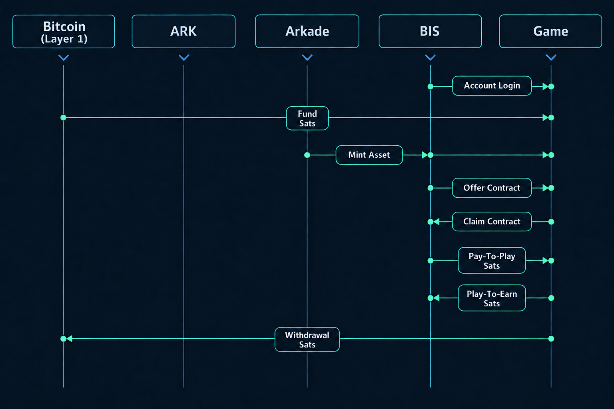

<!-- AI: This follows the Deep Dive Overview format: always show a diagram with a legend, one overview paragraph with Related Projects, and the three most important concepts. Each concept has a paragraph, a code embed, and a Learn More sentence linking to Deep Dive Details. For every documentation page, format code embeds consistently: introduce the example with a concise explanatory paragraph, leave a blank line, use the correct language fence (`ts` for TypeScript or `js` for JavaScript), keep the example focused on the public API and runnable shape, add short comments inside the code when they clarify intent, and leave a blank line before the closing fence and following prose. Use verified TypeScript terminology for BIS's public integration boundary and distinguish the game's JavaScript runtime where applicable. Keep this structure stable for future BIS/game overview updates. -->


### Legend

1. [Bitcoin](https://bitcoin.org/en/) (Layer 1) — The decentralized base layer that provides final settlement and security.
2. [Ark](https://ark-protocol.org/) (Layer 2) — An off-chain Bitcoin transaction-batching protocol for fast, low-cost payments with self-custodied exits to Layer 1.
3. [Arkade](https://arkadeos.com/) (Layer 2) — A programmable Bitcoin execution layer for wallets, payments, assets, and contracts.
4. [BIS](https://github.com/SamuelAsherRivello/blockchain-integration-service) (Integration) — A custom TypeScript/React library that connects Signet or Mutinynet Arkade workflows to a game through a small, game-neutral contract.
5. [Game](https://github.com/SamuelAsherRivello/blockchain-stealth-and-steel-game) (Application) — The custom Stealth & Steel game, which owns scenes and gameplay consequences after BIS confirms an outcome.

# Deep Dive Overview

BIS is the TypeScript/React library in this repository. Stealth & Steel is its separate JavaScript game consumer. Configured Signet and Mutinynet wallet workflows stay inside BIS; scenes, gameplay, and effect commits stay in the game. Bitcoin, Ark, and Arkade describe the underlying settlement/provider layers, not additional game interfaces.

### Related Projects

- [Stealth & Steel](https://github.com/SamuelAsherRivello/blockchain-stealth-and-steel-game): The separate JavaScript game that consumes BIS.
- [Blockchain Integration Service](https://github.com/SamuelAsherRivello/blockchain-integration-service): This repository, containing the reusable BIS library and browser demonstrations.

The shared image is a conceptual economic overview, not an API call sequence. The precise boundary is the three-part contract below. For the complete command inventory, state rules, workflow tables, and verification limits, continue to [Deep Dive Details](deep-dive-details.md).

## BIS

### 1. `BisService`

[`BisService`](../packages/integration/src/client/integration-layer/bis-service.ts) is the lifecycle-owning runtime facade for BIS workflows, UI, and cleanup. It implements the public [`IBis`](../packages/integration/src/client/integration-layer/bis.ts) surface, hydrates account state, mounts BIS-owned UI, and coordinates context, wallet, LTO, equipment, and workflow state without exposing those private implementation layers.

```ts
// Creates the lifecycle facade with a callback that retrieves the current IBisGame.
const bis: IBis = new BisService({ getBisGame });

// Waits for account state to hydrate before the game exposes wallet workflows.
await bis.readyAsync();

// Attaches BIS-owned account and wallet UI to the game-provided container.
bis.mount(container);

// Reads a copied, safe snapshot without exposing BIS's private controllers.
const snapshot = bis.getSnapshot();
```

Learn more about the full command surface, ownership boundary, and cleanup behavior in [Deep Dive Details: BisService](deep-dive-details.md#1-bisservice).

Account readiness does not await speculative reads. After activation and a render opportunity, the context prepares balance/addresses, missing Transactions, passive Contracts, and demand-eligible Assets in that order. Pages adopt current work without restarting it; Details remains non-modal. Warming is finite and memory-only, and explicit wallet operations retain live checks. Marketplace inventory, Game Wallet, and Onboarding keep their existing owners. See the [package caching policy](../packages/integration/integration-package-readme.md#accounts-caching-and-operations).

### 2. `IBis`

[`IBis`](../packages/integration/src/client/integration-layer/bis.ts) is the complete game-to-BIS public service contract. It exposes readiness, mounting, Account visibility, copied snapshots, capability checks, named continuation/reward/equipment/contract commands, and safe reset/disposal without exposing mutable services or private controllers.

```ts
interface IBis {
  // Waits for account and provider state to hydrate before workflows begin.
  readyAsync(): Promise<void>;

  // Mounts BIS-owned Account and wallet UI into the game-provided container.
  mount(container: HTMLElement): void;

  // Controls Account presentation without exposing the underlying UI controller.
  openAccountDialog(): void;
  isLoadingUIVisible(): boolean;
  showLoadingUI(): void;
  hideLoadingUI(): void;

  // Returns copied state and capability reasons safe for game-owned presentation.
  getSnapshot(): BisSnapshot;
  hasItemSupport(): boolean;
  hasAssetMintingSupport(): boolean;
  hasContractSupport(): boolean;

  // Continuation commands address facade-owned workflows by workflow ID.
  beginContinuation(request?: BisGameContinuationRequest): BisGameContinuationState;
  payContinuationAsync(workflowId: string): Promise<BisGameContinuationState>;
  checkContinuationAsync(workflowId: string): Promise<BisGameContinuationState>;
  endContinuation(workflowId: string): void;

  // Reward commands preserve financial truth separately from the game effect receipt.
  beginReward(request: BisGameRewardRequest): BisGameRewardState;
  refreshRewardAsync(workflowId: string): Promise<BisGameRewardState>;
  collectRewardAsync(workflowId: string): Promise<BisGameRewardState>;
  checkRewardAsync(workflowId: string): Promise<BisGameRewardState>;
  acknowledgeRewardAsync(workflowId: string): Promise<BisGameRewardState>;
  endReward(workflowId: string): void;

  // Equipment commands expose the public loadout projection, not private controllers.
  refreshEquipmentAsync(): Promise<BisGameEquipmentState>;
  selectEquipmentAsync(assetId: string): Promise<BisGameEquipmentState>;
  clearEquipmentAsync(family: BisGameEquipmentFamily): Promise<BisGameEquipmentState>;

  // Contract commands manage offers and recovery through the BIS-owned workflow.
  startContractAsync(request: BisContractRequest): Promise<BisContractActionResult>;
  queryContractsAsync(filter?: BisContractFilter): Promise<BisContractQueryResult>;
  checkContractsAsync(filter?: BisContractFilter): Promise<BisContractQueryResult>;
  claimContractAsync(contractId: string): Promise<BisContractActionResult>;
  rejectContractAsync(contractId: string): Promise<BisContractActionResult>;
  endContractSessionAsync(offerSessionId: string): Promise<void>;

  // Invalidates transient local work and disposes BIS-owned resources safely.
  resetForGameAsync(): Promise<BisResetResult>;
  dispose(options?: BisDisposeOptions): void;
}
```

Learn more about the public service surface, named commands, copied state, and cleanup behavior in [Deep Dive Details: IBis](deep-dive-details.md#named-game-commands).

### 3. `IBisGame`

[`IBisGame`](../packages/integration/src/client/state-layer-core/bis-game.ts) is the game-neutral callback contract that BIS uses to receive the active session, capture an opaque continuation target, apply confirmed continuation or reward effects, and deliver typed BIS events. It keeps gameplay consequences in the game while BIS remains responsible for financial truth and provider workflows. `BisGameSession` remains the supporting immutable identity carried through this contract; its details are covered in [Deep Dive Details](deep-dive-details.md#3-bisgamesession).

```ts
interface IBisGame {

  // Receives copied BIS state and lifecycle notifications through one game-owned channel.
  onBisEvent(event: BisEvent): void;

  // Identifies the current game run so BIS never delivers an outcome to a different session.
  getActiveGameSession(): BisGameSession | undefined;

  // Records the game-defined point to resume after a verified BIS operation completes.
  captureContinuationTarget(input: Readonly<{
    gameSession: BisGameSession;
  }>): BisGameContinuationTarget | undefined;

  // Applies a confirmed continuation and reports whether the game effect took place.
  applyConfirmedContinuationAsync(input: BisGameConfirmedContinuation): Promise<BisGameEffectReceipt>;

  // Presents a confirmed player reward and reports whether the game effect took place.
  presentConfirmedPlayerRewardAsync(input: BisGameConfirmedPlayerReward): Promise<BisGameEffectReceipt>;
}
```

Learn more about callbacks, stale-result protection, effect receipts, notifications, and session-bound identity in [Deep Dive Details: IBisGame](deep-dive-details.md#2-ibisgame).

## Want More Detail?

To learn more about the technical details see the [Deep Dive Details](deep-dive-details.md).
