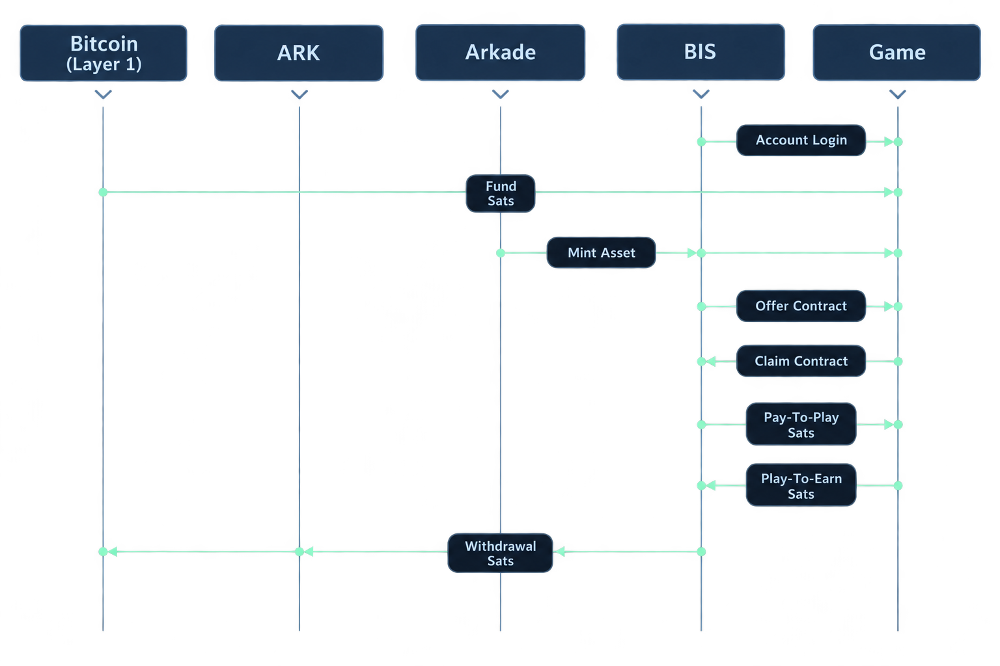
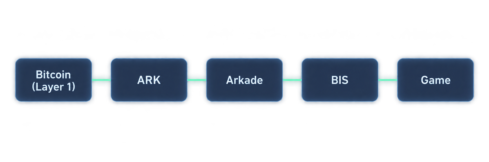

<!-- AI: These shared diagrams are stored only in BIS/documentation in the BIS repository. If they are updated, store them only there; both Deep Dive pages must keep linking to these single sources. -->
# Deep Dive





This document reviews the inner workings of the project.

This project spans 2 repos:

1. BIS Library: Reusable TypeScript/React library with Signet and Mutinynet wallet and blockchain workflow integration.
2. [Stealth & Steel Game](https://github.com/SamuelAsherRivello/stealth-and-steel-game/blob/main/STEALTH_STEEL/documentation/deep-dive.md): TypeScript example stealth-action game consuming BIS.

### Legend

1. [Bitcoin](https://bitcoin.org/en/) (Layer 1) — The decentralized base layer that provides final settlement and security.
2. [Ark](https://ark-protocol.org/) (Layer 2) — An off-chain Bitcoin transaction-batching protocol for fast, low-cost payments with self-custodied exits to Layer 1.
3. [Arkade](https://arkadeos.com/) (Layer 2) — A programmable Bitcoin execution layer for wallets, payments, assets, and contracts.
4. [BIS](https://github.com/SamuelAsherRivello/blockchain-integration-service) (Integration) — A custom TypeScript/React library that connects Signet or Mutinynet Arkade workflows to a game through a small, game-neutral contract.
5. [Game](https://github.com/SamuelAsherRivello/stealth-and-steel-game) (Application) — The custom Stealth & Steel host game, which owns scenes and gameplay consequences after BIS confirms an outcome.

---

## BIS

This repository owns the published wallet/workflow boundary. Read the Stealth & Steel Deep Dive from the first list above alongside this document to see where a verified BIS result stops and a game-owned effect begins.

### The shared showcase: `BisHostGame`

[`BisHostGame`](../packages/integration/src/client/state-layer-core/bis-host-game.ts) is the deliberately complete, protocol-neutral contract the game implements. It has exactly four clearly named methods: identify the active game session, capture an opaque continuation target, apply a confirmed continuation, and present a confirmed reward. The names trade brevity for reviewability.

```ts
interface BisHostGame {
  getActiveGameSessionReference(): BisHostGameSessionReference | undefined;
  captureContinuationTarget(input: { gameSessionReference: BisHostGameSessionReference }): BisHostGameContinuationTarget | undefined;
  applyConfirmedContinuation(input: BisHostGameConfirmedContinuation): Promise<BisHostGameEffectReceipt>;
  presentConfirmedPlayerReward(input: BisHostGameConfirmedPlayerReward): Promise<BisHostGameEffectReceipt>;
}
```

A session reference carries `gameId` and `gameSessionId`. BIS treats the continuation target as opaque. The game reports `applied`, `already-applied`, or `not-applicable`; those are effect receipts, not financial status. A stale session therefore cannot revive a new run, and an inapplicable delivery cannot charge, reverse, mint, or retry a confirmed BIS operation.

### BIS-specific showcase: `BisGameServices`

[`BisGameServices`](../packages/integration/src/client/state-layer-core/bis-game-services.ts) is the package’s lifecycle-owning facade. Its numbered comments are a concise route through the architecture:

1. The public surface is the protocol-neutral host, never Arkade.
2. Context, game wallet, LTO, and UI are assembled at one ownership boundary.
3. Account hydration remains the readiness gate.
4. Confirmed results are delivered to the host without changing financial truth.
5. Disposal runs in reverse ownership order while pending operations remain recoverable.

```ts
const services = new BisGameServices({ getGameHost });
await services.ready();
services.mount(container);
const controller = services.createContinue({ onEffectReceipt });
```

The facade intentionally composes existing controllers rather than absorbing their domain rules. Core controllers still own state, validation, persistence, and reconciliation; UI still owns presentation; Arkade adapters remain internal. That makes `BisGameServices` a stable starting point without making it a new catch-all service.
