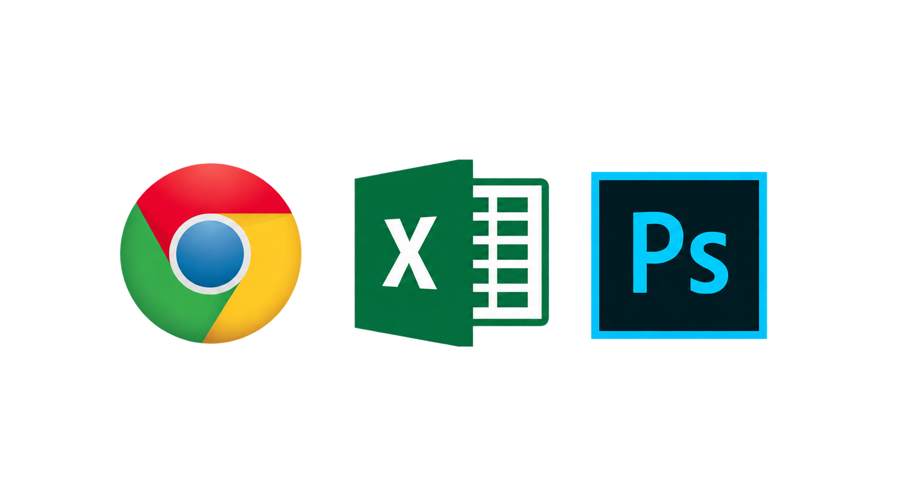
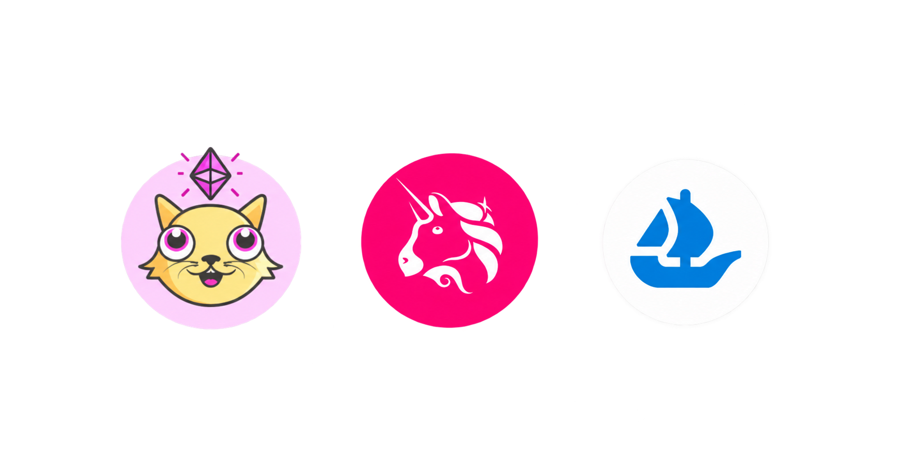
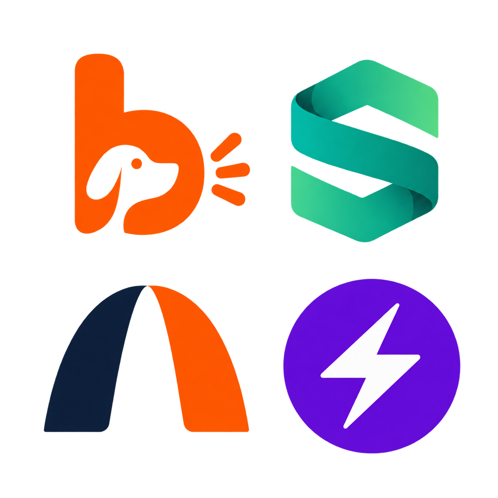
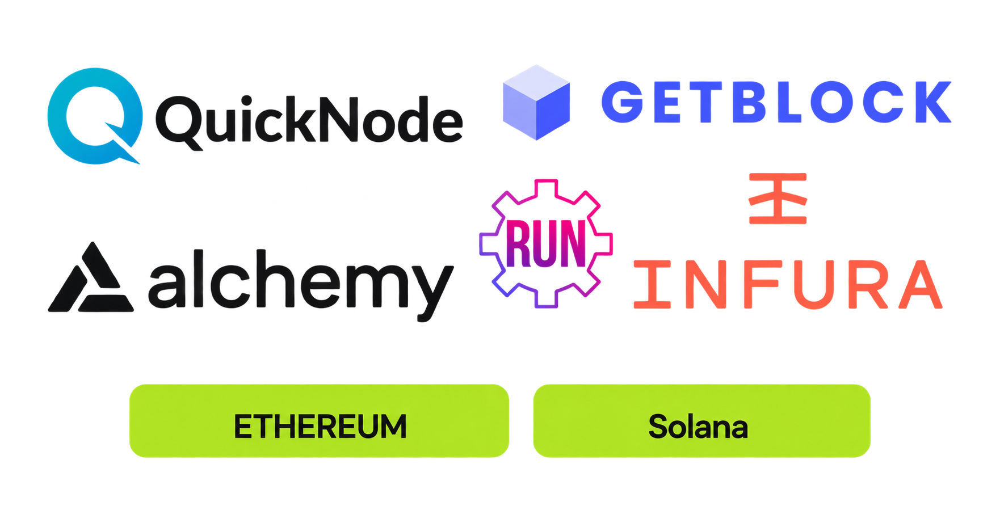
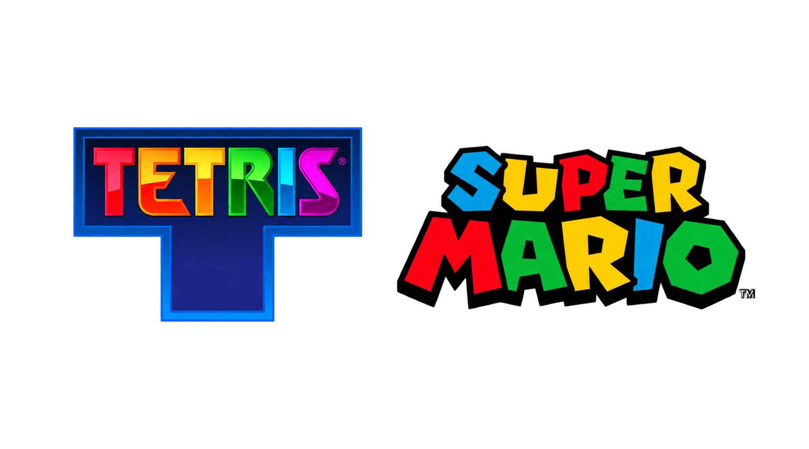
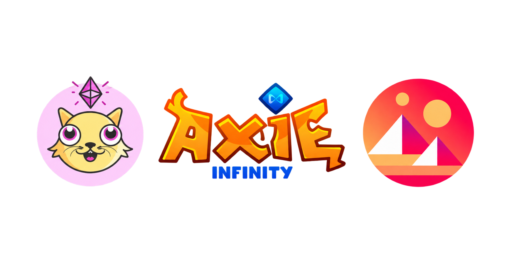
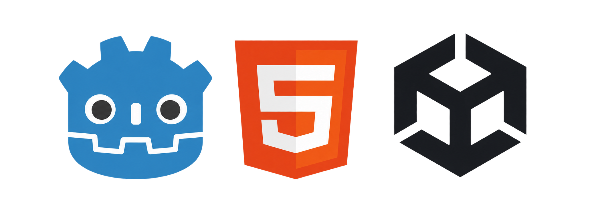
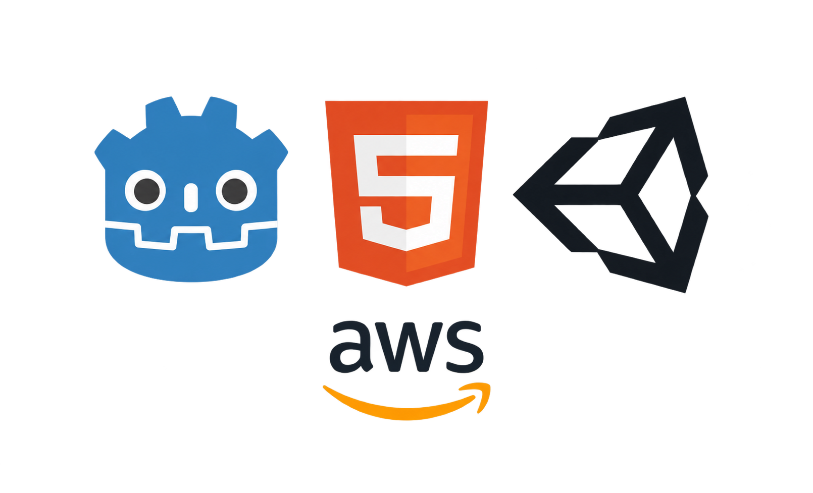
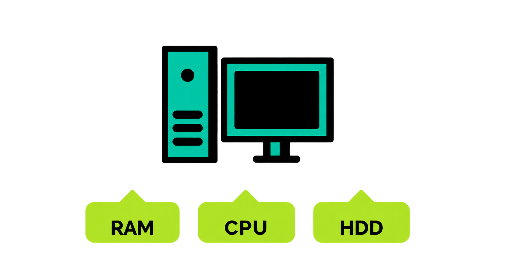
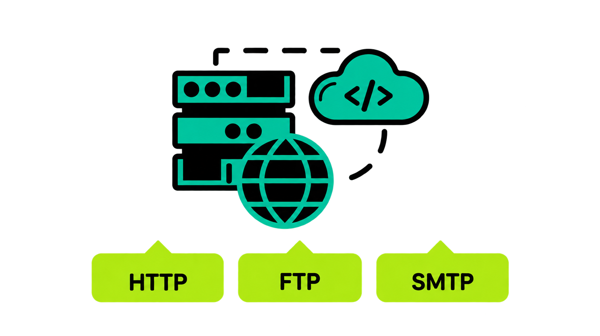

# Blockchain
## For Game Designers

---
layout: mondrian-subsection
contentSlide: 2
contentSlideId: g3e50a99ab1a_1_76
templateLayout: mondrian-subsection
catalogSlide: 2
imageTreatment: none
---

# Gaming 
## Recap

---
layout: mondrian-image-right
contentSlide: 3
contentSlideId: g3f8e096bf14_0_0
templateLayout: mondrian-image-right
catalogSlide: 14
image: ./assets/blockchain-for-game/source-slides/slide-3-gen-alpha-chart-user-2x.png
backgroundSize: 121.2%
class: slide-image-right-offset b-safe-image-right b-slide-eleven
imageTreatment: copy-upscaled
---
# Gen Alpha
## Leisure time by entertainment platform

Source: [GWI.com](https://www.gwi.com/reports/gen-alpha)
---
layout: mondrian-image-right
contentSlide: 4
contentSlideId: g3f8e096bf14_0_6
templateLayout: mondrian-image-right
catalogSlide: 14
image: ./assets/blockchain-for-game/source-slides/slide-4-global-games-market-user-2x.png
backgroundSize: contain
class: slide-image-right-offset b-safe-image-right b-slide-eleven
imageTreatment: copy-upscaled
---
# Global Games Market
## Regional market size — 2026

Source: [Newzoo.com](https://newzoo.com/articles/executive-summary-ggmr-2026-free-edition)
---
layout: mondrian-image-bottom
contentSlide: 4.1
contentSlideId: game-platform-targets
localAddition: true
templateLayout: mondrian-image-bottom
catalogSlide: 15
image: ./assets/blockchain-for-game/game-platform-targets.png
backgroundSize: contain
backgroundColor: '#050608'
imageTreatment: generated-original
---

# Where Players Play ...
#

Source: [theesa.com](https://www.theesa.com/wp-content/uploads/2025/06/2025-Essential-Facts-Booklet-05-30-25-RGB.pdf)

---
layout: mondrian-image-bottom
contentSlide: 4.2
contentSlideId: game-engine-categories
localAddition: true
templateLayout: mondrian-image-bottom
catalogSlide: 15
image: ./assets/blockchain-for-game/game-engine-categories.png
backgroundSize: contain
backgroundColor: '#050608'
imageTreatment: generated-original
---

# How Devs Create ...
#

Source: [GDC.com](https://reg.gdconf.com/state-of-game-industry-2025)

---
layout: mondrian-image-right
contentSlide: 5
contentSlideId: p16
templateLayout: mondrian-image-right
catalogSlide: 14
image: ./assets/blockchain-for-game/source-slides/slide-5-fortnite-gameplay-2x.png
backgroundSize: 120%
class: slide-image-right-offset b-safe-image-right b-slide-eleven slide-five-template-eleven
imageTreatment: copy-upscaled
---
# Essentials for Game Development
<ul class="slide-five-template-eleven__skills"><li>UI</li><li>Input</li><li>Audio</li><li>Graphics</li><li>Animation</li><li>Programming</li></ul>
---
layout: mondrian-subsection
contentSlide: 6
contentSlideId: h71ce93168c13465f_0_27
templateLayout: mondrian-subsection
catalogSlide: 2
imageTreatment: none
---

# Blockchain Gaming
## Recap

---
layout: mondrian-content
contentSlide: 7
contentSlideId: h71ce93168c13465f_0_43
templateLayout: mondrian-content
catalogSlide: 3
imageTreatment: editable-table
---

# Generations In Web

<table class="deck-table deck-table--source deck-table--generations"><colgroup><col class="deck-table__row-label" /><col /><col /><col /></colgroup><thead><tr><th></th><th>WEB 1</th><th>WEB 2</th><th>WEB 3</th></tr></thead><tbody><tr><th>APPLICATION LAYER</th><td></td><td></td><td></td></tr><tr><th>PLATFORM LAYER</th><td></td><td></td><td></td></tr><tr><th>PROTOCOL LAYER</th><td></td><td></td><td></td></tr></tbody></table>

Source: [Ethereum.org](https://ethereum.org/en/web3/)

---
layout: mondrian-content
contentSlide: 8
contentSlideId: h71ce93168c13465f_0_78
templateLayout: mondrian-content
catalogSlide: 3
imageTreatment: editable-table
---

# Generations In Games

<table class="deck-table deck-table--source deck-table--generations"><colgroup><col class="deck-table__row-label" /><col /><col /><col /></colgroup><thead><tr><th></th><th>SINGLE PLAYER</th><th>SOCIAL / MULTIPLAYER</th><th>WEB3 / METAVERSE</th></tr></thead><tbody><tr><th>GAME LAYER</th><td></td><td></td><td></td></tr><tr><th>MIDDLEWARE LAYER</th><td></td><td></td><td></td></tr><tr><th>PROTOCOL LAYER</th><td></td><td></td><td></td></tr></tbody></table>

Source: [Ethereum.org](https://ethereum.org/en/web3/)
---
layout: mondrian-content
contentSlide: 9
contentSlideId: h71ce93168c13465f_0_55
templateLayout: mondrian-content
catalogSlide: 3
imageTreatment: editable-text-table
---

# Generations In Approach

<table class="deck-table deck-table--generations"><colgroup><col class="deck-table__row-label" /><col /><col /><col /></colgroup><thead><tr><th></th><th>WEB 1</th><th>WEB 2</th><th>WEB 3</th></tr></thead><tbody><tr><th>ACCESS</th><td>Read</td><td>Read / Write</td><td>Read / Write / Execute</td></tr><tr><th>USER-CONTENT CREATION</th><td>None</td><td>Free</td><td>Incentivized</td></tr><tr><th>FOCUS</th><td>Company</td><td>Community</td><td>Individual</td></tr></tbody></table>

Source: [Ethereum.org](https://ethereum.org/en/web3/)

---
layout: mondrian-image-bottom
contentSlide: 10
contentSlideId: g3e50a99ab1a_1_9441
templateLayout: mondrian-image-bottom
catalogSlide: 15
image: ./assets/blockchain-for-game/game-loop-action-reward-expansion-2x.png
backgroundSize: 70%
imagePosition: 50% calc(50% - 22.2px)
imagePaneColor: '#1463F5'
bleedImagePaneToBottom: true
imageTreatment: generated-original-2x
---
# Game Loop
---
layout: mondrian-image-bottom
contentSlide: 11
contentSlideId: g3e50a99ab1a_1_9459
templateLayout: mondrian-image-bottom
catalogSlide: 15
image: ./assets/blockchain-for-game/game-loop-action-reward-expansion-2x.png
overlayImage: ./assets/blockchain-for-game/game-loop-runner-v1.png
backgroundSize: 70%
imagePosition: 50% calc(50% - 22.2px)
imagePaneColor: '#1463F5'
bleedImagePaneToBottom: true
imageTreatment: generated-original-2x
---
# Game Loop
---
layout: mondrian-image-bottom
contentSlide: 12
contentSlideId: g3e50a99ab1a_1_9483
templateLayout: mondrian-image-bottom
catalogSlide: 15
image: ./assets/blockchain-for-game/game-loop-blockchain-2x.png
overlayImage: ./assets/blockchain-for-game/game-loop-runner-v1.png
backgroundSize: 70%
imagePosition: calc(50% - 7.9px) calc(50% - 0.5px)
imagePaneColor: '#1463F5'
bleedImagePaneToBottom: true
imageTreatment: generated-original-2x
class: game-loop-image-slide--blockchain
---
# Game Loop: Blockchain
---
layout: mondrian-content
contentSlide: 59
contentSlideId: blockchain-benefits-kpis
localAddition: true
templateLayout: mondrian-content
catalogSlide: 3
imageTreatment: none
---

# Blockchain Benefits

Improve the player experience, game economy, community, and revenue.

Source: [MDPI.com](https://www.mdpi.com/1999-5903/14/11/321)

- Assets: Give items durable, player-linked records
- Community Boost: Support player-to-player participation
- Discovery: Surface collections and markets outside the game
- Interoperability: Enable compatible experiences where design permits
- Longevity: Extend the ecosystem beyond launch cycles
- Monetization: Create optional, player-led market opportunities

---
layout: mondrian-content
contentSlide: 59
contentSlideId: blockchain-benefits-kpis-duplicate
localAddition: true
templateLayout: mondrian-content
catalogSlide: 3
imageTreatment: none
---

# Blockchain Benefits

Stronger KPIs: Improve measurable game outcomes

 - Increase game installs
 - Increase player engagement
 - Increase player retention
 - Increase revenue

Source: [UM.edu.mt](https://www.um.edu.mt/library/oar/handle/123456789/132109)

---
layout: mondrian-subsection
contentSlide: 13
contentSlideId: h71ce93168c13465f_0_31
templateLayout: mondrian-subsection
catalogSlide: 2
imageTreatment: none
---

# Blockchain Benefits

---
layout: mondrian-content
contentSlide: 14
contentSlideId: p42
templateLayout: mondrian-content
catalogSlide: 3
imageTreatment: none
---

# What does a Blockchain game need?
<ul class="feedback-capability-list"><li>Accounts</li><li>Assets</li><li>Transfers</li><li>Contracts</li><li>Events</li></ul>

---
layout: mondrian-content
contentSlide: 14
contentSlideId: p42-duplicate
localAddition: true
templateLayout: mondrian-content
catalogSlide: 3
imageTreatment: none
---

# What does a Blockchain game need?

<ul class="feedback-capability-list"><li><strong>Accounts</strong>: Player identity and wallet connection</li><li><strong>Assets</strong>: Items and collectible ownership</li><li><strong>Transfers</strong>: Send, receive, buy, sell, or trade</li><li><strong>Contracts</strong>: Rules and transaction execution</li><li><strong>Events</strong>: Game-state synchronization</li></ul>

---
layout: mondrian-subsection
contentSlide: 16
contentSlideId: h71ce93168c13465f_0_35
templateLayout: mondrian-subsection
catalogSlide: 2
imageTreatment: none
---

# Blockchain Results

---
layout: mondrian-content
contentSlide: 17
contentSlideId: g3fb61a5d5fe_0_57
templateLayout: mondrian-content
catalogSlide: 3
imageTreatment: omit
---
# Stronger KPIs
- Increase game installs
- Increase player engagement
- Increase player retention
- Increase revenue

Source: [UM.edu.mt](https://www.um.edu.mt/library/oar/handle/123456789/132109)
---
layout: mondrian-image-left
contentSlide: 20
contentSlideId: g3e50a99ab1a_1_7776
templateLayout: mondrian-image-left
catalogSlide: 13
image: ./assets/blockchain-for-game/game-lifespan-loop-scaled.png
backgroundSize: '88.3% 88.65%'
backgroundPosition: '50% 16%'
backgroundColor: '#1463F5'
imageTreatment: user-image-upscaled
---

# Traditional game installs
Limited lifetime ...

- Game installs begin at launch
- Games have a visible end date

---
layout: mondrian-image-left
contentSlide: 21
contentSlideId: g3e50a99ab1a_1_7791
templateLayout: mondrian-image-left
catalogSlide: 13
image: ./assets/blockchain-for-game/game-lifespan-pre-launch-post.png
backgroundSize: '100% auto'
backgroundPosition: '50% 50%'
backgroundColor: '#1463F5'
imageTreatment: user-image
---

# Blockchain game installs
Extend the game ecosystem's life beyond borders.

- Players engage earlier in the ecosystem
- More players can install on launch day
- Stronger, longer tail of interest after the game's sunset

Source: [MDPI.com](https://www.mdpi.com/1999-5903/14/11/321)

---
layout: mondrian-image-left
contentSlide: 22
contentSlideId: g3e50a99ab1a_1_7819
templateLayout: mondrian-image-left
catalogSlide: 13
image: ./assets/blockchain-for-game/player-engagement-session-upscaled.png
backgroundSize: '99.65% auto'
backgroundPosition: '50% calc(50% + 0.5px)'
backgroundColor: '#1463F5'
imageTreatment: user-image-upscaled
---

# Traditional player engagement
Limited play surface ...

- The game session is one moment
- Engagement can outlive that moment

---
layout: mondrian-image-left
contentSlide: 23
contentSlideId: g3e50a99ab1a_1_7830
templateLayout: mondrian-image-left
catalogSlide: 13
image: ./assets/blockchain-for-game/player-engagement-game-session.png
backgroundSize: '100.35% auto'
backgroundPosition: 'calc(50% - 0.5px) calc(50% - 0.5px)'
backgroundColor: '#1463F5'
imageTreatment: user-image
---

# Blockchain player engagement
Variety and depth of experiences reward players.

- Player-built progression, rewards, and unlockables
- Game outcomes connect to a wider ecosystem
- Players can build lasting digital ownership

Source: [SagePub.com](https://journals.sagepub.com/doi/10.1177/1555412019898305)

---
layout: mondrian-image-left
contentSlide: 24
contentSlideId: g3e50a99ab1a_1_7854
templateLayout: mondrian-image-left
catalogSlide: 13
image: ./assets/blockchain-for-game/game-content-traditional-retention.png
backgroundSize: '100% auto'
backgroundPosition: 'calc(50% + 1.5px) calc(50% + 2.5px)'
backgroundColor: '#1463F5'
imageTreatment: user-image
---

# Traditional player retention
Content limits play ...

- Content is the traditional retention boundary

---
layout: mondrian-image-left
contentSlide: 25
contentSlideId: g3e50a99ab1a_1_7870
templateLayout: mondrian-image-left
catalogSlide: 13
image: ./assets/blockchain-for-game/game-content-network-upscaled.png
backgroundSize: '100% auto'
backgroundPosition: 'calc(50% - 0.5px) calc(50% - 0.5px)'
backgroundColor: '#1463F5'
imageTreatment: user-image-upscaled
---

# Blockchain player retention
Empower players to create, own, and trade items.

- Participation creates more recurring players
- Unique items increase value
- Rewards create unique in-game moments

Source: [UM.edu.mt](https://www.um.edu.mt/library/oar/handle/123456789/132109)

---
layout: mondrian-image-left
contentSlide: 26
contentSlideId: g3e50a99ab1a_1_7917
templateLayout: mondrian-image-left
catalogSlide: 13
image: ./assets/blockchain-for-game/revenue-opportunities-core-upscaled.png
backgroundSize: '100% auto'
backgroundPosition: '50% calc(50% + 2.5px)'
backgroundColor: '#1463F5'
imageTreatment: user-image-upscaled
---

# Traditional game revenue
Limited financials ...

- Revenue opportunities end at the game boundary

---
layout: mondrian-image-left
contentSlide: 27
contentSlideId: g3e50a99ab1a_1_7933
templateLayout: mondrian-image-left
catalogSlide: 13
image: ./assets/blockchain-for-game/revenue-opportunities-network-upscaled.png
backgroundSize: '99.8% 99%'
backgroundPosition: '50% calc(50% + 4px)'
backgroundColor: '#1463F5'
imageTreatment: user-image-upscaled
---

# Blockchain game revenue
Introduce new and improved revenue streams.

- Create secondary marketplaces for recurring revenue
- Naturally reward user-generated content (UGC)
- Expand the game economy through the wider ecosystem

Source: [ScienceDirect.com](https://www.sciencedirect.com/science/article/abs/pii/S0167923624000800)

---
layout: mondrian-subsection
contentSlide: 28
contentSlideId: h71ce93168c13465f_0_39
templateLayout: mondrian-subsection
catalogSlide: 2
imageTreatment: none
---
# Blockchain Details
---
layout: mondrian-content
contentSlide: 29
contentSlideId: p36
templateLayout: mondrian-content
catalogSlide: 3
imageTreatment: none
---
# Blockchain: Key Features

- Decentralization: Control is shared across the network
- Immutability: Records resist alteration after confirmation
- Transparency: Ledger activity is openly verifiable
- Security: Cryptography and consensus help prevent tampering

Source: [Bitcoin.org](https://bitcoin.org/bitcoin.pdf)
---
layout: mondrian-image-bottom
contentSlide: 30
contentSlideId: p37
templateLayout: mondrian-image-bottom
catalogSlide: 15
image: ./assets/blockchain-for-game/blockchain-benefits-four-card-original-transparent.png
backgroundSize: contain
imageOpacity: 1
imageScale: 1.5
imageTint: white
arrowX: 380
arrowY: 180
imageTreatment: generated-transparent
---
# The Four Pillars

Control is shared across the network

Source: [Bitcoin.org](https://bitcoin.org/bitcoin.pdf)

---
layout: mondrian-image-bottom
contentSlide: 31
contentSlideId: p37-copy-1
templateLayout: mondrian-image-bottom
catalogSlide: 15
image: ./assets/blockchain-for-game/blockchain-benefits-four-card-original-transparent.png
backgroundSize: contain
imageOpacity: 1
imageScale: 1.5
imageTint: white
arrowX: 555
arrowY: 180
imageTreatment: generated-transparent
---
# The Four Pillars

Records resist alteration after confirmation

Source: [Bitcoin.org](https://bitcoin.org/bitcoin.pdf)
---
layout: mondrian-image-bottom
contentSlide: 32
contentSlideId: p37-copy-2
templateLayout: mondrian-image-bottom
catalogSlide: 15
image: ./assets/blockchain-for-game/blockchain-benefits-four-card-original-transparent.png
backgroundSize: contain
imageOpacity: 1
imageScale: 1.5
imageTint: white
arrowX: 730
arrowY: 180
imageTreatment: generated-transparent
---
# The Four Pillars

Ledger activity is openly verifiable

Source: [Bitcoin.org](https://bitcoin.org/bitcoin.pdf)
---
layout: mondrian-image-bottom
contentSlide: 33
contentSlideId: p37-copy-3
templateLayout: mondrian-image-bottom
catalogSlide: 15
image: ./assets/blockchain-for-game/blockchain-benefits-four-card-original-transparent.png
backgroundSize: contain
imageOpacity: 1
imageScale: 1.5
imageTint: white
arrowX: 905
arrowY: 180
imageTreatment: generated-transparent
---
# The Four Pillars

Cryptography and consensus help prevent tampering

Source: [Bitcoin.org](https://bitcoin.org/bitcoin.pdf)
---
layout: mondrian-title
contentSlide: 34
contentSlideId: h71ce93168c13465f_0_17
templateLayout: mondrian-title
catalogSlide: 1
imageTreatment: none
---

# Blockchain
## Gaming Case Study: BIS

---
layout: mondrian-content
contentSlide: 35
contentSlideId: p41
templateLayout: mondrian-content
catalogSlide: 3
imageTreatment: none
---
# Blockchain Gaming: Key Features

- Decentralization: Control is shared across the network
- Immutability: Records resist alteration after confirmation
- Transparency: Ledger activity is openly verifiable
- Security: Cryptography and consensus help prevent tampering

Source: [Bitcoin.org](https://bitcoin.org/bitcoin.pdf)
---
layout: mondrian-title
contentSlide: 38
contentSlideId: g3fb61a5d5fe_0_65
templateLayout: mondrian-title
catalogSlide: 1
imageTreatment: none
---
# Blockchain & Web3
## Comparison
---
layout: mondrian-two-columns-header
contentSlide: 39
contentSlideId: g3fb61a5d5fe_0_80
templateLayout: mondrian-two-columns-header
catalogSlide: 6
imageTreatment: none
---
# Blockchain powers Web3

::left::

## Blockchain
The shared, verifiable foundation for value, identity, and state

::right::

## Web3
The application layer built on top of blockchain networks

Draft: Blockchain is the infrastructure that makes Web3 applications possible.

---
layout: mondrian-two-columns-header
contentSlide: 39
contentSlideId: g3fb61a5d5fe_0_80
templateLayout: mondrian-two-columns-header
catalogSlide: 6
imageTreatment: none
---
# The terms have diverged

::left::

## Blockchain
Often means the underlying technology: networks, consensus, and digital assets

::right::

## Web3
Often means the industry vision: products, communities, and new business models

Draft: In the industry, “blockchain” and “Web3” now overlap—but they no longer mean exactly the same thing.

---
layout: mondrian-title
contentSlide: 60
contentSlideId: bitcoin-for-games-title
localAddition: true
templateLayout: mondrian-title
catalogSlide: 1
imageTreatment: none
---

# Blockchain
## Bitcoin for Games

---
layout: mondrian-image-bottom
contentSlide: 40.5
contentSlideId: bitcoin-press-start
localAddition: true
templateLayout: mondrian-image-bottom
catalogSlide: 15
image: ./assets/blockchain-for-game/bitcoin-press-start.png
backgroundSize: contain
backgroundColor: '#050608'
imageTreatment: user-provided
---

#

---
layout: mondrian-subsection
contentSlide: 40
contentSlideId: g3fb61a5d5fe_0_75
templateLayout: mondrian-subsection
catalogSlide: 2
imageTreatment: none
---

# Bitcoin
## The Best Money

---
layout: mondrian-quote
templateLayout: mondrian-quote
catalogSlide: 11
imageTreatment: none
---

# “There is no second best.”

— [Michael Saylor](https://www.youtube.com/watch?v=S3T4nhtHxOA)  
CEO, Strategy

---
layout: mondrian-fact
templateLayout: mondrian-fact
catalogSlide: 12
imageTreatment: none
---

# Bitcoin has outperformed <i>every</i> stock index, bond index, and commodity.

### 76% annualized 10-year return (2024)

Source: [Invesco.com](https://www.invesco.com/content/dam/invesco/emea/en/pdf/exploring-cryptocurrencies-2025.pdf)

---
layout: mondrian-quote
templateLayout: mondrian-quote
catalogSlide: 11
imageTreatment: none
---

# 

# “Bitcoin is a technical tour de force.”

— [Bill Gates](https://bitcoin-institute.pages.dev/entries/aftermath/2013-05-06-bill-gates-bitcoin-technical-tour-de-force/)  
Co-founder, Microsoft

---
layout: mondrian-fact
templateLayout: mondrian-fact
catalogSlide: 12
imageTreatment: none
---

# Bitcoin secures a new block every 10 minutes. 

## 24/7. 365. Never Hacked. 

Source: [Bitcoin.org](https://developer.bitcoin.org/devguide/block_chain.html)

---
layout: mondrian-quote
templateLayout: mondrian-quote
catalogSlide: 11
imageTreatment: none
---

# “Bitcoin changes absolutely everything.”

— [Jack Dorsey](https://archive.hrf.org/alex-gladstein-interviews-square-and-twitter-ceo-jack-dorsey/)  
Co-founder, Twitter and Block

---
layout: mondrian-fact
templateLayout: mondrian-fact
catalogSlide: 12
imageTreatment: none
---

# 21 million BTC

## No one can "print" more.

Bitcoin’s digital cap provides absolute scarcity. 

Source: [Bitcoin.org](https://bitcoin.org/en/faq)

---
layout: mondrian-quote
templateLayout: mondrian-quote
catalogSlide: 11
imageTreatment: none
---

# “Bitcoin is probably rat poison squared.”

— [Warren Buffett](https://buffett.cnbc.com/video/2018/05/05/munger-on-trading-cryptocurrencies-its-just-dementia.html)  
Director, Berkshire Hathaway Investments · 2018

---
layout: mondrian-fact
templateLayout: mondrian-fact
catalogSlide: 12
imageTreatment: none
---

# In 7 weeks

## Bitcoin IBIT becomes the fastest ETF <i>ever</i>
## to reach $10 billion in assets.

Source: [ETF.com](https://www.etf.com/sections/news/blackrocks-ibit-hits-10b-faster-any-other-etf)

---
layout: mondrian-quote
templateLayout: mondrian-quote
catalogSlide: 11
imageTreatment: none
---

# “Bitcoin is going to zero.”

— [Peter Schiff](https://www.benzinga.com/markets/cryptocurrency/23/02/30961211/bitcoin-will-go-to-0-but-the-ride-is-not-going-to-be-a-straight-line-peter-schiff-says)  
Chief, Euro Pacific Asset Management · 2023

---
layout: mondrian-fact
templateLayout: mondrian-fact
catalogSlide: 12
imageTreatment: none
---

# Bitcoin is ...

## Borderless, permissionless,
## censorship-resistant, and peer-to-peer.

Source: [Bitcoin.org](https://bitcoin.org/bitcoin.pdf)

---
layout: mondrian-quote
templateLayout: mondrian-quote
catalogSlide: 11
imageTreatment: none
---

# “Bitcoin is a pet rock.”

— [Jamie Dimon](https://fortune.com/2024/01/17/jamie-dimon-bitcoin-davos-pet-rock-jpmorgan-blackrock-larry-fink-crypto/)  
CEO, JPMorgan Chase · 2024

---
layout: mondrian-fact
templateLayout: mondrian-fact
catalogSlide: 12
imageTreatment: none
---

# JPMorgan reports $355.7M IBIT position

— [CoinDesk](https://www.coindesk.com/markets/2026/08/13/jpmorgan-grows-bitcoin-etf-stake-to-356m-adds-xrp-exposure) · 2026

---
layout: mondrian-fact
templateLayout: mondrian-fact
catalogSlide: 12
imageTreatment: none
---

# JPMorgan to accept Bitcoin ETFs as loan collateral

— [Bloomberg](https://news.bloomberglaw.com/private-equity/jpmorgan-plans-to-offer-clients-financing-against-crypto-etfs) · 2025

---
layout: mondrian-fact
templateLayout: mondrian-fact
catalogSlide: 12
imageTreatment: none
---

# JPMorgan opens Bitcoin-backed institutional lending

— [Bitcoin Foundation](https://bitcoinfoundation.org/news/bitcoin/jpmorgan-opens-bitcoin-backed-lending-as-wall-street-pushes-deeper-into-crypto/) · 2026

---
layout: mondrian-quote
contentSlide: 39.1
contentSlideId: bitcoin-gaming-volatility-response
templateLayout: mondrian-quote
catalogSlide: 11
imageTreatment: none
---

## Q: Too volatile?

# A: Price in fiat. Settle in sats.

— [Receiving payments](https://docs.strike.me/walkthrough/receiving-payments/) · 2026

---
layout: mondrian-quote
contentSlide: 39.2
contentSlideId: bitcoin-gaming-speed-response
templateLayout: mondrian-quote
catalogSlide: 11
imageTreatment: none
---

## Q: Too slow?

# A: Layer 2 delivers sats in milliseconds to seconds.

— [Transactions for the Future](https://lightning.network/post/first/) · 2016

---
layout: mondrian-quote
contentSlide: 39.3
contentSlideId: bitcoin-gaming-flexibility-response
templateLayout: mondrian-quote
catalogSlide: 11
imageTreatment: none
---

## “Too inflexible?”

# Arkade moves in-game currency, items, NFTs, and more.

— [Ark Protocol](https://ark-protocol.org/) · 2026

---
layout: mondrian-subsection
contentSlide: 40
contentSlideId: g3fb61a5d5fe_0_75
templateLayout: mondrian-subsection
catalogSlide: 2
imageTreatment: none
---

# Bitcoin
## The Best For Gaming

---
layout: mondrian-image-left
contentSlide: 39.9
contentSlideId: bitcoin-layers-city-block
localAddition: true
templateLayout: mondrian-image-left
catalogSlide: 13
image: ./assets/blockchain-for-game/confused-searching-stick-figure.png
backgroundSize: 'auto 100%'
backgroundPosition: '50% 50%'
backgroundColor: '#f4f1e9'
imageTreatment: generated-original
---

# So where is the Bitcoin gaming?

<!--
The illustration is supplied by the left image pane.
-->

---
layout: mondrian-image-left
contentSlide: 39.9
contentSlideId: bitcoin-layers-city-block
localAddition: true
templateLayout: mondrian-image-left
catalogSlide: 13
image: ./assets/blockchain-for-game/internet-adoption-panel-1.png
backgroundSize: '100% auto'
backgroundPosition: '50% 50%'
backgroundColor: '#f4f1e9'
imageTreatment: generated-original
---

#

<!--
The illustration is supplied by the left image pane.
-->

---
layout: mondrian-image-left
contentSlide: 39.9
contentSlideId: bitcoin-layers-city-block
localAddition: true
templateLayout: mondrian-image-left
catalogSlide: 13
image: ./assets/blockchain-for-game/internet-adoption-panel-2.png
backgroundSize: '100% auto'
backgroundPosition: '50% 50%'
backgroundColor: '#f4f1e9'
imageTreatment: generated-original
---

#

<!--
The illustration is supplied by the left image pane.
-->

---
layout: mondrian-image-left
contentSlide: 39.9
contentSlideId: bitcoin-layers-city-block
localAddition: true
templateLayout: mondrian-image-left
catalogSlide: 13
image: ./assets/blockchain-for-game/internet-adoption-panel-3.png
backgroundSize: '100% auto'
backgroundPosition: '50% 50%'
backgroundColor: '#f4f1e9'
imageTreatment: generated-original
---

#

<!--
The illustration is supplied by the left image pane.
-->

---
layout: mondrian-image-left
contentSlide: 39.9
contentSlideId: bitcoin-layers-city-block
localAddition: true
templateLayout: mondrian-image-left
catalogSlide: 13
image: ./assets/blockchain-for-game/internet-adoption-panel-4.png
backgroundSize: '100% auto'
backgroundPosition: '50% 50%'
backgroundColor: '#f4f1e9'
imageTreatment: generated-original
---

#

<!--
The illustration is supplied by the left image pane.
-->

---
layout: mondrian-image-left
contentSlide: 39.9
contentSlideId: bitcoin-layers-city-block
localAddition: true
templateLayout: mondrian-image-left
catalogSlide: 13
image: ./assets/blockchain-for-game/internet-adoption-panel-2.png
backgroundSize: '100% auto'
backgroundPosition: '50% 50%'
backgroundColor: '#f4f1e9'
imageTreatment: generated-original
---

#

<!--
The illustration is supplied by the left image pane.
-->

---
layout: mondrian-image-left
contentSlide: 39.9
contentSlideId: bitcoin-layers-city-block
localAddition: true
templateLayout: mondrian-image-left
catalogSlide: 13
image: ./assets/blockchain-for-game/bitcoin-adoption-panel-3.png
backgroundSize: 'auto 90%'
backgroundPosition: '50% 50%'
backgroundColor: '#f4f1e9'
imageTreatment: generated-original
---

#

<!--
The illustration is supplied by the left image pane.
-->

---
layout: mondrian-image-left
contentSlide: 39.9
contentSlideId: bitcoin-layers-city-block
localAddition: true
templateLayout: mondrian-image-left
catalogSlide: 13
image: ./assets/blockchain-for-game/bitcoin-adoption-panel-3.png
backgroundSize: 'auto 90%'
backgroundPosition: '50% 50%'
backgroundColor: '#f4f1e9'
imageTreatment: generated-original
---

# It is 
# early.

<!--
The illustration is supplied by the left image pane.
-->

---
layout: mondrian-image-left
contentSlide: 39.9
contentSlideId: bitcoin-layers-city-block
localAddition: true
templateLayout: mondrian-image-left
catalogSlide: 13
image: ./assets/blockchain-for-game/bitcoin-layers-city-block-2160x3840.png
backgroundSize: 'auto 100%'
backgroundPosition: '50% 50%'
backgroundColor: '#f4f1e9'
imageTreatment: generated-original
---

# New 
# York City
- Layer 3: Company
- Layer 2: Skyscraper
- Layer 1: Granite bedrock

  
Bitcoin is like investing in Manhattan.  – [Michael Saylor](https://decrypt.co/297075/buying-bitcoin-microstrategy-michael-saylor) (CEO, Strategy)

<!--
The illustration is supplied by the left image pane.
-->

---
layout: mondrian-image-left
contentSlide: 39.91
contentSlideId: bitcoin-layers-city-block-duplicate
localAddition: true
templateLayout: mondrian-image-left
catalogSlide: 13
image: ./assets/blockchain-for-game/bitcoin-layers-city-block-2160x3840.png
backgroundSize: 'auto 100%'
backgroundPosition: '50% 50%'
backgroundColor: '#f4f1e9'
imageTreatment: generated-original
---

# Commerce 
# Layers
- Layer 3: Company
- Layer 2: Skyscraper
- Layer 1: Granite bedrock

<!--
The illustration is supplied by the left image pane.
-->

---
layout: mondrian-image-left
contentSlide: 39.91
contentSlideId: bitcoin-layers-city-block-duplicate
localAddition: true
templateLayout: mondrian-image-left
catalogSlide: 13
image: ./assets/blockchain-for-game/bitcoin-layers-city-block-2160x3840.png
backgroundSize: 'auto 100%'
backgroundPosition: '50% 50%'
backgroundColor: '#f4f1e9'
imageTreatment: generated-original
---

# Bitcoin 
# Layers
- Layer 3: Applications
- Layer 2: Sidechains, channels
- Layer 1: Settlement, security

---
layout: mondrian-image-left
contentSlide: 39.91
contentSlideId: bitcoin-layers-city-block-duplicate
localAddition: true
templateLayout: mondrian-image-left
catalogSlide: 13
image: ./assets/blockchain-for-game/bitcoin-layers-city-block-2160x3840.png
backgroundSize: 'auto 100%'
backgroundPosition: '50% 50%'
backgroundColor: '#f4f1e9'
imageTreatment: generated-original
---

# Bitcoin 
# Layers
- Layer 3: Applications
  - Use Bitcoin for family (Cross-border with <FocusedLink href="https://strike.me/" name="Strike" message="An example of mass-market ease of use and polish." tone="orange">Strike</FocusedLink>)  
  - Use Bitcoin for opportunity (Loans with Ledn)
- Layer 2: Side-chains, channels
  - Make Bitcoin faster (Sub-second via Lightning)
  - Make Bitcoin more flexible (Confidential via Liquid)
- Layer 1: Settlement, security
  - Send Bitcoin through time (2020 → 2120)
  - Send Bitcoin through space (NYC → Tokyo)

---
layout: mondrian-content
contentSlide: 42
contentSlideId: g3fb61a5d5fe_0_101
templateLayout: mondrian-content
catalogSlide: 3
imageTreatment: editable-table
---

# Bitcoin Layers

<table class="deck-table deck-table--layers"><thead><tr><th>Layer</th><th>Pros</th><th>Cons</th></tr></thead><tbody><tr><th>Layer 3</th><td>Easy to use Rich features Mainstream potential</td><td>Early stage Depends on lower layers</td></tr><tr><th>Layer 2</th><td>Improved scaling Faster, lower-fee payments</td><td>Security tradeoffs Complex for new users</td></tr><tr><th>Layer 1</th><td>High security Decentralized Well-established</td><td>Limited scaling Slower, higher fees</td></tr></tbody></table>

Source: [Lightning.engineering](https://docs.lightning.engineering/the-lightning-network/)
---
layout: mondrian-content
contentSlide: 43
contentSlideId: h5a9ba4b51e017a3d_3_0
templateLayout: mondrian-content
catalogSlide: 3
imageTreatment: editable-table
---

# For Gaming

<table class="deck-table deck-table--layers deck-table--gaming"><thead><tr><th>Layer</th><th>Game advantage</th><th>Design consideration</th></tr></thead><tbody><tr><th>Layer 3</th><td>Player-facing features Game-specific experiences</td><td>Tools are still evolving Depends on lower layers</td></tr><tr><th>Layer 2</th><td>Fast, lower-fee player actions Better in-game cadence</td><td>Integration and custody tradeoffs New-user complexity</td></tr><tr><th>Layer 1</th><td>High-assurance ownership Decentralized settlement</td><td>Limited scaling Slower, higher-fee actions</td></tr></tbody></table>

Source: [Lightning.engineering](https://docs.lightning.engineering/the-lightning-network/)

---
layout: mondrian-subsection
contentSlide: 40
contentSlideId: g3fb61a5d5fe_0_75
templateLayout: mondrian-subsection
catalogSlide: 2
imageTreatment: none
---

# Bitcoin Ecosystem
## Layer 2

---
layout: mondrian-content
contentSlide: 58
contentSlideId: local-bitcoin-ecosystem-table-of-contents
localAddition: true
templateLayout: mondrian-content
catalogSlide: 4
catalogExample: 2
class: toc-template
imageTreatment: none
---
# Bitcoin Ecosystem

<table class="deck-table deck-table--layers deck-table--ecosystem"><thead><tr><th>Name</th><th>Description</th></tr></thead><tbody><tr><th><a href="https://lightning.network/">Lightning Network</a></th><td>Instant low-fee Bitcoin payments</td></tr><tr><th><a href="https://liquid.net/">Liquid</a></th><td>Confidential Bitcoin asset sidechain</td></tr><tr><th><a href="https://bitcoin.org/">Taproot</a></th><td>Layer 1 privacy and smart-contract flexibility</td></tr><tr><th><a href="https://ark-protocol.org/">Ark Protocol</a></th><td>Off-chain scalable Bitcoin payments</td></tr><tr><th><a href="https://arkadeos.com/">Arkade</a></th><td>Developer tools for Ark</td></tr></tbody></table>

---
layout: mondrian-subsection
contentSlide: 44
contentSlideId: g3fb61a5d5fe_0_32
templateLayout: mondrian-subsection
catalogSlide: 2
imageTreatment: none
---
# Lightning
## Bitcoin Ecosystem
---
layout: mondrian-content
contentSlide: 45
contentSlideId: g3fb61a5d5fe_0_37
templateLayout: mondrian-content
catalogSlide: 3
imageTreatment: none
---

# Lightning Network
## Layer 2
A decentralized network to enable instant payments.

- Participants update balances in bidirectional payment channels
- The latest agreed channel state can be enforced on-chain
- High-volume, high-speed payments remain anchored to Bitcoin

Source: [Lightning.network](https://lightning.network/)

---
layout: mondrian-image-bottom
contentSlide: 46
contentSlideId: bitcoin-lightning-network-infographic
templateLayout: mondrian-image-bottom
catalogSlide: 15
image: ./assets/blockchain-for-game/bitcoin-lightning-network.png
backgroundSize: contain
backgroundColor: '#050608'
imageTreatment: generated-infographic
---
---
layout: mondrian-subsection
contentSlide: 47
contentSlideId: g3fb61a5d5fe_0_44
templateLayout: mondrian-subsection
catalogSlide: 2
imageTreatment: none
---
# Liquid
## Bitcoin Ecosystem
---
layout: mondrian-content
contentSlide: 48
contentSlideId: g3fb61a5d5fe_0_49
templateLayout: mondrian-content
catalogSlide: 3
imageTreatment: none
---

# Liquid Network
## Layer 2
A sidechain for confidential payments, assets, and smart contracts.

- Confidential transactions hide asset types and amounts from third parties
- Issued assets can represent digital collectibles and reward points
- The tradeoff is a federated trust model

Source: [Liquid.net](https://docs.liquid.net/docs/liquid-features-and-benefits)

---
layout: mondrian-image-bottom
contentSlide: 49
contentSlideId: bitcoin-liquid-layer-2-infographic
templateLayout: mondrian-image-bottom
catalogSlide: 15
image: ./assets/blockchain-for-game/bitcoin-liquid-layer-2.png
backgroundSize: contain
backgroundColor: '#050608'
imageTreatment: generated-infographic
---
---
layout: mondrian-subsection
contentSlide: 50
contentSlideId: g3e50a99ab1a_1_11981
templateLayout: mondrian-subsection
catalogSlide: 2
imageTreatment: none
---
# Taproot
## Bitcoin Ecosystem
---
layout: mondrian-content
contentSlide: 51
contentSlideId: g3fb61a5d5fe_0_26
templateLayout: mondrian-content
catalogSlide: 3
imageTreatment: none
---

# Taproot
## Layer 1
Makes transactions smarter, more private, and more efficient.

- Simple cooperative payments stay compact
- Advanced conditions reveal only what’s needed
- Built on modern Schnorr signature technology

Source: [GitHub.com](https://github.com/bitcoin/bips/blob/master/bip-0341.mediawiki)

---
layout: mondrian-image-bottom
contentSlide: 52
contentSlideId: bitcoin-taproot-infographic
templateLayout: mondrian-image-bottom
catalogSlide: 15
image: ./assets/blockchain-for-game/bitcoin-taproot.png
backgroundSize: contain
backgroundColor: '#050608'
imageTreatment: generated-infographic
---
---
layout: mondrian-subsection
contentSlide: 53
contentSlideId: g3fb61a5d5fe_0_0
templateLayout: mondrian-subsection
catalogSlide: 2
imageTreatment: none
---
# Ark
## Bitcoin Ecosystem
---
layout: mondrian-two-columns-header
contentSlide: 54
contentSlideId: g3fb61a5d5fe_0_18
templateLayout: mondrian-two-columns-header
catalogSlide: 6
imageTreatment: none
---

# Ark Protocol
## Layer 2
::left::

## About

A layer 2 for low-cost, high-speed transactions.

::right::

## Details

- Transfers: Low-cost off-chain payments
- Model: Bitcoin-like UTXO design
- Setup: No payment channels required

::bottom::

Source: [Ark-protocol.org](https://ark-protocol.org/)

---
layout: mondrian-image-bottom
contentSlide: 55
contentSlideId: bitcoin-ark-protocol-infographic
templateLayout: mondrian-image-bottom
catalogSlide: 15
image: ./assets/blockchain-for-game/bitcoin-ark-protocol.png
backgroundSize: contain
backgroundColor: '#050608'
imageTreatment: generated-infographic
---
---
layout: mondrian-subsection
contentSlide: 56
contentSlideId: arkade-subsection
templateLayout: mondrian-subsection
catalogSlide: 2
imageTreatment: none
---
# Arkade
## Bitcoin Ecosystem
---
layout: mondrian-two-columns-header
contentSlide: 57
contentSlideId: arkade-protocol
templateLayout: mondrian-two-columns-header
catalogSlide: 6
class: arkade-protocol-spacing
imageTreatment: none
---

# Arkade Execution Engine
## Layer 2

::left::

## About

A programmable extension for financial applications.

::right::

## Details

- Toolkit: Payments, swaps, assets, contracts
- Bitcoin: Uses scripts and confirmations
- Recovery: Users exit to Bitcoin

::bottom::

Source: [Arkadeos.com](https://arkadeos.com/)

---
layout: mondrian-content
contentSlide: 14
contentSlideId: p42
templateLayout: mondrian-content
catalogSlide: 3
imageTreatment: none
---

# What does a Blockchain game need?
<ul class="feedback-capability-list"><li>Accounts</li><li>Assets</li><li>Transfers</li><li>Contracts</li><li>Events</li></ul>

---
layout: mondrian-content
contentSlide: 14
contentSlideId: p42-duplicate
localAddition: true
templateLayout: mondrian-content
catalogSlide: 3
imageTreatment: none
---

# What does a Blockchain game need?

<ul class="feedback-capability-list"><li><strong>Accounts</strong>: Player identity and wallet connection</li><li><strong>Assets</strong>: Items and collectible ownership</li><li><strong>Transfers</strong>: Send, receive, buy, sell, or trade</li><li><strong>Contracts</strong>: Rules and transaction execution</li><li><strong>Events</strong>: Game-state synchronization</li></ul>

---
layout: mondrian-content
contentSlide: 14
contentSlideId: p42-duplicate
localAddition: true
templateLayout: mondrian-content
catalogSlide: 3
imageTreatment: none
---

# What does Arkade OS provide?

<ul class="feedback-capability-list"><li><strong>Accounts</strong>: Create a new player account in seconds</li><li><strong>Assets</strong>: Deliver an in-game power-up instantly</li><li><strong>Transfers</strong>: Send sats to a player in seconds</li><li><strong>Contracts</strong>: Resolve game rules in under a second</li><li><strong>Events</strong>: Sync game state instantly</li></ul>

<em>Each operation runs at Arkade’s off-chain execution speed, not Bitcoin Layer 1 block time</em>

<strong>Funding from Bitcoin Layer 1 and settlement back to Layer 1 follow traditional Bitcoin timing, about 10 minutes per block and roughly 60 minutes for finality</strong>

Source: <FocusedLink href="https://docs.arkadeos.com/" name="Arkade Documentation" message="Official Arkade developer documentation." tone="orange" mode="direct">docs.arkadeos.com</FocusedLink>

---
layout: mondrian-content
contentSlide: 14
contentSlideId: p42-duplicate
localAddition: true
templateLayout: mondrian-content
catalogSlide: 3
imageTreatment: none
---

# What does Arkade OS provide?

<ul class="feedback-capability-list"><li><strong>Accounts</strong>: Create a new player account in seconds</li><li><strong>Assets</strong>: Deliver an in-game power-up instantly</li><li><strong>Transfers</strong>: Send sats to a player in seconds</li><li><strong>Contracts</strong>: Resolve game rules in under a second</li><li><strong>Events</strong>: Sync game state instantly</li></ul>

<em>Each operation runs at Arkade’s off-chain execution speed, not Bitcoin Layer 1 block time</em>

<strong>Funding from Bitcoin Layer 1 and settlement back to Layer 1 follow traditional Bitcoin timing, about 10 minutes per block and roughly 60 minutes for finality</strong>

Source: <FocusedLink href="https://docs.arkadeos.com/" name="Arkade Documentation" message="Official Arkade developer documentation." tone="orange" mode="direct">docs.arkadeos.com</FocusedLink>

---
layout: mondrian-content
contentSlide: 14
contentSlideId: arkade-official-projects
localAddition: true
templateLayout: mondrian-content
catalogSlide: 3
imageTreatment: none
---

# Arkade Ecosystem
## The tech

<table class="deck-table deck-table--ecosystem"><thead><tr><th>Name</th><th>Description</th></tr></thead><tbody><tr><th><a href="https://github.com/arkade-os/compiler">Arkade Compiler</a></th><td>Smart-contract language compiler</td></tr><tr><th><a href="https://github.com/arkade-os/demos">Arkade Demos</a></th><td>Example Arkade integrations</td></tr><tr><th><a href="https://github.com/arkade-os/arkade-wdk">Arkade WDK</a></th><td>Wallet development kit integration</td></tr><tr><th><a href="https://github.com/arkade-os/arkd">arkd</a></th><td>Arkade operator backend services</td></tr><tr><th><a href="https://github.com/arkade-os/go-sdk">Go SDK</a></th><td>Go wallet developer SDK</td></tr><tr><th><a href="https://github.com/arkade-os/rust-sdk">Rust SDK</a></th><td>Rust wallet development crates</td></tr><tr><th><a href="https://github.com/arkade-os/tapscripts">Tapscripts</a></th><td>Tapscript contract examples</td></tr><tr><th><a href="https://github.com/ArkLabsHQ/wallet-sdk">TypeScript SDK</a></th><td>TypeScript wallet developer SDK</td></tr></tbody></table>

---
layout: mondrian-content
contentSlide: 14
contentSlideId: arkade-apps-using-ark
localAddition: true
templateLayout: mondrian-content
catalogSlide: 3
imageTreatment: none
---

# Arkade Ecosystem
## Apps using the tech

<table class="deck-table deck-table--ecosystem"><thead><tr><th>Name</th><th>Description</th></tr></thead><tbody><tr><th><a href="https://github.com/ArkLabsHQ/arkade-explorer">Arkade Explorer</a></th><td>Browse Arkade network activity</td></tr><tr><th><a href="https://github.com/arkade-os/wallet">Arkade Wallet</a></th><td>Self-custodial Bitcoin wallet</td></tr><tr><th><a href="https://github.com/ArkLabsHQ/btcpay-arkade">BTCPay Arkade</a></th><td>Merchant Bitcoin payments plugin</td></tr><tr><th><a href="https://github.com/IsaqueFranklin/Byzantium-wallet-web">Byzantium Wallet</a></th><td>Experimental Arkade web wallet</td></tr><tr><th><a href="https://github.com/ArkLabsHQ/coinflip">Coinflip Game</a></th><td>Provably fair Bitcoin game</td></tr><tr><th><a href="https://faucet.mutinynet.com/">MutinyNet Faucet</a></th><td>MutinyNet test-sats faucet</td></tr></tbody></table>
