# Blockchain For Gaming
## A practical recap of games, blockchain, and the Bitcoin ecosystem
---
layout: mondrian-subsection
contentSlide: 2
contentSlideId: g3e50a99ab1a_1_76
templateLayout: mondrian-subsection
catalogSlide: 2
imageTreatment: none
---
# Gaming Recap
---
layout: mondrian-image-right
contentSlide: 3
contentSlideId: g3f8e096bf14_0_0
templateLayout: mondrian-image-right
catalogSlide: 10
image: ./assets/blockchain-for-game/source-slides/slide-3-gen-alpha-chart-user-2x.png
backgroundSize: contain
class: slide-image-right-offset b-safe-image-right b-slide-eleven
imageTreatment: copy-upscaled
---
# Gen Alpha
## Leisure time by entertainment platform
---
layout: mondrian-image-right
contentSlide: 4
contentSlideId: g3f8e096bf14_0_6
templateLayout: mondrian-image-right
catalogSlide: 10
image: ./assets/blockchain-for-game/source-slides/slide-4-global-games-market-user-2x.png
backgroundSize: contain
class: slide-image-right-offset b-safe-image-right b-slide-eleven
imageTreatment: copy-upscaled
---
# Global Games Market
## Regional market size — 2026
---
layout: mondrian-image-right
contentSlide: 5
contentSlideId: p16
templateLayout: mondrian-image-right
catalogSlide: 10
image: ./assets/blockchain-for-game/source-slides/slide-5-fortnite-gameplay-2x.png
backgroundSize: 120%
class: slide-image-right-offset b-safe-image-right b-slide-eleven slide-five-template-eleven
imageTreatment: copy-upscaled
---
# Essentials for Game Development
<ul class="slide-five-template-eleven__skills"><li>UI</li><li>Input</li><li>Audio</li><li>Graphics</li><li>Animation</li><li>Programming</li></ul>
---
layout: mondrian-subsection
contentSlide: 6
contentSlideId: h71ce93168c13465f_0_27
templateLayout: mondrian-subsection
catalogSlide: 2
imageTreatment: none
---
# Blockchain Gaming Recap
---
layout: mondrian-content
contentSlide: 7
contentSlideId: h71ce93168c13465f_0_43
templateLayout: mondrian-content
catalogSlide: 3
imageTreatment: editable-table
---

# Generations In Web

<table class="deck-table deck-table--source"><thead><tr><th></th><th>WEB 1</th><th>WEB 2</th><th>WEB 3</th></tr></thead><tbody><tr><th>APPLICATION LAYER</th><td>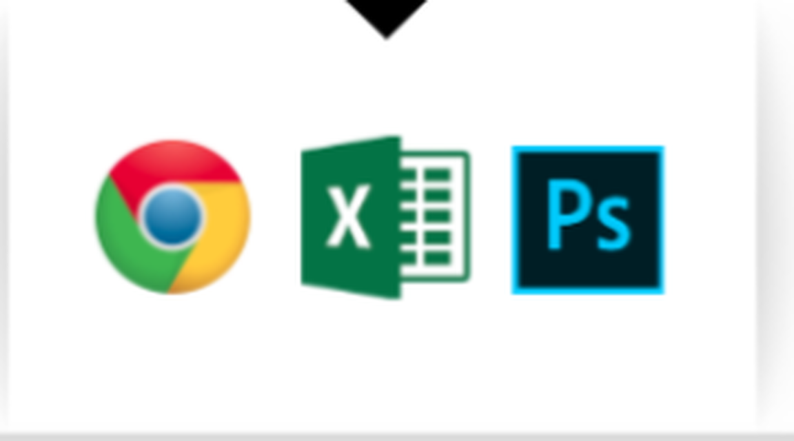</td><td>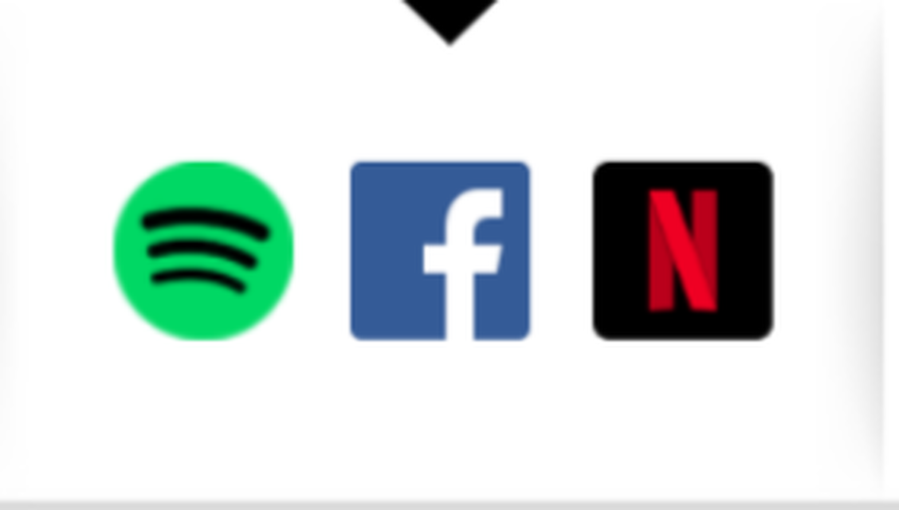</td><td>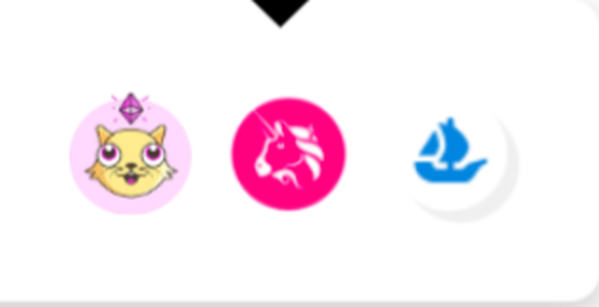</td></tr><tr><th>PLATFORM LAYER</th><td>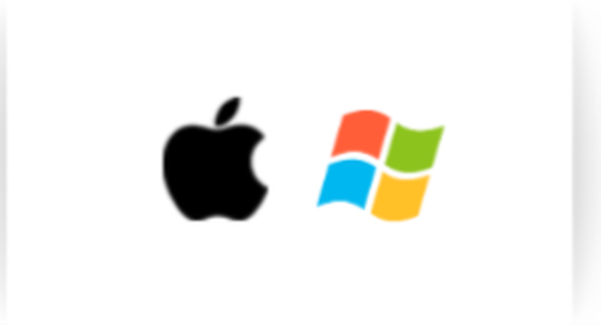</td><td></td><td>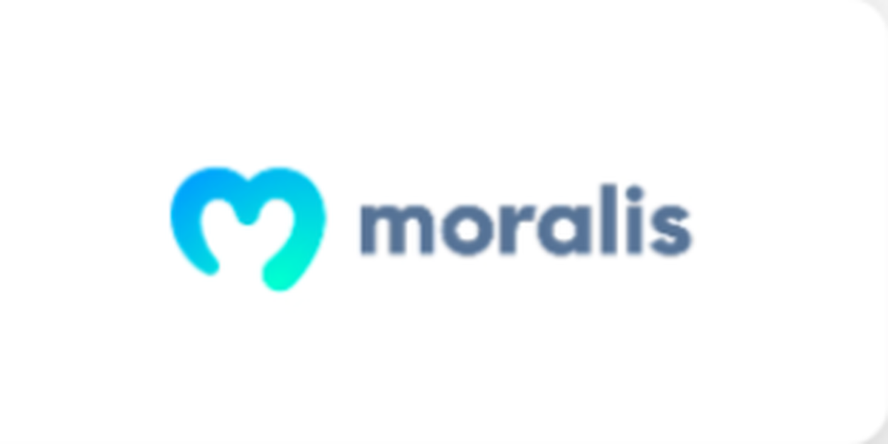</td></tr><tr><th>PROTOCOL LAYER</th><td>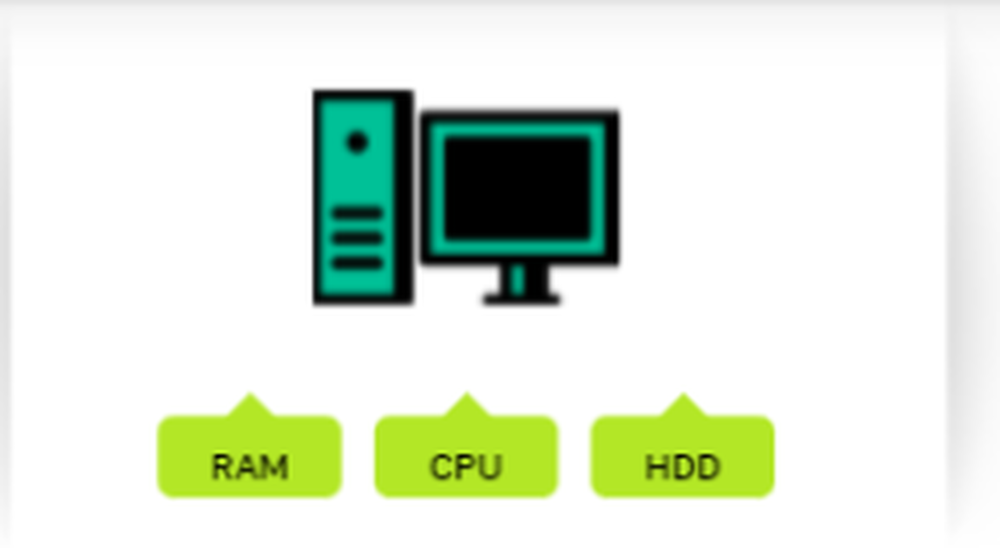</td><td>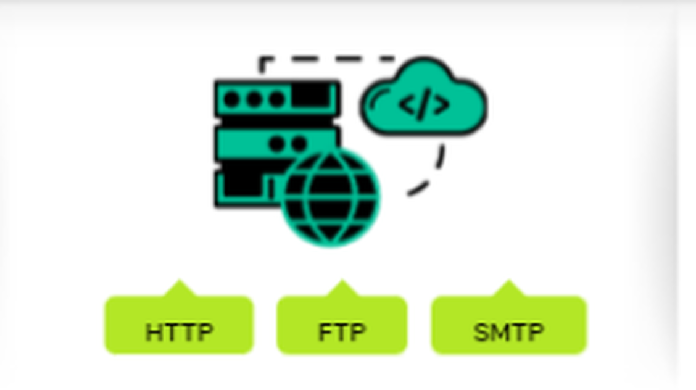</td><td>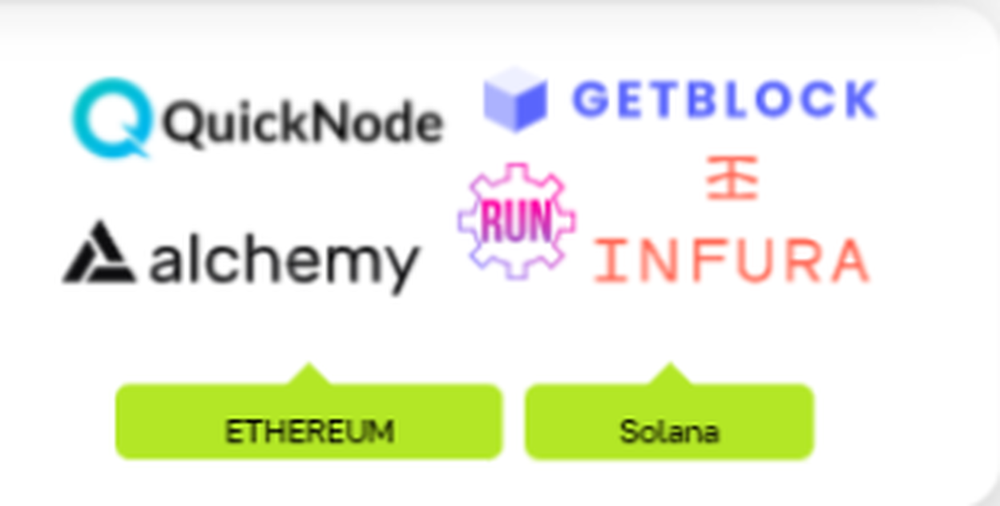</td></tr></tbody></table>

Web

---
layout: mondrian-content
contentSlide: 8
contentSlideId: h71ce93168c13465f_0_78
templateLayout: mondrian-content
catalogSlide: 3
imageTreatment: editable-table
---

# Generations In Games

<table class="deck-table deck-table--source"><thead><tr><th></th><th>SINGLE PLAYER</th><th>SOCIAL / MULTIPLAYER</th><th>WEB3 / METAVERSE</th></tr></thead><tbody><tr><th>GAME LAYER</th><td>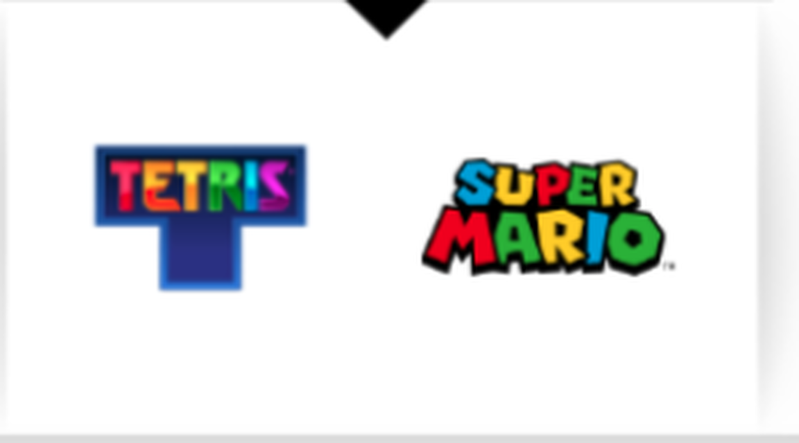</td><td>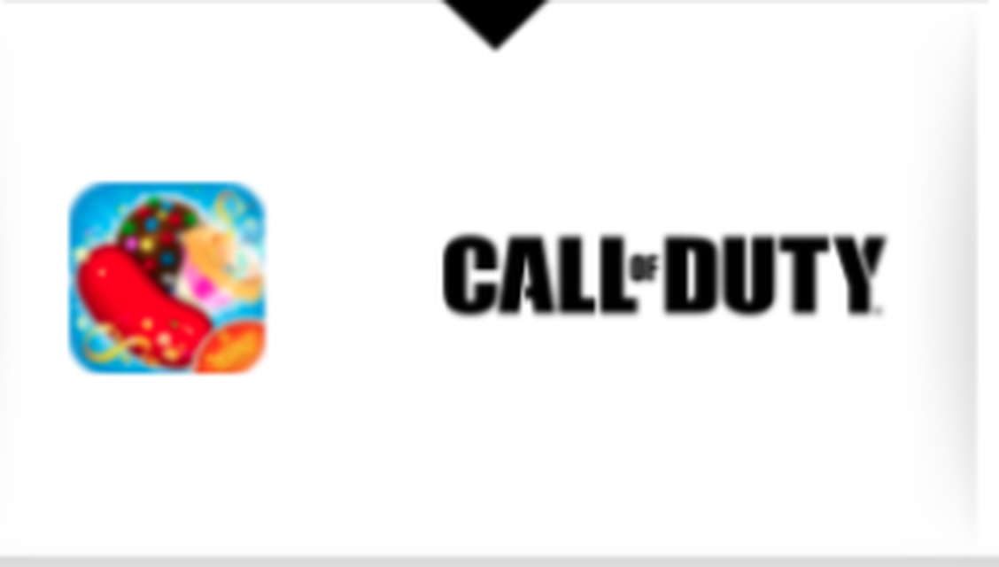</td><td>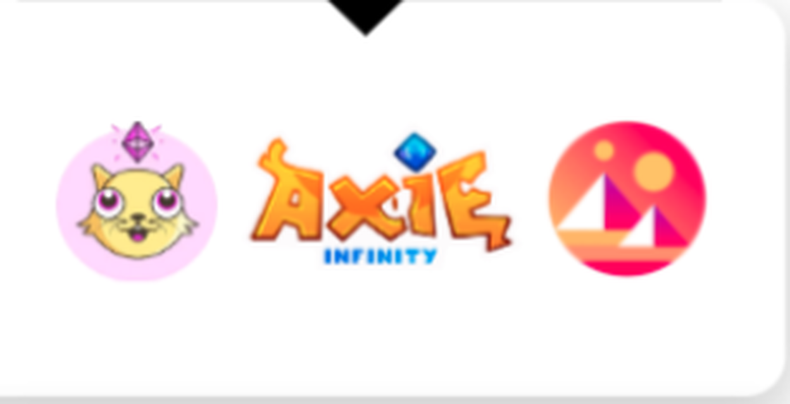</td></tr><tr><th>MIDDLEWARE LAYER</th><td></td><td></td><td></td></tr><tr><th>PROTOCOL LAYER</th><td></td><td>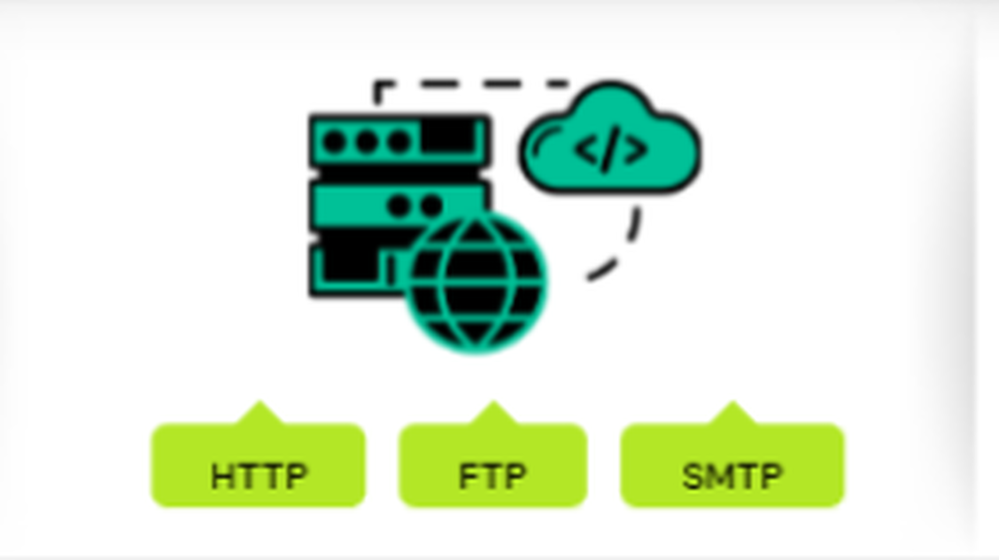</td><td>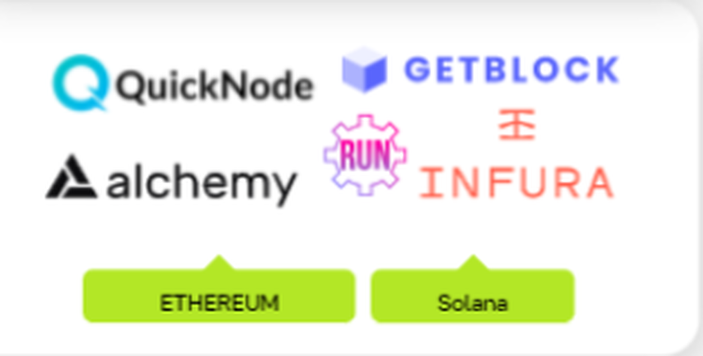</td></tr></tbody></table>

Games

---
layout: mondrian-content
contentSlide: 9
contentSlideId: h71ce93168c13465f_0_55
templateLayout: mondrian-content
catalogSlide: 3
imageTreatment: editable-text-table
---

# Generations In Approach

<table class="deck-table"><thead><tr><th></th><th>WEB 1</th><th>WEB 2</th><th>WEB 3</th></tr></thead><tbody><tr><th>ACCESS</th><td>Read</td><td>Read / Write</td><td>Read / Write / Execute</td></tr><tr><th>USER-CONTENT CREATION</th><td>None</td><td>Free</td><td>Incentivized</td></tr><tr><th>FOCUS</th><td>Company</td><td>Community</td><td>Individual</td></tr></tbody></table>
Approach

---
layout: mondrian-diagram
contentSlide: 10
contentSlideId: g3e50a99ab1a_1_9441
templateLayout: mondrian-diagram
catalogSlide: 12
imageTreatment: omit
class: feedback-diagram-position
---
# Game Loop Design
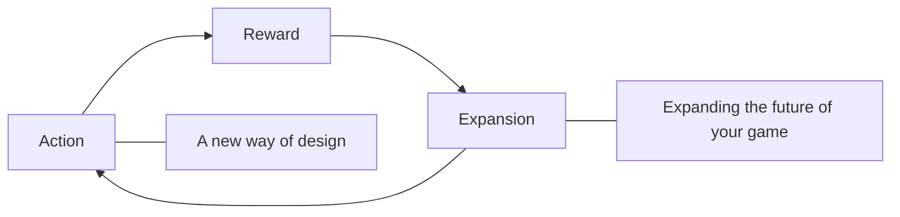
---
layout: mondrian-diagram
contentSlide: 11
contentSlideId: g3e50a99ab1a_1_9459
templateLayout: mondrian-diagram
catalogSlide: 12
imageTreatment: reimagine
class: feedback-diagram-position
---
# Game Loop Design
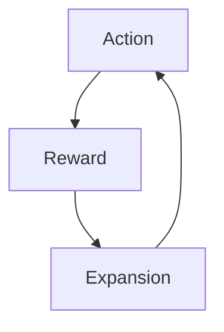

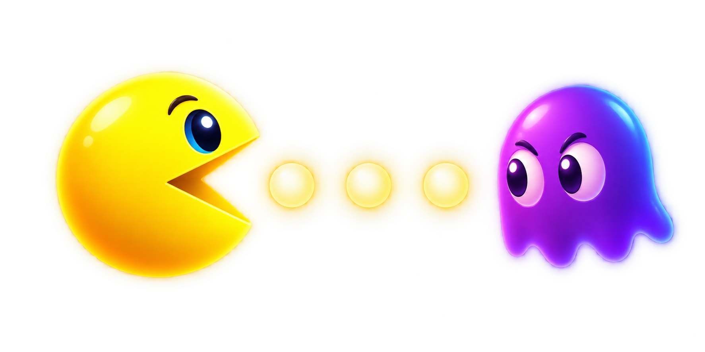
---
layout: mondrian-diagram
contentSlide: 12
contentSlideId: g3e50a99ab1a_1_9483
templateLayout: mondrian-diagram
catalogSlide: 12
imageTreatment: omit
class: feedback-diagram-position
---
# Game Loop Design + Blockchain
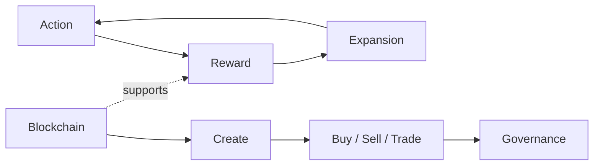
---
layout: mondrian-subsection
contentSlide: 13
contentSlideId: h71ce93168c13465f_0_31
templateLayout: mondrian-subsection
catalogSlide: 2
imageTreatment: none
---
# Blockchain Recap
---
layout: mondrian-content
contentSlide: 14
contentSlideId: p42
templateLayout: mondrian-content
catalogSlide: 3
imageTreatment: none
---
# What does every Blockchain game need?
<ul class="feedback-capability-list"><li><strong>Accounts</strong> — Player identity and wallet connection</li><li><strong>Assets</strong> — Items and collectible ownership</li><li><strong>Transfers</strong> — Send, receive, buy, sell, or trade</li><li><strong>Contracts</strong> — Rules and transaction execution</li><li><strong>Events</strong> — Game-state synchronization</li></ul>
---
layout: mondrian-content
contentSlide: 15
contentSlideId: h71ce93168c13465f_0_11
templateLayout: mondrian-content
catalogSlide: 3
imageTreatment: none
---
# What does every Blockchain game need?
<ul class="feedback-capability-list feedback-capability-list--detailed"><li><strong>Accounts</strong><ul><li>Player identity</li><li>Wallet connection</li></ul></li><li><strong>Assets</strong><ul><li>Items and collectibles</li><li>Ownership records</li></ul></li><li><strong>Transfers</strong><ul><li>Send or receive assets</li><li>Buy, sell, or trade</li></ul></li><li><strong>Contracts</strong><ul><li>On-chain game rules</li><li>Transaction execution</li></ul></li><li><strong>Events</strong><ul><li>Transaction updates</li><li>Game-state synchronization</li></ul></li></ul>
---
layout: mondrian-subsection
contentSlide: 16
contentSlideId: h71ce93168c13465f_0_35
templateLayout: mondrian-subsection
catalogSlide: 2
imageTreatment: none
---
# Blockchain Benefits
---
layout: mondrian-content
contentSlide: 17
contentSlideId: g3fb61a5d5fe_0_57
templateLayout: mondrian-content
catalogSlide: 3
imageTreatment: omit
---
# Stronger KPIs
- Increase game installs
- Increase player engagement
- Increase player retention
- Increase revenue
---
layout: mondrian-content
contentSlide: 18
contentSlideId: g3e50a99ab1a_1_7753
templateLayout: mondrian-content
catalogSlide: 3
imageTreatment: omit
---
# Stronger KPIs
- Increase game installs
- Increase player engagement
- Increase player retention
- Increase revenue
---
layout: mondrian-image-left
contentSlide: 20
contentSlideId: g3e50a99ab1a_1_7776
templateLayout: mondrian-image-left
catalogSlide: 9
image: ./assets/blockchain-for-game/game-lifespan-loop-upscaled.png
backgroundSize: contain
imageTreatment: user-image-upscaled
---
# Traditional game installs
There is a big potential to push the limits of a player’s lifespan.

- Game installs begin at launch.
- Traditional games have a visible end.
---
layout: mondrian-image-left
contentSlide: 21
contentSlideId: g3e50a99ab1a_1_7791
templateLayout: mondrian-image-left
catalogSlide: 9
image: ./assets/blockchain-for-game/player-engagement-session-upscaled.png
backgroundSize: contain
imageTreatment: user-image-upscaled
---
# Blockchain game installs
With our SDK, a game’s ecosystem lives beyond the traditional borders of the game itself.

- More players can install on launch day.
- Players can explore via the ecosystem before and after play.
---
layout: mondrian-image-left
contentSlide: 22
contentSlideId: g3e50a99ab1a_1_7819
templateLayout: mondrian-image-left
catalogSlide: 9
image: ./assets/blockchain-for-game/player-engagement-network-upscaled.png
backgroundSize: contain
imageTreatment: user-image-upscaled
---
# Traditional player engagement
We have created a way to expand player engagement beyond the game session.

- The game session is one moment.
- Engagement can outlive that moment.
---
layout: mondrian-image-left
contentSlide: 23
contentSlideId: g3e50a99ab1a_1_7830
templateLayout: mondrian-image-left
catalogSlide: 9
image: ./assets/blockchain-for-game/game-content-network-upscaled.png
backgroundSize: contain
imageTreatment: user-image-upscaled
---
# Blockchain player engagement
Varied, immersive player experiences encourage longer and more frequent play as players’ time gains more value.

- Player time earns value.
- The SDK connects game-session outcomes to an ecosystem.
---
layout: mondrian-right-diagram
contentSlide: 24
contentSlideId: g3e50a99ab1a_1_7854
templateLayout: mondrian-right-diagram
catalogSlide: 13
imageTreatment: mermaid
---
# Traditional player retention
Enabling games to live longer than the existing game content.

- Content is the traditional retention boundary.

::right::
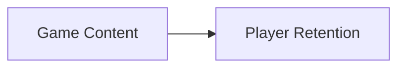
---
layout: mondrian-right-diagram
contentSlide: 25
contentSlideId: g3e50a99ab1a_1_7870
templateLayout: mondrian-right-diagram
catalogSlide: 13
imageTreatment: mermaid
---
# Blockchain player retention
With our SDK, players can move their items freely.

- Participation creates more recurring players.
- Unique items increase value.
- Rewards create unique in-game moments.

::right::
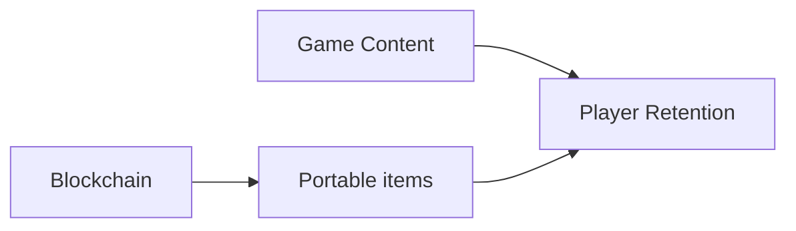
---
layout: mondrian-image-left
contentSlide: 26
contentSlideId: g3e50a99ab1a_1_7917
templateLayout: mondrian-image-left
catalogSlide: 9
image: ./assets/blockchain-for-game/revenue-opportunities-core-upscaled.png
backgroundSize: contain
imageTreatment: user-image-upscaled
---
# Traditional game revenue
With traditional gaming, revenue streams are limited to game boundaries and player base.

- Revenue opportunities end at the game boundary.
---
layout: mondrian-image-left
contentSlide: 27
contentSlideId: g3e50a99ab1a_1_7933
templateLayout: mondrian-image-left
catalogSlide: 9
image: ./assets/blockchain-for-game/revenue-opportunities-network-upscaled.png
backgroundSize: contain
imageTreatment: user-image-upscaled
---
# Blockchain game revenue
Blockchain introduces new and improved revenue streams.

- Create second-hand marketplaces for recurring revenue.
- Expand the game economy through the wider ecosystem.
---
layout: mondrian-subsection
contentSlide: 28
contentSlideId: h71ce93168c13465f_0_39
templateLayout: mondrian-subsection
catalogSlide: 2
imageTreatment: none
---
# Blockchain Details
---
layout: mondrian-content
contentSlide: 29
contentSlideId: p36
templateLayout: mondrian-content
catalogSlide: 3
imageTreatment: none
---
# Blockchain: Blockchain Key Features
Blockchain is built on blockchain technology.

- **Decentralized** — Resilient, failure-resistant
- **Transparent** — Data is public
- **Immutable** — Incorruptible / permanent
---
layout: mondrian-image-bottom
contentSlide: 30
contentSlideId: p37
templateLayout: mondrian-image-bottom
catalogSlide: 12
image: ./assets/blockchain-for-game/blockchain-benefits-four-card-original-transparent.png
backgroundSize: contain
imageTreatment: generated-transparent
---
# Blockchain: Structure

Decentralization, immutability, transparency, and security make shared game records trustworthy.
---
layout: mondrian-diagram
contentSlide: 31
contentSlideId: p38
templateLayout: mondrian-diagram
catalogSlide: 12
imageTreatment: mermaid-white-network
---
# Blockchain Is Decentralized
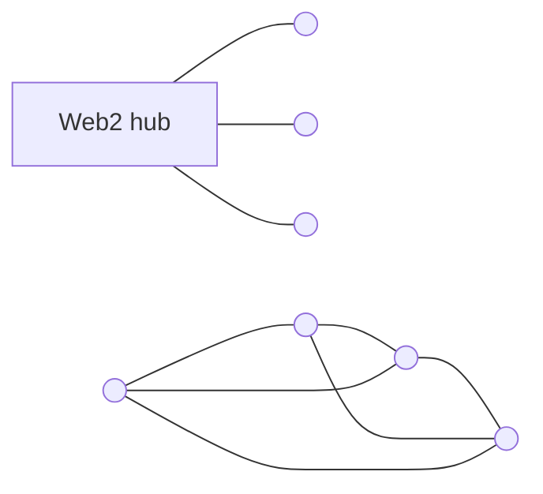

Web2 is centralized; Web3 forms a peer network.

---
layout: mondrian-diagram
contentSlide: 32
contentSlideId: p39
templateLayout: mondrian-diagram
catalogSlide: 12
imageTreatment: mermaid-gold-network
---
# Blockchain Is Transparent
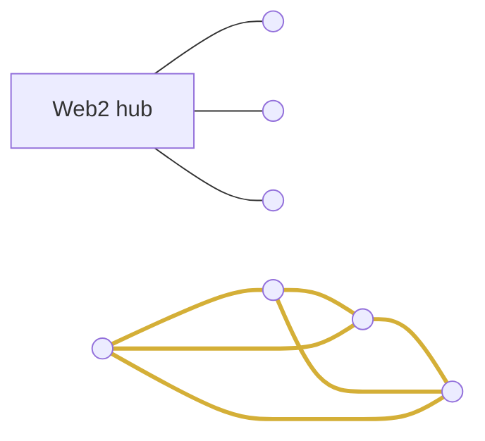

Gold connections make the shared network visible.

---
layout: mondrian-diagram
contentSlide: 33
contentSlideId: p40
templateLayout: mondrian-diagram
catalogSlide: 12
imageTreatment: mermaid-gold-red-network
---
# Blockchain Is Immutable
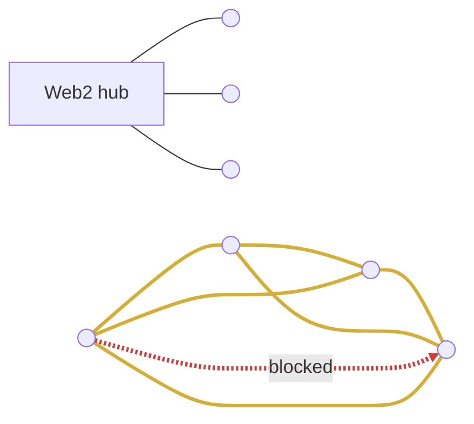

A conflicting change is visible and rejected.

---
layout: mondrian-intro
contentSlide: 34
contentSlideId: h71ce93168c13465f_0_17
templateLayout: mondrian-intro
catalogSlide: 1
imageTreatment: none
---
# Blockchain Case Study
## BIS
---
layout: mondrian-content
contentSlide: 35
contentSlideId: p41
templateLayout: mondrian-content
catalogSlide: 3
imageTreatment: none
---
# Blockchain Gaming: Blockchain Key Features
Blockchain gaming is built on blockchain technology.

- **Decentralized** — Ecosystem > single game lifespan
- **Transparent** — Open data ecosystem
- **Immutable** — Digital ownership
---
layout: mondrian-intro
contentSlide: 36
contentSlideId: g3fb61a5d5fe_0_70
templateLayout: mondrian-intro
catalogSlide: 1
imageTreatment: none
---
# Blockchain Case Study
## BIS
---
layout: mondrian-diagram
contentSlide: 37
contentSlideId: g3faa3cf280c_1_0
templateLayout: mondrian-diagram
catalogSlide: 12
imageTreatment: mermaid
---
# BIS
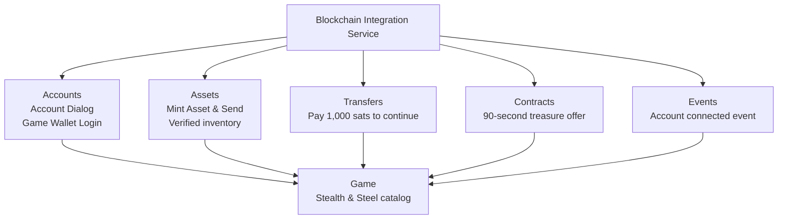
---
layout: mondrian-intro
contentSlide: 38
contentSlideId: g3fb61a5d5fe_0_65
templateLayout: mondrian-intro
catalogSlide: 1
imageTreatment: none
---
# Blockchain & Web3
## Comparison
---
layout: mondrian-two-columns
contentSlide: 39
contentSlideId: g3fb61a5d5fe_0_80
templateLayout: mondrian-two-columns
catalogSlide: 4
imageTreatment: none
---
::left::

# Web3 vs Bitcoin
## Bitcoin
Peer-to-peer monetary network Conservative protocol evolution
::right::

## Web3
Blockchain application ecosystem Programmable applications across chains

Both use cryptography and distributed ledgers. Design determines decentralization and security.
---
layout: mondrian-intro
contentSlide: 40
contentSlideId: g3fb61a5d5fe_0_75
templateLayout: mondrian-intro
catalogSlide: 1
imageTreatment: none
---
# Bitcoin Ecosystem
## Let’s Learn …
---
layout: mondrian-content
contentSlide: 41
contentSlideId: g3fb61a5d5fe_0_86
templateLayout: mondrian-content
catalogSlide: 3
imageTreatment: none
---
# Bitcoin Layers
- **Layer 1:** settlement and security
- **Layer 2:** Lightning and sidechains
- **Layer 3:** applications
---
layout: mondrian-content
contentSlide: 42
contentSlideId: g3fb61a5d5fe_0_101
templateLayout: mondrian-content
catalogSlide: 3
imageTreatment: editable-table
---

# Bitcoin Layers

<table class="deck-table deck-table--layers"><thead><tr><th>Layer</th><th>Pros</th><th>Cons</th></tr></thead><tbody><tr><th>Layer 3</th><td>Easy to use Rich features Mainstream potential</td><td>Early stage Depends on lower layers</td></tr><tr><th>Layer 2</th><td>Improved scaling Faster, lower-fee payments</td><td>Security tradeoffs Complex for new users</td></tr><tr><th>Layer 1</th><td>High security Decentralized Well-established</td><td>Limited scaling Slower, higher fees</td></tr></tbody></table>

---
layout: mondrian-content
contentSlide: 43
contentSlideId: h5a9ba4b51e017a3d_3_0
templateLayout: mondrian-content
catalogSlide: 3
imageTreatment: editable-table
---

# For Gaming

<table class="deck-table deck-table--layers deck-table--gaming"><thead><tr><th>Layer</th><th>Game advantage</th><th>Design consideration</th></tr></thead><tbody><tr><th>Layer 3</th><td>Player-facing features Game-specific experiences</td><td>Early-stage tooling Depends on lower layers</td></tr><tr><th>Layer 2</th><td>Fast, lower-fee player actions Better in-game cadence</td><td>Integration and custody tradeoffs New-user complexity</td></tr><tr><th>Layer 1</th><td>High-assurance ownership Decentralized settlement</td><td>Limited scaling Slower, higher-fee actions</td></tr></tbody></table>

---
layout: mondrian-subsection
contentSlide: 44
contentSlideId: g3fb61a5d5fe_0_32
templateLayout: mondrian-subsection
catalogSlide: 2
imageTreatment: none
---
# Lightning
## Bitcoin Ecosystem
---
layout: mondrian-content
contentSlide: 45
contentSlideId: g3fb61a5d5fe_0_37
templateLayout: mondrian-content
catalogSlide: 3
imageTreatment: none
---
# Lightning Network
Lightning is a decentralized network that uses Bitcoin smart-contract functionality to enable instant payments across participants.

- Participants update balances in bidirectional payment channels.
- The latest agreed channel state can be enforced on-chain.
- High-volume, high-speed payments remain anchored to Bitcoin.

Source: [lightning.network](https://lightning.network/)
---
layout: mondrian-image-bottom
contentSlide: 46
contentSlideId: bitcoin-lightning-network-infographic
templateLayout: mondrian-image-bottom
catalogSlide: 45
image: ./assets/blockchain-for-game/bitcoin-lightning-network.png
backgroundSize: contain
imageTreatment: generated-infographic
---
---
layout: mondrian-subsection
contentSlide: 47
contentSlideId: g3fb61a5d5fe_0_44
templateLayout: mondrian-subsection
catalogSlide: 2
imageTreatment: none
---
# Liquid
## Bitcoin Ecosystem
---
layout: mondrian-content
contentSlide: 48
contentSlideId: g3fb61a5d5fe_0_49
templateLayout: mondrian-content
catalogSlide: 3
imageTreatment: none
---
# Liquid Network
Liquid is a production Bitcoin sidechain for confidential transactions, asset issuance, and programmable smart contracts.

- Confidential Transactions hide asset types and amounts from third parties.
- Issued Assets can represent digital collectibles and reward points.
- The tradeoff is a federated trust model.

Source: [Liquid developer documentation](https://docs.liquid.net/docs/liquid-features-and-benefits)
---
layout: mondrian-subsection
contentSlide: 49
contentSlideId: g3e50a99ab1a_1_11981
templateLayout: mondrian-subsection
catalogSlide: 2
imageTreatment: none
---
# Taproot
## Bitcoin Ecosystem
---
layout: mondrian-content
contentSlide: 50
contentSlideId: g3fb61a5d5fe_0_26
templateLayout: mondrian-content
catalogSlide: 3
imageTreatment: none
---
# Taproot
Taproot defines SegWit v1 spending rules using Schnorr signatures and Merkle branches.

- A key-path spend can keep a cooperative spend compact.
- A script-path spend can reveal only the condition that is used.
- It is deployed as BIP 341 with related Schnorr and Tapscript specifications.

Source: [BIP 341](https://github.com/bitcoin/bips/blob/master/bip-0341.mediawiki)
---
layout: mondrian-subsection
contentSlide: 51
contentSlideId: g3fb61a5d5fe_0_0
templateLayout: mondrian-subsection
catalogSlide: 2
imageTreatment: none
---
# Ark
## Bitcoin Ecosystem
---
layout: mondrian-two-columns-header
contentSlide: 52
contentSlideId: g3fb61a5d5fe_0_18
templateLayout: mondrian-two-columns-header
catalogSlide: 5
imageTreatment: none
---
# Ark Protocol

::left::

## About

Ark is a layer 2 protocol for low-cost off-chain Bitcoin transactions.

::right::

## Details

- **Transfers:** Low-cost off-chain payments.
- **Model:** Bitcoin-like UTXO design.
- **Setup:** No payment channels required.

::bottom::

Source: [Ark Protocol](https://ark-protocol.org/)
---
layout: mondrian-subsection
contentSlide: 53
contentSlideId: arkade-subsection
templateLayout: mondrian-subsection
catalogSlide: 2
imageTreatment: none
---
# Arkade
## Bitcoin Ecosystem
---
layout: mondrian-two-columns-header
contentSlide: 54
contentSlideId: arkade-protocol
templateLayout: mondrian-two-columns-header
catalogSlide: 5
imageTreatment: none
---
# Arkade Protocol

::left::

## About

Arkade is a programmable extension of Bitcoin for financial applications.

::right::

## Details

- **Toolkit:** Payments, swaps, assets, contracts.
- **Bitcoin:** Uses scripts and confirmations.
- **Recovery:** Users exit to Bitcoin.

::bottom::

Source: [Arkade](https://arkadeos.com/)
