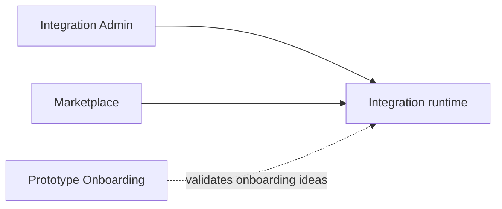

# Blockchain Integration Service

## Technical orientation

Reusable Bitcoin-oriented game integration with browser applications for administration and marketplace experiences

<!--
Introduce this as an initial technical orientation. The source is the current package-level Understand graph and the repository README.
-->

---
layout: two-cols-header
---

# What BIS adds to a game

::left::

## Accounts and payments

- Create and restore game accounts
- Manage balances and addresses
- Support deposits, withdrawals, and pay-to-play flows

::right::

## Assets and contracts

- Present player assets and marketplace inventory
- Support game items, achievements, and trophies
- Model limited-time player reward offers

<!--
These capabilities come from the repository README. Keep this slide focused on the product surface rather than implementation detail.
-->

---
layout: center
---

# Package architecture



The reusable integration runtime owns shared wallet, state, and React client behavior. The browser applications compose that runtime for specific product experiences.

<!--
The package-level knowledge graph identifies the reusable Integration Runtime and separate host applications. Do not imply that every package consumes every other package.
-->

---
layout: two-cols-header
---

# Integration runtime

::left::

## Client and state layers

The runtime organizes reusable behavior around a React client surface and a state layer that coordinates account, asset, activity, payment, and onboarding flows.

::right::

## Arkade adapter boundary

Wallet-oriented modules keep provider-specific operations separate from shared state and user-interface code. This boundary makes the integration package the primary reusable API surface.

<!--
The Understand tour identifies the React client, shared state context, and Arkade wallet adapters as the core reading path.
-->

---
layout: two-cols-header
---

# Product-facing applications

::left::

## Integration Admin

The admin application combines development controls with a portrait runtime preview. It demonstrates the integration package through its public API.

::right::

## Marketplace and onboarding

Marketplace owns its own catalog and account-facing application shell. Prototype Onboarding remains an independent experiment for the Signet onboarding journey.

<!--
This deck calls out applications in the current package structure. Avoid presenting the onboarding prototype as a production service.
-->

---
layout: two-cols-header
---

# A practical reading path

::left::

1. Start with the integration package README and manifest
2. Follow the demo or admin entry point into the shared client
3. Read the shared state context and boarding record modules

::right::

4. Inspect Arkade account and boarding adapters
5. Trace activity and sending modules
6. Contrast those shared concerns with the Marketplace host and catalog

<!--
This sequence comes directly from the generated Understand tour. It is a suggested orientation, not a required implementation order.
-->

---
layout: two-cols-header
---

# Development workflow

::left::

## Main project

```sh
npm ci
npm test
npm run build
npm run dev
```

The root launcher provides the shared four-package local preview.

::right::

## This presentation

```sh
cd BIS/documentation/slidev
npm run dev
npm run build
```

Slidev serves the presentation independently on port 3032.

<!--
The root commands are established in the repository README. The workspace commands become available after Slidev dependencies are installed.
-->

---
layout: two-cols-header
---

# Current boundaries

::left::

## Networks and operations

The current project targets Bitcoin Signet and Mutinynet. Games can remain playable without an account.

::right::

## Verification posture

Package tests and browser fixtures cover wallet-oriented workflows. Some payment and transfer paths retain documented verification limits, and Lightning invoice receiving remains unavailable.

<!--
Keep these scope statements accurate. Do not turn them into marketing claims or imply a production backend.
-->

---
layout: end
---

# Continue from the source

`BIS/packages/.ua/knowledge-graph.json` provides the architecture evidence behind this draft.

`README.md` and `BIS/documentation/` remain the source of truth for project scope, commands, and product documentation.

<!--
Close by directing technical readers to the source material. Future revisions can add screenshots, a live product walkthrough, or individual code paths.
-->
