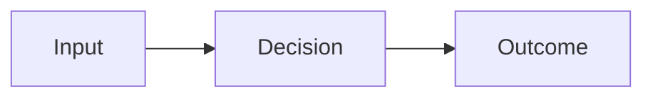

# Section Template

## Section divider with title and subtitle

Start here when you want to see the standard building blocks before choosing a theme or writing final content.

---
layout: mondrian-subsection
catalogLayout: mondrian-subsection
---

# The Subsection Template

Use for an ordinary explanatory section. Keep the title to one or two lines.

---
layout: mondrian-content
catalogLayout: mondrian-content
---

# Bullet Template

The flexible baseline layout: headings, prose, bullet points, diagrams, code, and custom components all work here.

- Use it for most information slides
- Let the content determine the visual hierarchy

---
layout: mondrian-content
catalogLayout: mondrian-content
class: toc-template
---

# TOC Template

## Table of contents

- Now: Shape the primary narrative
- Next: Support it with evidence
- Later: Close with a clear action

---
layout: mondrian-two-columns
catalogLayout: mondrian-two-columns
---

::left::

# Primary point

Lead with the decision, diagram, or image that matters most.

::right::

## Supporting evidence

Use one concise proof point, comparison, or example.

---
layout: mondrian-two-columns-header
catalogLayout: mondrian-two-columns-header
---

# Two Columns, One Headline Template

::left::

## Preferred option

Make the decision legible first.

- **Best fit:** clear outcome
- Constraint: known trade-off
- Proof: one concrete signal

::right::

## Alternative option

Make the contrast equally easy to scan.

- Different fit: distinct outcome
- Constraint: named trade-off
- Proof: one concrete signal

---
layout: mondrian-center
catalogLayout: mondrian-center
---

# Center Template

Use one sentence or one question for a key idea or transition.

---
layout: mondrian-demo
catalogLayout: mondrian-demo
---

# Demo

## <FocusedLink href="https://www.google.com/" name="Google" message="Search engine.">Let's play ... </FocusedLink>

---
layout: mondrian-hook
catalogLayout: mondrian-hook
---

# [POST PRODUCTION]

## <FocusedLink href="https://www.google.com/" name="Go" message="This is temp"> Insert Hook</FocusedLink>

---
layout: mondrian-tease
catalogLayout: mondrian-tease
---

# [PRE PRODUCTION]

## <FocusedLink href="https://www.google.com/" name="Tea" message="This is temp"> Insert Tease Slides</FocusedLink>

---
layout: mondrian-quote
catalogLayout: mondrian-quote
---

# “Here is the quote template now.”

— Source or speaker

---
layout: mondrian-fact
catalogLayout: mondrian-fact
---

# 72%

of the audience can repeat the key point after a focused close.

---
layout: mondrian-image-left
catalogLayout: mondrian-image-left
image: layout-placeholder.svg
class: slide-image-left-offset b-safe-image-left
---

# Image Left Template

Choose this when the visual establishes context. Keep the explanation short and place the image first.

---
layout: mondrian-image-right
catalogLayout: mondrian-image-right
image: layout-placeholder.svg
class: slide-image-right-offset b-safe-image-right b-slide-eleven
---

# Image Right Template

Choose this when the explanation leads. Use the visual as supporting evidence, second.

---
layout: mondrian-image-bottom
catalogLayout: mondrian-image-bottom
image: layout-placeholder.svg
backgroundSize: contain
---

# Image Bottom Template

Use a short title above one centered visual. Keep the title to one line or select another image layout.

---
layout: mondrian-blank
catalogLayout: mondrian-blank
---

# Blank Template

Use only for an embedded artifact or an intentional visual pause—not ordinary content.

---
layout: mondrian-diagram
catalogLayout: mondrian-diagram
---

# Diagram Template

## One takeaway, then one supporting relationship

---
layout: mondrian-right-diagram
catalogLayout: mondrian-right-diagram
---

# Right Diagram Template

Use the left pane for one takeaway and no more than three short evidence points.

- Frame the relationship
- Name the evidence
- Leave the diagram primary

::right::

---
layout: mondrian-thank-you
catalogLayout: mondrian-thank-you
---

# Thank You!

---
layout: mondrian-logos
catalogLayout: mondrian-logos
class: game-xp-slide
---

# Game XP

<em>Godot, HTML5, Unity, ... Browser, Console, Mobile, PC, AR/VR/XR, ...</em>

---
layout: mondrian-video-xp
catalogLayout: mondrian-video-xp
---

# Blockchain XP

  
  
  
  
  
  
  
  
  
  
  
  

<em>Ark, Arkade, Bitcoin, Lightning, Liquid, Taproot, Wavelength, &amp; EVM/Web3, ...</em>

---
layout: mondrian-about
catalogLayout: mondrian-about
class: about-expanded-copy about-contact-emphasis
---

# Say Hi :)

## Available For Hire

- Senior game developer (remote)
- 20+ years experience
- [Samuel Asher Rivello](http://samuelasherrivello.com)
- [LinkedIn profile](https://www.linkedin.com/in/SamuelAsherRivello)

---
layout: mondrian-product
catalogLayout: mondrian-product
---

# Game Name
## Description ...

::left-label::

<FocusedLink href="https://example.com/" name="Example website" message="Example game website." tone="orange">Website</FocusedLink>

::left::

::right-label::

<FocusedLink href="https://www.youtube.com/" name="Example YouTube" message="Example game video." tone="orange" mode="direct">YouTube</FocusedLink>

::right::

---
layout: mondrian-about-end-cards
catalogLayout: mondrian-about-end-cards
class: about-expanded-copy about-contact-emphasis
---

# Say Hi :)

## Available For Hire

- Senior game developer (remote)
- 20+ years experience
- [Samuel Asher Rivello](http://samuelasherrivello.com)
- [LinkedIn profile](https://www.linkedin.com/in/SamuelAsherRivello)
