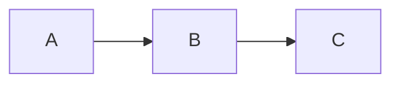

# Section Template

## Section divider with title and subtitle

Start here when you want to see the standard building blocks before choosing a theme or writing final content.

---
layout: mondrian-subsection
catalogLayout: mondrian-subsection
---

# The Subsection Template

Use these for the ordinary explanatory part of a presentation.

---
layout: mondrian-content
catalogLayout: mondrian-content
---

# Bullet Template

The flexible baseline layout: headings, prose, bullet points, diagrams, code, and custom components all work here.

- Use it for most information slides.
- Let the content determine the visual hierarchy.

---
layout: mondrian-two-columns
catalogLayout: mondrian-two-columns
---

::left::

# Two Columns Template

Use the left side for the primary point, a diagram, or an image.

::right::

## Supporting detail

Use the right side for supporting evidence, a comparison, or an example.

---
layout: mondrian-two-columns-header
catalogLayout: mondrian-two-columns-header
---

# Two Columns, One Headline Template

::left::

## Left idea

Make one side of a comparison clear.

::right::

## Right idea

Make the contrasting side equally clear.

---
layout: mondrian-center
catalogLayout: mondrian-center
---

# Center Template

Use a centered statement for a key idea, question, or transition.

---
layout: mondrian-quote
catalogLayout: mondrian-quote
---

# “Here is the quote template now.”

— Source or speaker

---
layout: mondrian-fact
catalogLayout: mondrian-fact
---

# Fact Template

One large number or short fact, followed by a sentence that makes its meaning obvious.

---
layout: mondrian-image-left
catalogLayout: mondrian-image-left
image: layout-placeholder.svg
class: slide-image-left-offset b-safe-image-left
---

# Image Left Template

Place an image on the left and your explanation on the right. Replace this sample image with your own project visual.

---
layout: mondrian-image-right
catalogLayout: mondrian-image-right
image: layout-placeholder.svg
class: slide-image-right-offset b-safe-image-right b-slide-eleven
---

# Image Right Template

Reverse the emphasis: explanation first, supporting visual second.

---
layout: mondrian-image-bottom
catalogLayout: mondrian-image-bottom
image: layout-placeholder.svg
backgroundSize: contain
---

# Image Bottom Template

One-line subtitle sits above a centered supporting visual.

---
layout: mondrian-blank
catalogLayout: mondrian-blank
---

# Blank Template

---
layout: mondrian-diagram
catalogLayout: mondrian-diagram
---

# Diagram Template

## Subtitle

---
layout: mondrian-right-diagram
catalogLayout: mondrian-right-diagram
---

# Right Diagram Template

Use the left pane for the takeaway and concise evidence.

- Keep the diagram explanatory.
- Keep the relationship visible.

::right::

---
layout: mondrian-thank-you
catalogLayout: mondrian-thank-you
---

# Thank You!

---
layout: mondrian-video-xp
catalogLayout: mondrian-video-xp
---

# Blockchain XP

  
  
  
  
  
  
  
  
  
  
  
  

<em>Ark, Bitcoin Lightning, Wavelength, &amp; EVM/Web3, ...</em>

---
layout: mondrian-logos
catalogLayout: mondrian-logos
class: game-xp-slide
---

# Game XP

<em>Godot, HTML, Unity, ...</em>

---
layout: mondrian-about
catalogLayout: mondrian-about
class: about-expanded-copy about-contact-emphasis
---

# Say Hi :)

## Available For Hire

- Senior Game Developer (Remote)
- 20+ Years XP
- [SamuelAsherRivello.com](http://samuelasherrivello.com)
- [LinkedIn.com/in/SamuelAsherRivello](https://www.linkedin.com/in/SamuelAsherRivello)

---
layout: mondrian-about-end-cards
catalogLayout: mondrian-about-end-cards
class: about-expanded-copy about-contact-emphasis
---

# Say Hi :)

## Available For Hire

- Senior Game Developer (Remote)
- 20+ Years XP
- [SamuelAsherRivello.com](http://samuelasherrivello.com)
- [LinkedIn.com/in/SamuelAsherRivello](https://www.linkedin.com/in/SamuelAsherRivello)
