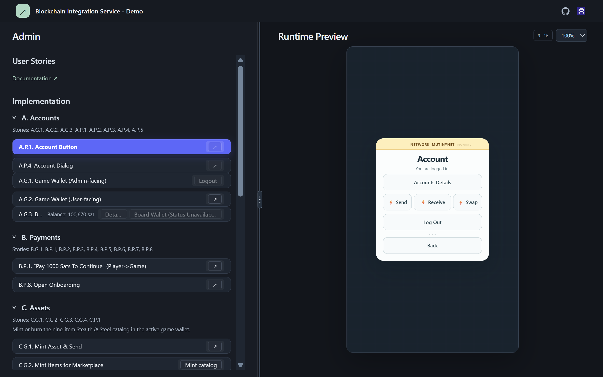
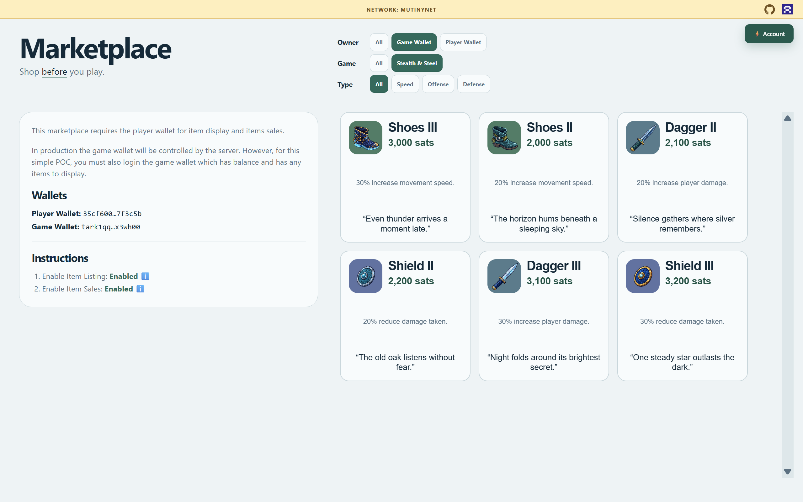

<!-- AI: Customize this template from the target repository's actual files, configuration, and user instructions. Preserve the section order, heading styles, and concise format unless asked to change them. Replace placeholders only with verified information; leave unknown values as placeholders. Do not invent features, commands, URLs, contributors, or deployment behavior. Keep these instructions hidden as HTML comments. -->
<!-- AI: Preserve the creator banner unless a replacement is requested. Update its relative path if assets move and verify the file exists with matching filename capitalization. -->

# Blockchain Integration Service (BIS)

<!-- AI: Replace {PROJECT_NAME} with the requested project display name. Write one short introduction sentence explaining what the project does and who it is for, based on implemented behavior. -->
This is a proof-of-concept (POC) demonstrating Blockchain use cases for gaming.

The BIS adds a Blockchain enabled ui and service layer to your games for Signet and Mutinynet networks for Bitcoin.

### BIS Benefits

- Accounts
- Payments
  - Deposits and withdrawals
  - Pay-to-play mechanics
- Assets
  - Marketplace
  - In-game items
  - Achievements and trophies
- Contracts, including limited-time player reward offers

## Images

<!-- AI: Use screenshots that exist in this repository and represent the current project. Keep relative paths, matching link href and image src, and the 400-pixel preview width. Replace placeholder alt text with a brief description. Preserve image order unless instructed otherwise; do not invent asset paths. -->
### Admin

### Marketplace

## Demo

<!-- AI: Keep the verified public demo URLs. Use a hidden ?v=<published-version> cache buster in each destination while leaving the labels unchanged. Advance both values for every published version. Do not add a Current release announcement or version badge here unless explicitly requested by the user. -->
### BIS

* [BIS Admin](https://samuelasherrivello.github.io/blockchain-integration-service/admin/?v=0.0.9)
* [BIS Marketplace](https://samuelasherrivello.github.io/blockchain-integration-service/marketplace/?v=0.0.9)

### Game

- See [Stealth & Steel](https://github.com/SamuelAsherRivello/stealth-and-steel-game)

## Table of Contents

<!-- AI: Keep this list synchronized with the top-level sections below it and their Markdown anchors. Exclude the title, Images, Demo, and Table of Contents because they appear above or here. Do not add subsection entries unless requested. -->
1. [Getting Started](#getting-started)
2. [Project Overview](#project-overview)
3. [Project Details](#project-details)
4. [Deep Dive](#deep-dive)
5. [Resources](#resources)
6. [Credits](#credits)

## Getting Started

<!-- AI: Preserve the exact introduction below: Run the following commands to get started. Do not restore Node.js/npm prerequisite or repository-root instructions here. Keep setup commands in the existing subsections; do not add a separate commands section. -->
Run the following commands to get started.

### 🛠 Build Project

<!-- AI: Replace {command} with the actual build command or required editor action. Verify it against manifests, scripts, or project settings. Specify the working directory and dependency installation when necessary; do not assume npm or a particular engine. -->
1. Run `npm ci` to install the locked workspace dependencies.
2. Run `npm run build` to check types and build the integration library and demo.

### 🛠 Run Project

<!-- AI: Replace {command} with the actual local launch command or editor action. State where to run it and how to open the app if needed. Refer to the printed URL when the port can vary. Avoid repeating completed build/setup steps. -->
1. Run `npm run dev` and open the localhost URL printed by Vite.
2. Select **A.P.1 Account Button**, then **Account**, to open the account chooser in the 9:16 preview. **Documentation ↗** opens the user-story diagrams.

Use `npm run preview` to serve the production build locally.

### What about sandbox?

For an isolated Windows Codex workflow, see [Windows Sandbox Setup](BIS/documentation/setup-sandbox-windows.md), which covers Docker Sandboxes installation, permissions, and usage.

### 🛠 Release Version

<!-- AI: Describe the repository's existing release workflow in the fewest steps, based on checked-in workflows or release scripts. Distinguish builds, tags, releases, and deployment accurately. If no release process exists, retain a placeholder rather than inventing one. Documentation edits do not authorize publishing or changing Git history. -->
1. For the first published baseline use `0.0.1`; for every later published update increment only the last digit (`0.0.N` → `0.0.(N+1)`). Run `npm run check:release -- --previous-version <prior-version>` to validate the transition, then run `npm test` and `npm run build`.
2. Update both hidden `v` cache-busters in the Admin and Marketplace links to the new version, commit the intended changes, and push to `main`; [Deploy live demo](.github/workflows/deploy-pages.yml) builds and publishes both routes to GitHub Pages.
3. Check the [Actions run](https://github.com/SamuelAsherRivello/blockchain-integration-service/actions/workflows/deploy-pages.yml), then verify [BIS Admin](https://samuelasherrivello.github.io/blockchain-integration-service/admin/?v=0.0.9) and [BIS Marketplace](https://samuelasherrivello.github.io/blockchain-integration-service/marketplace/?v=0.0.9). Manual deployment is also available; this workflow does not create version tags or GitHub releases.

## Project Overview

<!-- AI: Summarize the project's purpose, main capabilities, and intended use cases. Describe current implementation; label planned capabilities explicitly rather than presenting them as complete. Keep detailed tooling under Project Details. Keep this section brief; do not add release-specific status, smoke-test, or future-work detail unless explicitly requested. -->
BIS separates reusable game integration from its development demo. The integration owns account creation and restoration, browser persistence, balances, transaction history, receiving addresses, Arkade sending, Bitcoin/Arkade transfer flows, and generic asset minting, listing, and burning across the selected Signet or Mutinynet network. The demo provides admin controls, a console, and a portrait runtime preview through the public API.

This is a work in progress with no custom application server. The two supported network options are Signet and Mutinynet. Payment and transfer flows have documented verification limits; Lightning invoice receiving is currently unavailable. Games remain separate and can be playable without an account. See the user stories and package documentation for implementation status and remaining checks.

### 📝 Documentation

<!-- AI: Link to the main documentation files that actually exist using relative Markdown links and a short purpose for each. Update links when files move; do not reference documentation inherited from another project unless present here. -->
- [README](README.md): Setup, commands, and repository overview.
- [Project brief](BIS/documentation/BGS_PROJECT_BRIEF.md): Original BGS design baseline.
- [Design discussion](BIS/documentation/design-discussion.md): Confirmed decisions and implementation notes.
- [User Story Diagrams](BIS/documentation/User%20Story%20Diagrams.md): Flows, scope, and verification status.
- [Integration package](BIS/packages/integration/README.md): Public API and runtime behavior.
- [Game smoke test](BIS/documentation/SMOKE_TEST_BIS_TO_GAME.md): Integration setup and acceptance checks.
- [Demo application](BIS/packages/integration-demo/README.md): Admin demonstrations and verification hosts.
- [Windows Sandbox Setup](BIS/documentation/setup-sandbox-windows.md): Docker Sandboxes setup and Codex usage on Windows.

### 📝 Structure

<!-- AI: Replace PROJECT_NAME with the actual main project directory and list only the few folders needed to understand the repository. Check paths and capitalization. Omit generated output, dependency folders, and exhaustive file inventories. -->
- `BIS/documentation/`: Project documentation and README images.
- `BIS/packages/integration/`: Reusable runtime UI, core state, and Arkade adapters.
- `BIS/packages/integration-demo/`: Admin UI, 9:16 preview, and documentation viewer.
- `BIS/scripts/`: Project automation, including the test runner.
- `openspec/`: Tracked specifications and change plans.
- `.agents/skills/`: Local specification workflows.
- `.github/workflows/`: GitHub Pages deployment.

The root `package.json`, `package-lock.json`, and `tsconfig.json` configure npm workspaces and shared tooling.

## Project Details

<!-- AI: Replace this placeholder with a short description of implementation details useful to developers. Verify the stack from repository files and avoid repeating the overview or claiming unverified package versions. Keep this section brief; do not add test commands, test caveats, or dependency-version inventory unless explicitly requested. -->
React and TypeScript power both packages, with Vite for development and production builds. `@bis/integration-demo` consumes `@bis/integration` through its public exports; the reusable package owns its UI, core state, and Arkade adapters. Arkade-specific types and recovery material stay out of public state and events.

### 📦 AI

<!-- AI: Keep this section to the concise Codex and OpenSpec links below. Do not restore OpenSpec CLI setup instructions, PowerShell requirements, compatibility-link explanations, OpenSpec commands, or Grill Me guidance in this README unless explicitly requested by the user. -->
- [Codex](https://openai.com/codex/): Repository guidance in [AGENTS.md](AGENTS.md) and local skills.
- [OpenSpec](https://openspec.dev/): Specifications and change planning in `openspec/`.

### 📦 Packages

<!-- AI: Keep the package list limited to React, Arkade SDK, TypeScript, and Vite. Do not restore Mermaid, react-markdown, or @scure/bip39 entries or descriptions in this README unless explicitly requested by the user. Verify listed versions against the repository. -->
- [React](https://react.dev/): Runtime components and demo UI (`19.2.8`).
- [Arkade SDK](https://github.com/arkade-os/sdk): Signet and Mutinynet wallet and asset integration (`0.4.67`).
- [TypeScript](https://www.typescriptlang.org/): Static type checking (`7.0.2`).
- [Vite](https://vite.dev/): Local development server and production builds (`8.2.2`).

## Deep Dive

Deep Dive takes a closer look at a few representative files and the cross-repository contract that connects them. 

Start with the [BIS Deep Dive](BIS/documentation/deep-dive.md).

## Resources

<!-- AI: Keep relevant external learning and best-practice links with readable labels and short descriptions. Preserve the existing Best Practices resource unless asked to replace it. Verify new destinations and avoid duplicating local documentation links. -->
- [Best Practices](https://www.SamuelAsherRivello.com/best-practices/) - Procedures prescribed as the most effective

## Credits

<!-- AI: Preserve established attribution and ownership. Customize the following subsections only from confirmed contributor, contact, and license information; do not infer a new owner from the repository name. -->
### 💡 Contributors

<!-- AI: Preserve existing contributor credit and add contributors only when confirmed. Do not automatically advance experience counts or their reference year. -->
- Samuel Asher Rivello - Over 25 years of game development XP (2026)

### 💡 Contact

<!-- AI: Preserve confirmed contact destinations and their order unless requested otherwise. Use readable display URLs without a protocol or trailing slash while keeping the real link target intact. Do not invent accounts or change target capitalization based on display styling. -->
- [LinkedIn.com/in/SamuelAsherRivello](https://Linkedin.com/in/SamuelAsherRivello) ⭐
- [GitHub.com/SamuelAsherRivello](https://github.com/SamuelAsherRivello/)
- [Twitter.com/srivello](https://twitter.com/srivello/)
- Resume / Portfolio: [SamuelAsherRivello.com](http://www.SamuelAsherRivello.com)

### 💡 License

<!-- AI: Preserve the MIT License link to the root LICENSE file copied from github-repository-template. Verify the file exists; do not replace the link with plain text. Keep the copyright holder and year consistent with that file. Do not change license terms, ownership, or dates without an explicit request. -->
- Provided as-is under the [MIT License](LICENSE).

- Copyright © 2026 Rivello Multimedia Consulting, LLC.
