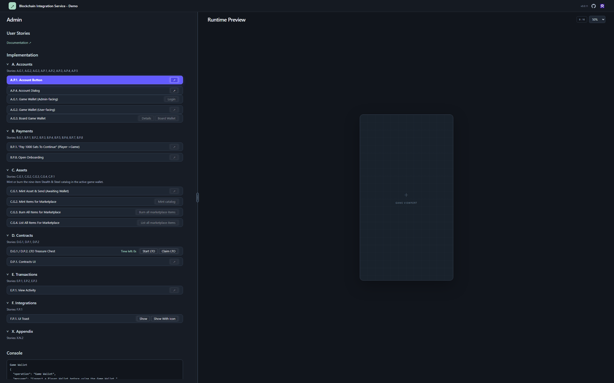
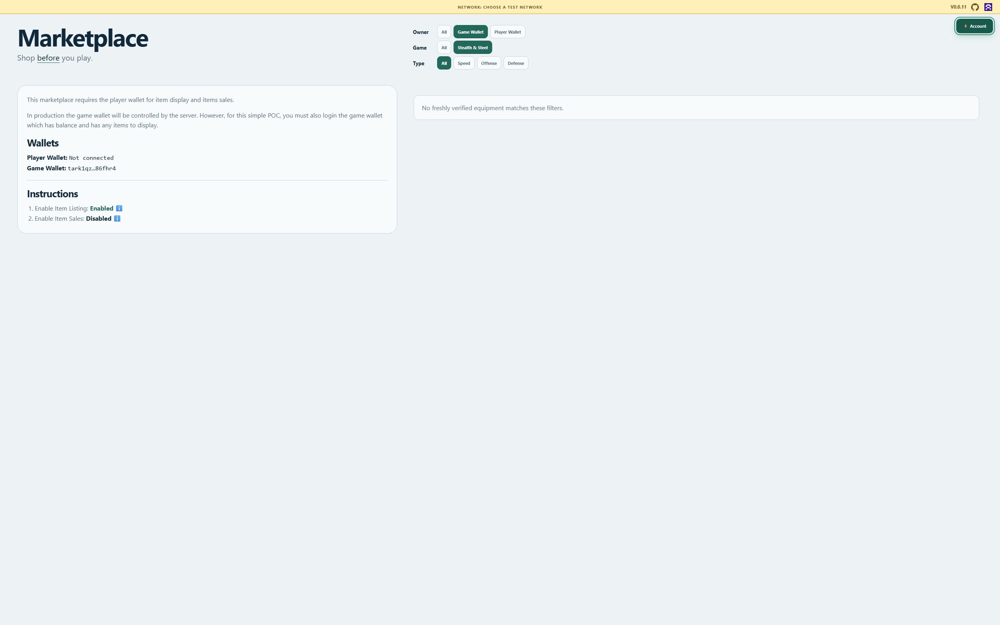

<!-- AI: Customize this template from the target repository's actual files, configuration, and user instructions. Preserve the section order, heading styles, and concise format unless asked to change them. Replace placeholders only with verified information; leave unknown values as placeholders. Do not invent features, commands, URLs, contributors, or deployment behavior. Use verified TypeScript terminology for BIS's public integration boundary. Keep these instructions hidden as HTML comments. -->
<!-- AI: Preserve the creator banner unless a replacement is requested. Update its relative path if assets move and verify the file exists with matching filename capitalization. -->

<a href="https://github.com/SamuelAsherRivello/blockchain-presentations">Blockchain Presentations</a> ·
<a href="https://github.com/SamuelAsherRivello/blockchain-stealth-and-steel-game">Stealth &amp; Steel Game</a>  
  

# Blockchain Integration Service (BIS)

<!-- AI: Replace {PROJECT_NAME} with the requested project display name. Write one short introduction sentence explaining what the project does and who it is for, based on implemented behavior. -->
This is a proof-of-concept (POC) demonstrating Blockchain use cases for gaming.

> [!WARNING]
> Prototype only, not a production-ready project. See the [Prototype scope and security](BIS/documentation/prototype-scope-and-security-readme.md).

The BIS adds a Blockchain enabled ui and service layer to your games for Signet and Mutinynet networks for Bitcoin.

### BIS Benefits

- Accounts
- Payments
  - Deposits and withdrawals
  - Pay-to-play mechanics
- Assets
  - Marketplace
  - In-game items
  - Achievements and trophies
- Contracts, including limited-time player reward offers

## Images

<!-- AI: Use screenshots that exist in this repository and represent the current project. Keep relative paths, matching link href and image src, and the 400-pixel preview width. Replace placeholder alt text with a brief description. Preserve image order unless instructed otherwise; do not invent asset paths. -->
### Admin

### Marketplace

## Live Demo

<!-- AI: Keep the verified public demo URLs. Use a hidden ?v=<published-version> cache buster in each destination while leaving the labels unchanged. Advance both values for every published version. Do not add a Current release announcement or version badge here unless explicitly requested by the user. -->
### BIS

* [BIS Admin](https://samuelasherrivello.github.io/blockchain-integration-service/admin/?v=0.0.18)
* [BIS Marketplace](https://samuelasherrivello.github.io/blockchain-integration-service/marketplace/?v=0.0.18)

### Game

- See [Stealth & Steel](https://github.com/SamuelAsherRivello/stealth-and-steel-game)

### Presentations

<!-- AI: For any updates to the slidev presentations put them here. Only keep the one latest of each-->
* [Slidev Presentations](https://github.com/SamuelAsherRivello/blockchain-presentations)

## Table of Contents

<!-- AI: Keep this list synchronized with the top-level sections below it and their Markdown anchors. Exclude the title, Images, Demo, and Table of Contents because they appear above or here. Do not add subsection entries unless requested. -->
1. [Getting Started](#getting-started)
2. [Project Overview](#project-overview)
3. [Project Details](#project-details)
4. [Deep Dive](#deep-dive)
5. [Resources](#resources)
6. [Credits](#credits)

## Getting Started

<!-- AI: Preserve the exact introduction below: Run the following commands to get started. Do not restore Node.js/npm prerequisite or repository-root instructions here. Keep setup commands in the existing subsections; do not add a separate commands section. -->
Run the following commands to get started.

### 🛠 Build Project

<!-- AI: Replace {command} with the actual build command or required editor action. Verify it against manifests, scripts, or project settings. Specify the working directory and dependency installation when necessary; do not assume npm or a particular engine. -->
1. Run `npm ci` to install the locked workspace dependencies.
2. Run `npm run build` to check types and build the integration library, Admin, and Marketplace release surfaces.
3. Run `npm test` to run their automated suite. When a change affects the shared four-package local preview, run `npm run build:all` and `npm run test:all` to include the independent Onboarding Spike checks.

### 🛠 Run Project

<!-- AI: Replace {command} with the actual local launch command or editor action. State where to run it and how to open the app if needed. Refer to the printed URL when the port can vary. Avoid repeating completed build/setup steps. -->
1. Run `npm run dev` to start one Vite server for all four packages.
2. Open [BIS Admin](http://127.0.0.1:5174/admin/), [BIS Marketplace](http://127.0.0.1:5174/marketplace/), [Onboarding Spike](http://127.0.0.1:5174/onboarding/), [Prototype Faucet](http://127.0.0.1:5174/prototype-faucet/), or the [Integration README](http://127.0.0.1:5174/integration/).
3. In Admin, select **A.P.1 Account Button**, then **Account**, to open the account chooser in the 9:16 preview. **Documentation ↗** opens the user-story diagrams.

### 🛠 Release Version

<!-- AI: Describe the repository's existing release workflow in the fewest steps, based on checked-in workflows or release scripts. Distinguish builds, tags, releases, and deployment accurately. If no release process exists, retain a placeholder rather than inventing one. Documentation edits do not authorize publishing or changing Git history. -->
1. For the first published baseline use `0.0.1`; for every later published update increment only the last digit (`0.0.N` → `0.0.(N+1)`). Run `npm run check:release -- --previous-version <prior-version>` to validate the transition, then run `npm test` and `npm run build`.
2. Update both hidden `v` cache-busters in the Admin and Marketplace links to the new version, commit the intended changes, and push to `main`; [Deploy live demo](.github/workflows/deploy-pages.yml) builds and publishes both routes to GitHub Pages.
3. Check the actual push-triggered [Actions run](https://github.com/SamuelAsherRivello/blockchain-integration-service/actions/workflows/deploy-pages.yml), then verify [BIS Admin](https://samuelasherrivello.github.io/blockchain-integration-service/admin/?v=0.0.18) and [BIS Marketplace](https://samuelasherrivello.github.io/blockchain-integration-service/marketplace/?v=0.0.18). Tags, GitHub Releases and manual dispatch are not prerequisites. BIS publishes both demos independently; game updates publish separately to the game's single stable Pages link.

## Project Overview

<!-- AI: Summarize the project's purpose, main capabilities, and intended use cases. Describe current implementation; label planned capabilities explicitly rather than presenting them as complete. Keep detailed tooling under Project Details. Keep this section brief; do not add release-specific status, smoke-test, or future-work detail unless explicitly requested. -->
BIS separates reusable game integration from its development demos for Signet and Mutinynet Bitcoin networks. The integration package provides account, payment, transfer, and asset capabilities through a public API, while the Admin, Marketplace, and onboarding packages demonstrate those capabilities in the browser.

### 📝 Documentation

<!-- AI: Link to the main documentation files that actually exist using relative Markdown links and a short purpose for each. Update links when files move; do not reference documentation inherited from another project unless present here. -->
- [Diagram](BIS/documentation/bis-concept-diagram-1.png): BIS architecture and integration overview.
- [Faucets](BIS/documentation/Faucets%20-%20README.md): Faucets for funding an account.
- [Integration Admin](BIS/packages/integration-admin/integration-admin-package-readme.md): Admin demonstrations and verification hosts.
- [Marketplace](BIS/packages/marketplace/marketplace-package-readme.md): Game equipment catalog and account UI.

### 📝 Structure

<!-- AI: Replace PROJECT_NAME with the actual main project directory and list only the few folders needed to understand the repository. Check paths and capitalization. Omit generated output, dependency folders, and exhaustive file inventories. -->
- `BIS/documentation/`: Project documentation and README images.
- `BIS/packages/integration/`: Reusable runtime UI, core state, and Arkade adapters.
- `BIS/packages/integration-admin/`: Admin UI, 9:16 preview, and documentation viewer.
- `BIS/packages/marketplace/`: Equipment catalog and account UI using the public integration API.
- `BIS/packages/prototype-faucet/`: Experimental Arkade faucet page and server; not part of the BIS product API.
- `BIS/packages/prototype-onboarding/`: Independent Arkade onboarding experiment with separate browser persistence.

## Project Details

<!-- AI: Replace this placeholder with a short description of implementation details useful to developers. Verify the stack from repository files and avoid repeating the overview or claiming unverified package versions. Keep this section brief; do not add test commands, test caveats, or dependency-version inventory unless explicitly requested. -->
React and TypeScript power the reusable integration, Admin, Marketplace, and onboarding packages, with Vite for development and production builds while the integration package owns the public UI, state, and Arkade adapter boundaries consumed by the other packages.

### 📦 AI

<!-- AI: Keep this section to the concise Codex and OpenSpec links below. Do not restore OpenSpec CLI setup instructions, PowerShell requirements, compatibility-link explanations, OpenSpec commands, or Grill Me guidance in this README unless explicitly requested by the user. -->
- [Codex](https://openai.com/codex/): Repository guidance in [AGENTS.md](AGENTS.md) and local skills.
- [OpenSpec](https://openspec.dev/): Specifications and change planning in `openspec/`.

### 📦 Packages

#### External Packages

<!-- AI: Keep the package list limited to React, Arkade SDK, TypeScript, and Vite. Do not restore Mermaid, react-markdown, or @scure/bip39 entries or descriptions in this README unless explicitly requested by the user. Verify listed versions against the repository. -->
- [Arkade SDK](https://github.com/arkade-os/sdk): Signet and Mutinynet wallet and asset integration (`0.4.72`).
- [React](https://react.dev/): Runtime components and demo UI (`19.3.0`).
- [TypeScript](https://www.typescriptlang.org/): Static type checking (`7.0.2`).
- [Vite](https://vite.dev/): Local development server and production builds (`8.3.0`).

#### Internal Packages

- [Integration](BIS/packages/integration/integration-package-readme.md): Reusable BIS UI, state, and wallet integration library.
- [Integration Admin (BIS Admin)](BIS/packages/integration-admin/integration-admin-package-readme.md): Admin controls and the runtime preview.
- [Marketplace](BIS/packages/marketplace/marketplace-package-readme.md): Game equipment catalog and account UI.
- [Prototype Faucet](BIS/packages/prototype-faucet/prototype-faucet-package-readme.md): Experimental Arkade funding tool for local development on Signet and Mutinynet.
- [Prototype Onboarding](BIS/packages/prototype-onboarding/prototype-onboarding-package-readme.md): Independent Signet onboarding experiment.

## Deep Dive

- To learn more about the technical details see the [Deep Dive Overview](BIS/documentation/deep-dive-overview.md).

## Resources

<!-- AI: Keep relevant external learning and best-practice links with readable labels and short descriptions. Preserve the existing Best Practices resource unless asked to replace it. Verify new destinations and avoid duplicating local documentation links. -->
- [Best Practices](https://www.SamuelAsherRivello.com/best-practices/) - Procedures prescribed as the most effective

## Credits

<!-- AI: Preserve established attribution and ownership. Customize the following subsections only from confirmed contributor, contact, and license information; do not infer a new owner from the repository name. -->
### 💡 Contributors

<!-- AI: Preserve existing contributor credit and add contributors only when confirmed. Do not automatically advance experience counts or their reference year. -->
- Samuel Asher Rivello - Over 25 years of game development XP (2026)

### 💡 Contact

<!-- AI: Preserve confirmed contact destinations and their order unless requested otherwise. Use readable display URLs without a protocol or trailing slash while keeping the real link target intact. Do not invent accounts or change target capitalization based on display styling. -->
- [LinkedIn.com/in/SamuelAsherRivello](https://Linkedin.com/in/SamuelAsherRivello) ⭐
- [GitHub.com/SamuelAsherRivello](https://github.com/SamuelAsherRivello/)
- [Twitter.com/srivello](https://twitter.com/srivello/)
- Resume / Portfolio: [SamuelAsherRivello.com](http://www.SamuelAsherRivello.com)

### 💡 License

<!-- AI: Preserve the MIT License link to the root LICENSE file copied from github-repository-template. Verify the file exists; do not replace the link with plain text. Keep the copyright holder and year consistent with that file. Do not change license terms, ownership, or dates without an explicit request. -->
- Provided as-is under the [MIT License](LICENSE).

- Copyright © 2026 Rivello Multimedia Consulting, LLC.
